<p align="center">
  
</p>

<div align="center">

# NØNOS Shield

**Private payments on Ethereum L1. Each transfer is settled by one STARK, verified in one transaction.**

No trusted setup · No pairing curves · No SNARK wrapper · Zero-knowledge proofs · Post-quantum notes

</div>

> [!WARNING]
> **Testnet, before any external audit.** The launch pool runs on Sepolia and holds no real value.
> 43 private transfers have settled on it, one transaction each, and the live verifier still
> accepts all 43. The proofs are zero-knowledge. The Merkle digests are 24 bytes, the anonymity
> set is small, and a batch carries one intent. Nothing is deployed on mainnet. Read
> [docs/20-security-status.md](docs/20-security-status.md) first.

<br/>

| | |
|---|---|
| **Proof system** | STARK over Goldilocks, challenges in $\mathbb{F}_{p^2}$, FRI at radix 4, Keccak commitments truncated to 24 bytes |
| **On chain** | Solidity verifier, one transaction per transfer, every constraint evaluated on chain. 7,066,977 to 7,882,382 gas across 43 settlements |
| **Proof** | 112,916 bytes, one direct proof of the join-split: 44 columns, $2^{13}$ rows. It travels as a 113,216-byte argument, and a settlement carries 116,708 bytes of calldata, under the 131,072-byte limit that nodes relay |
| **Soundness** | 80 provable bits and 142 conjectured, computed and returned by the verifier on chain |
| **Privacy** | Notes in a depth-32 Poseidon tree, spent by nullifier. The trace is masked, and a rank check on the masks runs before a proof leaves the device |
| **Encryption to the recipient** | X-Wing (ML-KEM-768 + X25519) with ChaCha20-Poly1305, 1,186 bytes per note |
| **Trust** | No setup ceremony, no proxy, no upgrade key over the verifier. Security rests on hash functions and the soundness of the STARK |

The full record of the launch, with every transaction and every figure recomputed from the chain:
[Private transfers on Ethereum L1](https://nonos.software/assets/papers/private-transfers/private-transfers.pdf).

## Contents

1. [The system in one picture](#the-system-in-one-picture)
2. [Privacy: what is hidden, from whom, and what is not](#privacy-what-is-hidden-from-whom-and-what-is-not)
3. [Keys and notes](#keys-and-notes)
4. [Why Ethereum L1, and what that costs](#why-ethereum-l1-and-what-that-costs)
5. [A settlement, step by step](#a-settlement-step-by-step)
6. [The verifier](#the-verifier)
7. [Deployed on Sepolia](#deployed-on-sepolia)
8. [Limits](#limits)
9. [Status and what comes next](#status-and-what-comes-next)
10. [Repository, build and documentation](#repository-build-and-documentation)

---

## The system in one picture

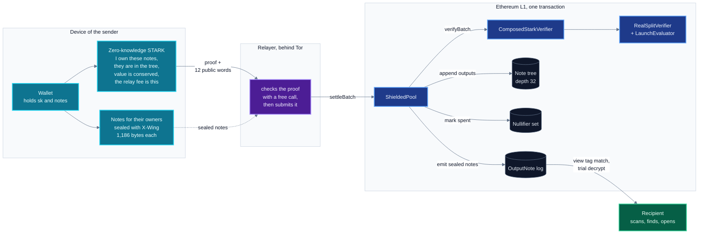

A note is a private claim on value. To pay someone, the wallet proves on the device that it owns
notes already in the tree of the pool, and that the new notes it creates carry the same value less
the relay fee. A relayer submits that proof in one Ethereum transaction. The pool verifies it,
marks the nullifiers of the spent notes, appends the new notes to the tree, and emits them sealed
to their owners, who find them by scanning the chain.

The relayer sees the proof and the sealed notes, never a key. The fee and its recipient are words
of the proven statement, so a relayer can submit a transfer or drop it, and cannot change it.

---

## Privacy: what is hidden, from whom, and what is not

### The model

Every note is a leaf in one tree. A leaf is a **commitment**, a Poseidon compression that hides
the value, asset and owner of the note behind a random blinding. With $v$ the value, $a$ the asset
id and $\mathsf{compress}$ the two-to-one Poseidon compression over Goldilocks digests
(`PoseidonGoldilocks.hash2`), the pool computes (`ShieldedPool._computeCommitmentWith`)

$$
\mathrm{cm} = \mathsf{compress}\big(\mathit{pub},\ \mathrm{ownerCommit}\big), \qquad
\mathit{pub} = \big(v \bmod 2^{32},\ \lfloor v/2^{32} \rfloor,\ a,\ \texttt{0x4E4F5445}\big),
\qquad \mathrm{ownerCommit} = \mathsf{compress}(\mathrm{spend\_pk},\ \mathrm{blinding}),
$$

where $\mathit{pub}$ is a digest of four Goldilocks limbs packed limb 0 lowest and `0x4E4F5445`
is the ASCII of `NOTE`. The pool never sees `spend_pk` or the blinding, only `ownerCommit`.

Spending a note publishes its **nullifier**, derived from the note, its position and a key only
its owner holds. The pool refuses any nullifier it has recorded (`NullifierAlreadySpent`) and two
equal nullifiers in one intent (`DuplicateNullifier`), so a note cannot be spent twice. The public
words and the events name no leaf. They show that some notes under a root were spent, and not which.

The proof is **zero-knowledge**. The prover appends a mask pair to the trace, columns 42 and 43,
filled with fresh randomness, and a rank check on the masks runs before a proof leaves the device.
Hiding is a property of the prover, outside this repository. The verifier here checks soundness
only.

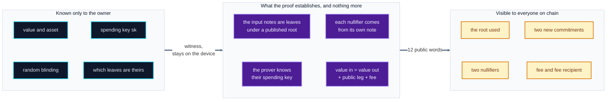

The **anonymity set** of a spend is every note under the root it proves against: at most
$2^{32} - 1$ leaves (`GoldilocksIncrementalTree.MAX_LEAVES`), and in practice every note inserted
by an independent depositor before that root. The Sepolia pool has few independent depositors,
and its anonymity set is small.

### What each action reveals

| Action | Public on chain | Hidden |
|---|---|---|
| **Deposit** (`absorb`) | depositor address, asset, amount, the new commitment | who will own the note |
| **Private transfer** | two nullifiers, two new commitments, the root, two sealed notes, the asset, the relay fee and its recipient | sender, recipient, amount, and which notes were spent |
| **Private swap** | the same, plus the clearing price | who traded, how much, which notes |
| **Withdraw** | recipient address, amount, fee, asset, two nullifiers, two new commitments | which notes paid for it, and who deposited them |

A private transfer carries no public amount and no recipient, and the pool refuses one that names a
recipient (`NoPublicLegFieldsSet`). Value enters the pool only through a deposit, and a settlement
whose public amount is negative reverts (`ShieldInViaDepositOnly`).

### Who learns what

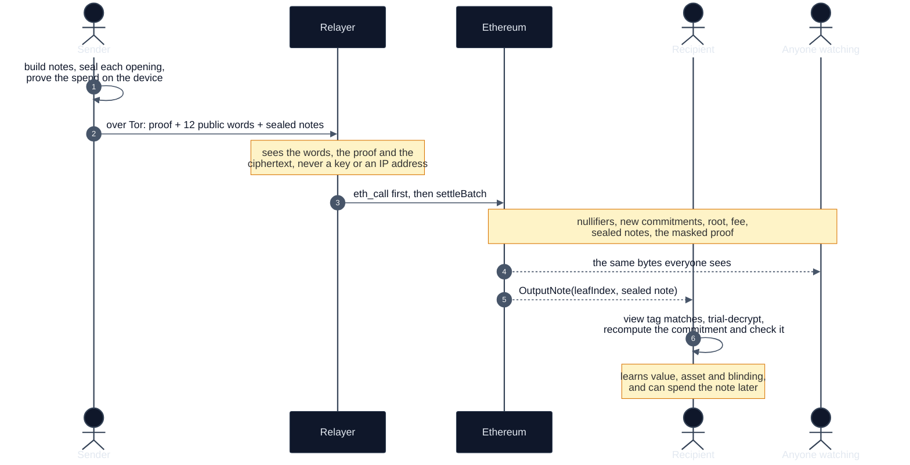

### Association sets

A spend also names an **association root**, and the pool accepts it only if it is registered in
`AssociationSetRegistry` (`UnknownAssociationRoot`). Publishing is open to anyone and append-only.
The registry refuses a zero or non-canonical digest and records any other, and the proof
establishes that the input notes of the spend lie under the root it names. A root published over a
subset of the notes lets a user show that their funds come from a set they choose, without
revealing which notes in that set are theirs.

### Finding your notes without telling anyone

Each sealed note starts with a version byte and a one-byte **view tag** derived from the per-note
shared secret. A wallet fetches every `OutputNote` and trial-decrypts only those whose tag matches.
That is about one in 256, most of them the notes of other people.

The tag is one byte by design. A wider tag would let an indexer filter by recipient, and the filter
would then be the recipient set. Wallets fetch everything, so every query is the same.

### Post-quantum, and why it matters for privacy in particular

A proof verified today stays verified. A ciphertext published today stays on chain forever, and
anyone can store it now and open it on the day a quantum computer exists. So the two halves are
protected differently:

- **Proofs** rest on hash functions: Poseidon inside the circuit, Keccak on chain. There is no
  discrete-log or pairing assumption to break.
- **Notes** are sealed with **X-Wing**, a hybrid of ML-KEM-768 and X25519. A note stays secret as
  long as either primitive holds.

---

## Keys and notes

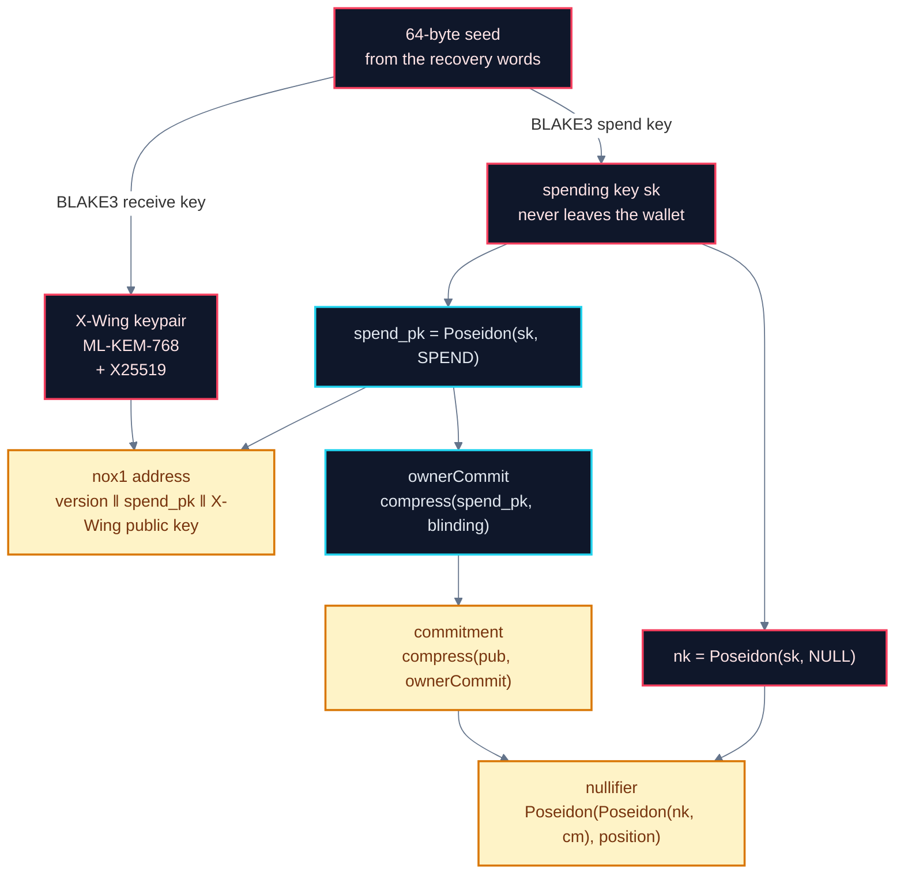

Poseidon is one-way, so `spend_pk` and `nk` do not give `sk`, and the circuit asks for `sk` to
spend. A holder of `nk` can compute the nullifiers of the notes of an account, and cannot spend them.

A note moves through the pool like this:

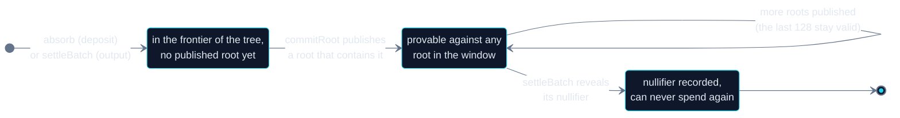

Deposits and outputs update the frontier of the tree without computing the root, which takes 32
Poseidon compressions. Leaf $i$ costs $\tau(i)$ compressions at insertion, $\tau(i)$ the number of
trailing one bits of $i$. `commitRoot` folds the frontier once and publishes a root for everything
inserted before it. Anyone may call it, and one call serves every deposit before it. The pool
keeps the last `ROOT_WINDOW` = 128 roots, so a proof built against a recent root still settles
after new deposits land.

---

## Why Ethereum L1, and what that costs

On L1 the verifier contract is the only judge. There is no sequencer to trust, no bridge to secure,
no data-availability committee, and no upgrade key: the pool holds its verifier in an immutable,
and no Shield contract sits behind a proxy. A transfer is final when its block is. The price is
that a whole proof must fit the limits of a single transaction:

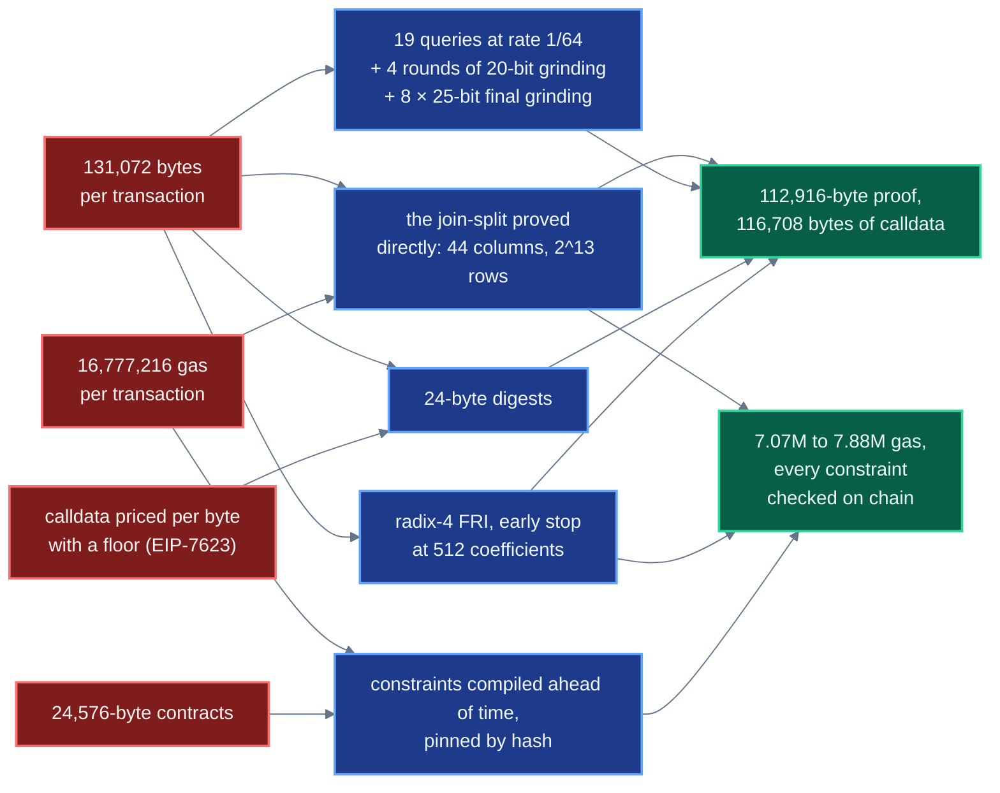

### Measured

| | gas | at 0.077 gwei* | at 1 gwei* |
|---|---:|---:|---:|
| a private transfer: `settleBatch` with verification, two nullifiers, two leaves, two sealed notes, 43 settlements | 7,066,977 to 7,882,382 | $1.50 to $1.68 | $19.52 to $21.77 |
| of which the verifier, `verifyBatch` alone | 4,980,509 | $1.06 | $13.76 |
| deposit one note, 80 deposits | 229,490 to 958,623 | $0.05 to $0.20 | $0.63 to $2.65 |
| publish a root, `commitRoot` | 4,424,015 | $0.94 | $12.22 |

\*ETH at $2,762.47 from the Chainlink ETH/USD feed and a base fee of 0.077 gwei, both read at
mainnet block 26,036,876. The gas is what each receipt says, and the dollars move with the market.
The verifier row is the execution gas of `verifyBatch` on the proof of settlement `0x1efa772d…8fa8`:
`eth_estimateGas` of that call, less its base cost and its calldata.
Every transaction hash is in appendix B of the
[launch record](https://nonos.software/assets/papers/private-transfers/private-transfers.pdf).

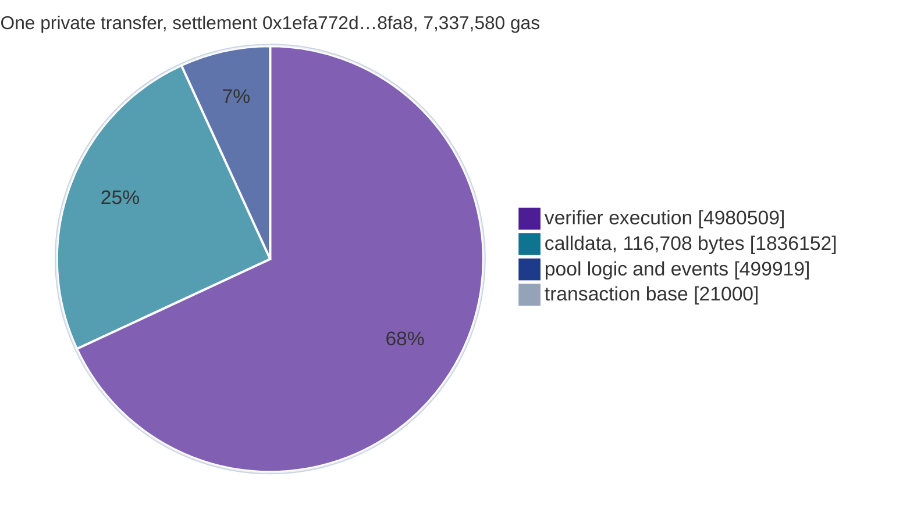

---

## A settlement, step by step

Every intent is 12 public words, the whole interface between the proof and the pool
(`ShieldedPool._decodeIntent`):

| # | word | meaning | the pool checks |
|---|---|---|---|
| 0 | `noteRoot` | the tree root the inputs are proven under | canonical, and one of the last 128 roots |
| 1 | `assocRoot` | the association set the inputs belong to | canonical, and registered |
| 2, 3 | `nf0`, `nf1` | the nullifiers of the two input notes | canonical, unseen, and different from each other |
| 4, 5 | `outCm0`, `outCm1` | the two output commitments | canonical, then appended to the tree |
| 6 | `publicAmount` | value leaving the pool, 0 for a private transfer or swap | $0 \le$ amount $\le p - 2$ (`Goldilocks.MAX_VALUE`) |
| 7 | `fee` | the relay fee, or the protocol fee on a public leg | with no public leg, at most `maxRelayFee` of the asset. With one, at most 0.5% of the amount |
| 8 | `assetId` | which token | registered |
| 9 | `clearingPrice` | for swaps, scaled by $10^{18}$ | below $p$, and the same in every intent of the batch |
| 10 | `recipient` | who receives the public leg | an address, set with a public leg and zero without |
| 11 | `feeRecipient` | who receives the fee, the relayer | an address, and zero when the fee is zero |

The verifier sees these words as 36 Goldilocks limbs (`PublicWords.publicsOf`): words 0 to 5 are
four 64-bit limbs each, low limb first, words 6 to 9 one limb each, and the addresses in words 10
and 11 split into $48 + 48 + 48 + 16$ bits, so $6 \cdot 4 + 4 + 2 \cdot 4 = 36$.
Every limb must be below $p$, so `publicAmount` and `fee` are also below $p = 2^{64} - 2^{32} + 1$
on the verifying path.

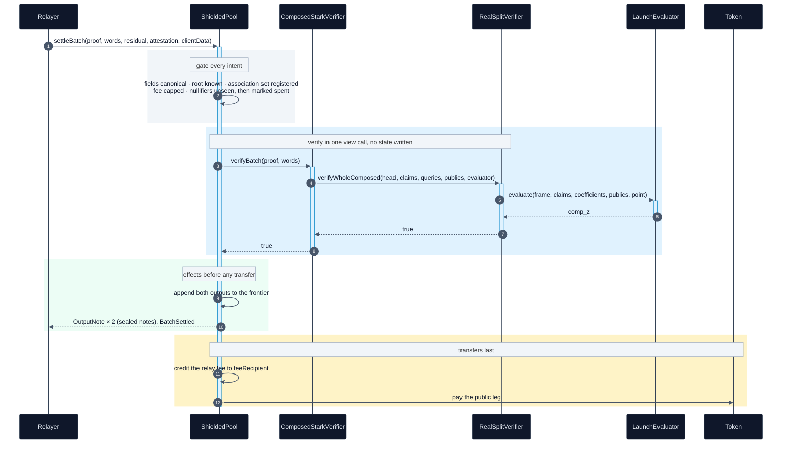

Every nullifier is marked spent and every output inserted before the first token transfer, and
`settleBatch` is `nonReentrant`. A relay fee is credited to `feeRecipient`, which takes it with
`claim`. The launch pool has no settler configured, so anyone may settle, and a sender can submit
its own proof with no relayer at all.

---

## The verifier

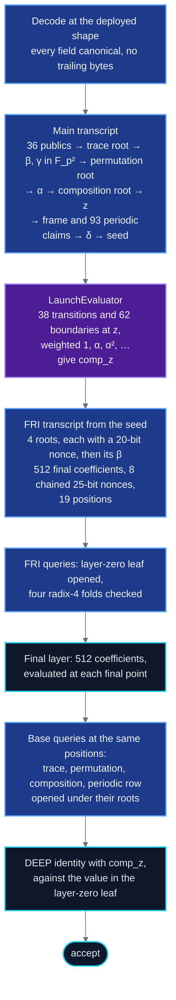

This is `RealSplitVerifier.verifyWholeComposed` on the launch stack. The verifier replays the
transcript once and hands the out-of-domain frame, the periodic claims, the composition
coefficients, $(\beta, \gamma, z)$ and the 36 public limbs to `LaunchEvaluator`. The constraints
of the evaluator are compiled from the circuit ahead of time and pinned by hash
(`LaunchImage.t.sol`). No caller supplies `comp_z`.

### The mathematics

**Field.** Goldilocks, $p = 2^{64} - 2^{32} + 1$, with
$p - 1 = 2^{32} \cdot 3 \cdot 5 \cdot 17 \cdot 257 \cdot 65537$, so $\mathbb{F}_p^\times$ has a
subgroup of order $2^k$ for every $k \le 32$. The element 7 generates $\mathbb{F}_p^\times$
(`RealQueryVerify.GEN`), so it is a quadratic non-residue, $X^2 - 7$ is irreducible, and

$$\mathbb{F}_{p^2} = \mathbb{F}_p[X]/(X^2 - 7), \qquad (a_0 + a_1X)(b_0 + b_1X) = (a_0b_0 + 7a_1b_1) + (a_0b_1 + a_1b_0)X .$$

Every challenge, the out-of-domain point $z$ and every committed value at $z$ live in
$\mathbb{F}_{p^2}$. Trace cells and evaluation points live in $\mathbb{F}_p$.

**Domains.** For trace length $t = 2^{13}$, constraint degree $d = 11$ and $e = 5$ extra blowup
bits,

$$N = 2^{\,\lceil \log_2(d\,t) \rceil + 1 + e} = 2^{23}, \qquad D = 2^{\lceil \log_2(d\,t) \rceil} = 2^{17}, \qquad \rho = D/N = 2^{-(1+e)} = 2^{-6}.$$

The trace generator is $g = 7^{(p-1)/t}$ and the evaluation domain is the coset
$x_i = s\,\omega^{i}$, $\omega = 7^{(p-1)/N}$, $s = 7$, $0 \le i < N$. The verifier fixes
$\log_2 N$ and $\log_2 t$ at deployment and reads neither from a proof.

**Transcript.** A Keccak-256 sponge: the state starts at $\mathrm{Keccak}(\texttt{"NONOS-STARK-EXT"})$
and every absorb or squeeze is $\sigma \leftarrow \mathrm{Keccak}(\mathit{tag} \,\|\, \sigma \,\|\, \mathit{data})$.
The main transcript absorbs the 36 public limbs and the trace root, squeezes $\beta, \gamma \in \mathbb{F}_{p^2}$,
absorbs the permutation root, squeezes one $\alpha$, absorbs the composition root, squeezes $z$,
absorbs the frame and the periodic claims, squeezes one $\delta$ and then a seed. The FRI
transcript starts at $\mathrm{Keccak}(\texttt{"NONOS-STARK-FRI-EXT"})$ and absorbs the seed. For
each of the 4 layers it absorbs the root, checks a nonce for 20 leading zero bits, and squeezes
$\beta_m$. It then absorbs the final layer, checks 8 chained nonces of 25 bits each, and squeezes
the 19 positions that FRI and the base queries share (`RealQueryVerify.friChallenges`).

**Composition,** as `ProgramFormAir` computes it. With $T_c$ the 44 trace columns, $P_m$ the 93
periodic columns, $C_1, \dots, C_{38}$ the transition constraints (straight-line programs over the
frame $T_c(z), T_c(gz)$, the claims $P_m(z)$ and the limbs of $\beta, \gamma$),
$E(z) = \prod_k (z - g^{\,t-k})$ over the rows the program exempts from its transitions, and boundary $j$ pinning column $c_j$ at row $r_j$ to the value $v_j$:

$$
\mathrm{comp}(z) = \frac{E(z)}{z^{t} - 1}\sum_{i=0}^{37} \alpha^{i}\, C_{i+1}\big(T(z), T(gz), P(z), \beta, \gamma\big)
\;+\; \sum_{j=0}^{61} \alpha^{38+j}\,\frac{T_{c_j}(z) - v_j}{z - g^{r_j}} .
$$

The statement of the spend enters as boundaries: pins that set a cell to a public limb $\pi_k$,
read from calldata. The evaluator refuses an image whose pins leave any of the 36 limbs unread
(`ProgramFormEvaluatorBase`). Every other $v_j$ is a constant of the program. One verifier serves
every spend, and each proof is bound to its own statement.

**DEEP,** at the query point $x = s\,\omega^{i}$, with $2 \cdot 44 + 1 + 93 = 182$ terms
(`RealQueryVerify.nDeepCoeffs`) and $k_n = \delta^{n}$:

$$
\mathrm{DEEP}(x) = \sum_{r=0}^{1}\sum_{c=0}^{43} k_{44r+c}\,\frac{T_c(x) - T_c(g^{r}z)}{x - g^{r}z}
+ k_{88}\,\frac{C(x) - \mathrm{comp}_z}{x - z}
+ \sum_{m=0}^{92} k_{89+m}\,\frac{P_m(x) - P_m(z)}{x - z}.
$$

The mask pair is opened as one $\mathbb{F}_{p^2}$ value, $M_{42} + X\,M_{43}$ in slot 42, and slot
43 must be zero (`MaskSlotNotZero`). The coefficient of column 43 is $X$ times that of column 42,
so the two terms combine into one. $T(x)$ is the opened trace row, its first 34 cells under the
trace root and the last 10 under the permutation root, $C(x)$ the opened composition value and
$P(x)$ the periodic row under the root fixed at deployment. The result must equal the slot of the
layer-zero leaf that FRI opens at the same position $i$, so the codeword the consistency check
reads is the codeword FRI tests.

**FRI at radix 4.** Write $f(x) = f_e(x^2) + x f_o(x^2)$. Then
$\tfrac{f(x) + f(-x)}{2} = f_e(x^2)$ and $\tfrac{f(x) - f(-x)}{2x} = f_o(x^2)$, so

$$f_2(a, b;\beta, x) = \frac{a + b}{2} + \beta\,\frac{a - b}{2x}$$

applied to $a = f(x)$, $b = f(-x)$ gives $f_e(x^2) + \beta f_o(x^2)$, a polynomial of half the
degree. At layer $m$ the domain has $N/4^m$ points, and with $Q_m = N/4^{m+1}$ the leaf at
$i = \mathit{pos} \bmod Q_m$ holds the four values at positions $i + jQ_m$, $j = 0, 1, 2, 3$.
With $x_0 = (s\,\omega^{i})^{4^m}$ and $x_1 = (s\,\omega^{i+Q_m})^{4^m}$ those positions are
$x_0, x_1, -x_0, -x_1$, and

$$\mathrm{fold}_4(v_0,v_1,v_2,v_3) = f_2\big(f_2(v_0,v_2;\beta_m,x_0),\ f_2(v_1,v_3;\beta_m,x_1);\ \beta_m^2,\ x_0^2\big),$$

since $x_1^2 = -x_0^2$. After $\ell = (\log_2 D - 9)/2 = 4$ folds the remaining polynomial arrives
as $F = 512$ coefficients $c_k$, and the last fold must equal $\sum_{k<512} c_k\,y^k$ at the final
point $y$, which the verifier computes from the index. It never takes a point from the proof.

**Soundness.** The verifier computes both figures on chain from its own parameters
(`StagedStarkVerifier`). With $q = 19$ queries, $\log_2(1/\rho) = 6$, $\kappa = 25$ bits per final
nonce, $S = 8$ final nonces, $\kappa_r = 20$ bits per round and $\log_2 N = 23$:

$$
\text{query} = q\Big(\tfrac{1}{2}\log_2\tfrac{1}{\rho} - \log_2\tfrac{7}{6}\Big) + \kappa + \log_2 S = 80.774533,
$$

$$
\text{commit} = 2\log_2 p - \Big(7\log_2 3.5 - \log_2 3 + 2\log_2 N + \tfrac{3}{2}\log_2\tfrac{1}{\rho}\Big) + \kappa_r = 81.933909,
$$

$$
\text{provable} = \big\lfloor \min(\text{query},\ \text{commit}) \big\rfloor = 80, \qquad
\text{conjectured} = q\log_2\tfrac{1}{\rho} + \kappa + \log_2 S = 142 .
$$

The query term credits each query with half the rate bits less the Johnson-bound loss
$\log_2(7/6)$, and the commit term is the batching and folding error of FRI in the Johnson regime
(Ben-Sasson, Carmon, Ishai, Kopparty and Saraf, *Proximity Gaps for Reed-Solomon Codes*, FOCS
2020). The conjectured figure assumes the Reed-Solomon proximity conjecture stated in the ethSTARK
documentation (StarkWare, 2021). On chain, `soundnessTermsForSize(1)` returns
`(80774533, 81933909)` in millionths of a bit, and `soundnessBits()` returns $(142, 80)$. The
24-byte Merkle digests give collision resistance $2^{96}$ against a classical attacker.

---

## Deployed on Sepolia

| Contract | Address |
|---|---|
| `ShieldedPool` | [`0x8e377752C8890E23A1E9F40eBbD41183Fc6949e2`](https://sepolia.etherscan.io/address/0x8e377752C8890E23A1E9F40eBbD41183Fc6949e2) |
| `ComposedStarkVerifier` | [`0xf64c399696E10C84C73B66350b45bA0fCD860927`](https://sepolia.etherscan.io/address/0xf64c399696E10C84C73B66350b45bA0fCD860927) |
| `RealSplitVerifier` | [`0x59AA962433060D0206C3595afEb1793c621747eA`](https://sepolia.etherscan.io/address/0x59AA962433060D0206C3595afEb1793c621747eA) |
| `LaunchEvaluator` | [`0x619A5ecdEe779Ec4455bbFa2eC3a5f4f9DEE3FF6`](https://sepolia.etherscan.io/address/0x619A5ecdEe779Ec4455bbFa2eC3a5f4f9DEE3FF6) |
| `PoseidonGoldilocks`, the tree hasher | [`0x0096416e4385BBd459141140A542f30E05b1A4d7`](https://sepolia.etherscan.io/address/0x0096416e4385BBd459141140A542f30E05b1A4d7) |
| `AssociationSetRegistry` | [`0x4375eE7D015aC8E404A03deb577E90b08de32Df3`](https://sepolia.etherscan.io/address/0x4375eE7D015aC8E404A03deb577E90b08de32Df3) |

The pool is deployed at block 11,772,152. Beta mode is off, so deposits are open to anyone.

### Check it yourself

Every claim above can be read from a public Sepolia RPC with `cast` from Foundry, with no key and
no transaction:

```sh
export RPC=https://ethereum-sepolia-rpc.publicnode.com
export POOL=0x8e377752C8890E23A1E9F40eBbD41183Fc6949e2
export ADAPTER=0xf64c399696E10C84C73B66350b45bA0fCD860927

# soundness the verifier computes: conjectured, provable
cast call $ADAPTER "soundnessBits()(uint256,uint256)" --rpc-url $RPC
# the query and commit terms, in millionths of a bit
cast call $ADAPTER "soundnessTermsForSize(uint256)(uint256,uint256)" 1 --rpc-url $RPC
# the verifier the pool is bound to, the words per intent, and beta mode
cast call $POOL "verifier()(address)" --rpc-url $RPC
cast call $POOL "wordsPerIntent()(uint256)" --rpc-url $RPC
cast call $POOL "betaMode()(bool)" --rpc-url $RPC
# no proxy: the EIP-1967 implementation slot of the pool is empty
cast storage $POOL 0x360894a13ba1a3210667c828492db98dca3e2076cc3735a920a3ca505d382bbc --rpc-url $RPC
```

Any settlement can be checked again against the live verifier with a free `eth_call` of
`verifyBatch` on its proof and words.

---

## Limits

| Limit | Why |
|---|---|
| No external audit | the verifier, the evaluator and the pool are tested and partly proved in Lean, and no outside party has reviewed them |
| Lean coverage | the Lean FRI bound is evaluated at other parameters, and the pool model has no relay fee. [formal/lean/README.md](formal/lean/README.md) lists every gap |
| 24-byte digests | collision resistance $2^{96}$, and less against a quantum attacker |
| Deposits and withdrawals are public | an address, an amount and a time enter or leave the pool in the clear |
| Amount and timing correlation | depositing 3.14 and withdrawing 3.14 an hour later links them, whatever the proof hides |
| Anonymity set size | privacy grows with the number of notes under a root, and the Sepolia pool has few |
| The asset is public | an ETH transfer can only come from an ETH note |
| Computational zero knowledge | the masks come from a keyed hash of device randomness, so hiding rests on that hash and on the randomness of the device |
| Network metadata | an RPC provider sees the IP address of a wallet that does not route through Tor |
| One intent per batch | every settlement pays for a whole verification |

---

## Status and what comes next

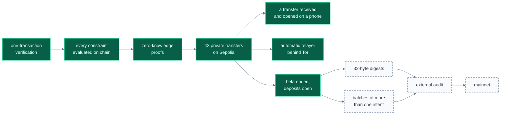

---

## Repository, build and documentation

```
contracts/shield/             pool, note tree, Poseidon hasher, fees, staking, association sets
contracts/shield/verifier/    verifier, adapter, constraint evaluator, transcript, Merkle, FRI, field arithmetic
contracts/faucet/             testnet faucet
test/shield/                  unit, property, invariant, symbolic and real-proof tests
spec/                         the launch program, real proofs, refused proofs and reference vectors
script/shield/                deploy, settle and verify, from Solidity
script/tools/                 the program generators CI holds to the launch program
formal/lean/                  Lean proofs, and where they stop short of the launch stack
docs/                         the design, one topic per file
```

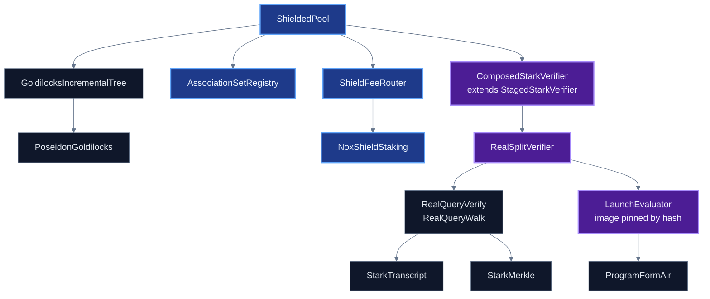

### Build and test

```sh
git clone --recurse-submodules https://github.com/NON-OS/l1-shield
cd l1-shield
forge build
forge test                                   # 617 tests, real launch proofs among them
cd formal/lean && lake exe cache get && lake build
```

One test forks mainnet and returns early when `MAINNET_RPC_URL` is unset. `DeployedSurface.t.sol`
uses `ffi` to run `test/tools/import_closure.py`, and fails if a contract outside the declared list
reaches the deployed path. The symbolic checks run under Halmos, as [docs/14](docs/14-testing.md)
shows.

### Documentation

| | |
|---|---|
| [01 Architecture](docs/01-architecture.md) | the contracts and how they fit |
| [02 Threat model](docs/02-threat-model.md) | who is trusted with what |
| [03 Verifier](docs/03-verifier-overview.md) · [04 Codec](docs/04-proof-codec.md) · [05 Transcript](docs/05-transcript.md) · [06 Merkle and FRI](docs/06-merkle-and-fri.md) · [07 Constraints](docs/07-constraints.md) | the verifier, byte by byte |
| [08 Pool](docs/08-pool.md) · [09 Tree](docs/09-tree.md) · [10 Fees and governance](docs/10-fees-liveness-governance.md) · [11 Faucet](docs/11-faucet.md) | the pool and its economics |
| [12 Gas](docs/12-gas.md) · [13 Deployment](docs/13-deployment.md) | what each operation costs, and how a stack goes on chain |
| [14 Testing](docs/14-testing.md) · [15 Glossary](docs/15-glossary.md) | how it is tested, and the vocabulary |
| [16 Wallet integration](docs/16-wallet-integration.md) · [17 Client data](docs/17-client-data.md) | building a wallet |
| [18 Gas research](docs/18-gas-research.md) · [19 Deployments and receipts](docs/19-deployments-and-receipts.md) | every number, with its receipt |
| [20 Security status](docs/20-security-status.md) | what is checked today, and what is not |

## Security

Report a vulnerability privately to `team@nonos.systems`, as [SECURITY.md](SECURITY.md) describes, and never in a public issue.

## License

MIT, see [LICENSE](LICENSE). Files whose SPDX header reads `AGPL-3.0-or-later` are under that
license instead.

The banner uses "Etna Volcano Paroxysmal Eruption July 30 2011" by gnuckx, licensed under
[CC BY 2.0](https://creativecommons.org/licenses/by/2.0/), recoloured by NØNOS.
