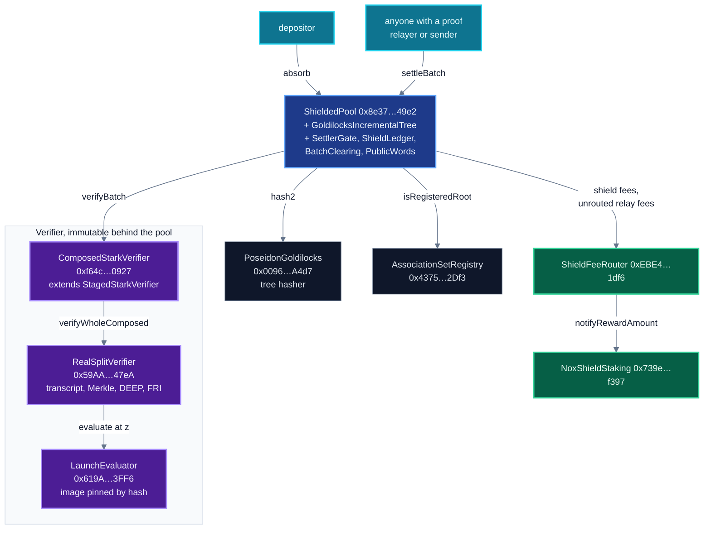

# Architecture

This document names the contracts of NØNOS Shield, states what each one does, and traces a deposit
and a settlement from the pool down to the constraint evaluator. It is the entry point for a reader
new to the repository, and it marks which contracts in the tree are live and which are not.

The verifier internals are in [03](03-verifier-overview.md) to [07](07-constraints.md). Who is
trusted with what is in [02-threat-model.md](02-threat-model.md). What the chain checks and what it
does not is in [20-security-status.md](20-security-status.md).

- [The launch stack](#the-launch-stack)
- [Design](#design)
- [Components](#components)
- [Contracts outside the deployed path](#contracts-outside-the-deployed-path)
- [A deposit](#a-deposit)
- [A settlement](#a-settlement)
- [The contracts](#the-contracts)
- [No recursion](#no-recursion)

## The launch stack

Every address below is on Sepolia and every value is read with `cast call`. None of these contracts
sits behind a proxy: the EIP-1967 implementation slot of each reads zero.

| contract | address | what it is bound to |
|---|---|---|
| `ShieldedPool` | `0x8e377752C8890E23A1E9F40eBbD41183Fc6949e2` | `verifier()`, `treeHasher()` and `associationRegistry()` below, all immutable. `wordsPerIntent() = 12` |
| `ComposedStarkVerifier` | `0xf64c399696E10C84C73B66350b45bA0fCD860927` | `verifierForSize(1)` and `evaluator()` below, `sizeCount() = 1`, `settler() = 0x0` |
| `RealSplitVerifier` | `0x59AA962433060D0206C3595afEb1793c621747eA` | the proof shape, as constructor immutables |
| `LaunchEvaluator` | `0x619A5ecdEe779Ec4455bbFa2eC3a5f4f9DEE3FF6` | an image pinned by `LaunchProgram.IMAGE_HASH`, `N_PUBLIC() = 36` |
| `PoseidonGoldilocks` | `0x0096416e4385BBd459141140A542f30E05b1A4d7` | the tree hasher |
| `AssociationSetRegistry` | `0x4375eE7D015aC8E404A03deb577E90b08de32Df3` | no owner |
| `ShieldFeeRouter` | `0xEBE49155459833d865737cA1288122a354f11df6` | `nox()`, `staking()`, `treasury()`, split 4000 / 3000 / 3000 bps |
| `NoxShieldStaking` | `0x739e06586305c4a543d5cFd5fE5506aA289cf397` | `rewardNotifier()` is the fee router, `cooldown() = 604800` |

The pool was deployed at block 11,772,152 in tx
`0xdb96b038e83b4bd17534819f9600a431700dc77afceb8f878119963983b87c42`. The pool, the fee router and
the staking contract share one owner, the Safe `0xD4251BA8bD4F68690BaB9f27d544819cFBE11854`.

## Design

`ShieldedPool` holds deposits as note commitments in an append-only Poseidon Merkle tree over the
Goldilocks field $\mathbb{F}_p$, $p = 2^{64} - 2^{32} + 1$. A note moves through `settleBatch`, which
spends two notes and creates two under a STARK proof and 12 public words.

The proof is a STARK over $\mathbb{F}_p$ with challenges in $\mathbb{F}_{p^2} = \mathbb{F}_p[X]/(X^2 - 7)$.
Solidity reads it directly. No SNARK wraps it, and there is no trusted setup and no pairing curve.
Soundness rests on the collision resistance of Keccak and Poseidon and on the FRI low-degree test.

The price of a STARK on L1 is proof size and verification gas. Four features fit the launch proof
into a single transaction:

| feature | what it buys | where |
|---|---|---|
| the join-split proved directly, 44 columns and $2^{13}$ rows | no recursion layer to verify | `RealSplitVerifier.logTraceLen() = 13`, `traceWidth() = 44` |
| 24-byte digests | shorter Merkle paths in calldata | `RealSplitVerifier.digestBytes() = 24` |
| radix-4 FRI with a 512-coefficient final layer | four folds, a single path per fold | `friRadix() = 4`, `logFinal() = 9` |
| constraints compiled ahead of time | the evaluator runs a pinned image and compiles nothing on chain | `LaunchEvaluator`, `LaunchImage.t.sol` |

The trace is committed in two rounds. Columns 0 to 33 sit under the trace root, and columns 34 to 43
under the permutation root, built after $\beta$ and $\gamma$ are drawn (`regionWidth() = 34`).
[05-transcript.md](05-transcript.md) gives the order.

## Components

| contract | file | role | replaceable |
|---|---|---|---|
| `ShieldedPool` | `contracts/shield/ShieldedPool.sol` | holds all user value: deposits, settlement, payouts, claims | no. `verifier`, `associationRegistry`, `treeHasher` and `wordsPerIntent` are immutable |
| `GoldilocksIncrementalTree` | `contracts/shield/GoldilocksIncrementalTree.sol` | the note tree, inherited by the pool | no |
| `PoseidonGoldilocks` | `contracts/shield/PoseidonGoldilocks.sol` | Poseidon, width 8, S-box $x^7$, 32 full rounds | no |
| `AssociationSetRegistry` | `contracts/shield/AssociationSetRegistry.sol` | append-only registry of association roots | no |
| `ComposedStarkVerifier` | `contracts/shield/verifier/ComposedStarkVerifier.sol` | the `IStarkVerifier` of the pool: routes by batch size, decodes one-call proofs, reports soundness | no |
| `RealSplitVerifier` | `contracts/shield/verifier/RealSplitVerifier.sol` | the STARK verifier for a single proof shape | no |
| `LaunchEvaluator` | `contracts/shield/verifier/LaunchEvaluator.sol` | the 38 transitions and 62 boundaries of the launch circuit at $z$ | no |
| `ShieldFeeRouter` | `contracts/shield/ShieldFeeRouter.sol` | swaps fees to NOX and splits them | yes, through `proposeFeeRouter` after `FEE_ROUTER_DELAY = 2 days` |
| `NoxShieldStaking` | `contracts/shield/NoxShieldStaking.sol` | pays stakers from the staking share | yes, through `proposeStaking` on the router after 2 days |

`test/shield/DeployedSurface.t.sol` computes the import closure of `RealSplitVerifier.sol` and fails
if it differs from its declared list of 13 files. The closure of each deployed entry point, from
`test/tools/import_closure.py`:

| entry point | files reached |
|---|---|
| `RealSplitVerifier.sol` | `RealQueryVerify`, `RealQueryWalk`, `GoldilocksCore`, `ProductionAir`, `ProductionComposeAir`, `ProductionDeepQuery`, `StarkFieldExt`, `StarkMerkle`, `StarkProofReader`, `StarkTranscript`, `Goldilocks`, `IProgramFormEvaluator` |
| `ComposedStarkVerifier.sol` | the above, plus `StagedStarkVerifier`, `PublicWords`, `IStarkVerifier` |
| `LaunchEvaluator.sol` | `ProgramFormEvaluator` (for `ProgramFormEvaluatorBase`), `ProgramFormAir`, `ProgramFormProgram`, `LaunchProgram`, `IProgramFormEvaluator` |
| `ShieldedPool.sol` | `GoldilocksIncrementalTree`, `SettlerGate`, `ShieldLedger`, `BatchClearing`, `PublicWords`, `Goldilocks` and five interfaces |

## Code outside the launch path

This repository holds the deployed launch stack and the libraries it imports. Parts of those files
serve no launch path:

| code | what it is |
|---|---|
| `ProductionAir`, `ProductionComposeAir`, `ProductionDeepQuery` | the transition of a recursion AIR. The launch verifier reads only `COSET_SHIFT` and `xFinal` from `ProductionAir` |
| the `ProgramFormEvaluator` contract and `ProgramFormProgram` | an evaluator of an 11-word circuit that compiles its tape in the constructor. `LaunchEvaluator` uses only `ProgramFormEvaluatorBase` from that file |
| `_insertLeaf` and `_insertLeaves` in the tree | single and batch insertion that the pool never calls ([09-tree.md](09-tree.md)) |
| `ShieldLedger.splitUnshield` | an unshield split that the pool never calls |
| the beta gate of the pool | inert once `betaMode` is false, as it is on the launch pool |

## A deposit

`absorb(assetId, amount, ownerCommit)` (`ShieldedPool.sol:336`):

1. Refuses when deposits are paused, when `betaWoundDown` is set, when the asset is unknown, and when
   `amount` is not a whole number of units in $[1, p - 2]$.
2. Runs the beta gate, which returns at once on the launch pool (`betaMode() = false`).
3. Refuses an `ownerCommit` with a limb at or above $p$.
4. Takes the asset. For an ERC-20 it compares the balance before and after, and refuses a token that
   delivers any other amount (`NonStandardTokenTransfer`).
5. Splits off the shield fee in units, $f = \lfloor u \cdot b_s / 10^4 \rfloor$, with $u$ the amount in
   units and $b_s$ = `shieldFeeBps` = 25 on the launch pool, and keeps $v = u - f$.
6. Computes the commitment from $v$. The caller never supplies it:

$$\mathrm{cm} = \mathsf{compress}\big((v \bmod 2^{32},\ \lfloor v / 2^{32} \rfloor,\ \mathrm{assetId},\ \texttt{0x4E4F5445}),\ \mathrm{ownerCommit}\big)$$

7. Inserts the leaf into the frontier and publishes no root. The leaf becomes provable once
   `commitRoot()` publishes a root that covers it.
8. Pays the fee to the fee router, or holds it in `unsweptFees` if the router refuses it.

[08-pool.md](08-pool.md#absorb-deposit) lists every check and revert.

## A settlement

`settleBatch(proof, publicInputs, residual, attestation, clientData)` (`ShieldedPool.sol:386`) runs
checks first, then verification, then effects, then transfers.

```mermaid
%%{init: {'theme':'base','themeVariables':{'fontFamily':'Inter, -apple-system, Segoe UI, Helvetica, Arial, sans-serif','lineColor':'#64748b','edgeLabelBackground':'#ffffff','titleColor':'#0f172a','clusterBkg':'#f8fafc','clusterBorder':'#cbd5e1'}}}%%
flowchart LR
    classDef check fill:#0f172a,stroke:#22d3ee,color:#e2e8f0,stroke-width:2px
    classDef ver fill:#4c1d95,stroke:#a78bfa,color:#f5f3ff,stroke-width:2px
    classDef eff fill:#1e3a8a,stroke:#60a5fa,color:#eff6ff,stroke-width:2px
    classDef pay fill:#065f46,stroke:#34d399,color:#ecfdf5,stroke-width:2px

    C1["gate<br/>wound down?<br/>settler window or open slot"]:::check
    C2["layout<br/>12 words per intent,<br/>at most 64 intents"]:::check
    C3["per intent<br/>decode and range-check,<br/>root known, set registered,<br/>nullifiers marked spent"]:::check
    V["verifyBatch<br/>a view call"]:::ver
    E["effects<br/>2 leaves per intent,<br/>OutputNote events,<br/>debits and credits"]:::eff
    T["transfers<br/>public leg, router fee,<br/>then the residual"]:::pay

    C1 --> C2 --> C3 --> V --> E --> T
```

The adapter serves a single batch size, `verifierForSize(1)`. A batch of more than one intent gets
false from `verifyBatch` and reverts `InvalidProof`. [08-pool.md](08-pool.md#settlebatch) gives each
step with its revert.

## The contracts

### ShieldedPool

`ShieldedPool` is the only contract that holds user value. Its verifier is immutable, so a new proof system needs a
new pool.

Before it stores the verifier, the constructor checks two Poseidon vectors, its own note commitment
against the prover vector, and a `verifyBatch` call. Any mismatch reverts the deployment
([08-pool.md](08-pool.md#custody)).

The launch pool passed its verifier check with a 32-byte digest. `ComposedStarkVerifier.attest`
verified a whole proof in tx `0xa6ffb574c26b8203f473569e6e3497ef6256fd34839a8cdb54cd7ec3c2254b99`
(block 11,772,150, 6,748,211 gas) and recorded its digest `0x80914f72…1c30`.

The pool deployment tx carries that digest in its calldata.

### GoldilocksIncrementalTree and PoseidonGoldilocks

The note tree has depth `TREE_DEPTH = 32` and holds at most $2^{32} - 1$ leaves. Inserts from
`absorb` and `settleBatch` update the frontier only.

`commitRoot()` folds the frontier to a root and publishes it, and the last `ROOT_WINDOW = 128` roots
stay valid. [09-tree.md](09-tree.md) has the details.

`PoseidonGoldilocks` checks three known-answer vectors in its constructor: the permutation, the
single-block hash and the note commitment. The pool constructor checks `hash2` and `hashFields`
against vectors of its own.

### ComposedStarkVerifier

The adapter the pool calls through `IStarkVerifier.verifyBatch(bytes proof, uint256[] publicInputs)`.
It accepts two forms of `proof`:

| form | accepted when |
|---|---|
| `abi.encode(ONE_CALL, head, claims, queries, word, word)`, longer than 192 bytes | `RealSplitVerifier.verifyWholeComposed` returns true for these words. The two trailing words are never read |
| 32 bytes | the bytes are a digest that `attest` recorded for `keccak256(abi.encode(publicInputs))` |

`ONE_CALL = keccak256("NONOS-SHIELD-ONE-CALL-v1")`. The adapter expands the 12 words of an intent
into 36 limbs (`PublicWords.publicsOf`) and passes them with `evaluator()` to the verifier.

It inherits `StagedStarkVerifier`, which computes the soundness figures on chain:
`soundnessBits() = (142, 80)` and `soundnessTermsForSize(1) = (80774533, 81933909)` in millionths of
a bit.

### RealSplitVerifier

Every dimension of the proof is a constructor immutable, and none is read from the proof. A different
shape is a different deployment. On the launch verifier:

| getter | value | getter | value |
|---|---:|---|---:|
| `nq` | 19 | `logDomain` | 23 |
| `logTraceLen` | 13 | `traceWidth` | 44 |
| `regionWidth` | 34 | `nCoeffs` | 100 |
| `nPeriodic` | 93 | `cosetShift` | 7 |
| `digestBytes` | 24 | `friRadix` | 4 |
| `logDegreeBound` | 17 | `logFinal` | 9 |
| `roundGrindBits` | 20 | `finalSearches` | 8 |
| `grindBits` | 25 | `maskColumn` | 42 |
| `recomputesCompZ` | true | `powerCoeffs`, `powerDeep` | true |

`verifyWholeComposed` replays the transcript once. It hands the out-of-domain frame, the 93 periodic
claims, the 100 coefficients, the 36 public limbs and $(\beta, \gamma, z)$ to the evaluator, and the
DEEP check uses the value it returns. No caller supplies the composition value.

| library | responsibility | document |
|---|---|---|
| `RealQueryVerify` | the shape, both transcript walks, the DEEP coefficients | [04](04-proof-codec.md), [05](05-transcript.md) |
| `RealQueryWalk` | the head decoder and every per-query check, read from calldata | [04](04-proof-codec.md), [06](06-merkle-and-fri.md) |
| `StarkTranscript` | Fiat-Shamir over Keccak-256, proof-of-work checks | [05](05-transcript.md) |
| `StarkMerkle` | leaf and node hashing, path folding | [06](06-merkle-and-fri.md) |
| `ProductionDeepQuery` | the DEEP combination with the periodic terms | [03](03-verifier-overview.md) |
| `ProductionAir`, `ProductionComposeAir` | the FRI fold chase, the final layer and the terms it needs | [06](06-merkle-and-fri.md) |
| `StarkFieldExt`, `GoldilocksCore` | arithmetic in $\mathbb{F}_p$ and $\mathbb{F}_{p^2}$ | [07](07-constraints.md) |
| `StarkProofReader` | bounds-checked little-endian readers | [04](04-proof-codec.md) |

### LaunchEvaluator

`LaunchEvaluator` evaluates the composition of the launch circuit at $z$ from an image compiled ahead of time. The
constructor takes the image only if it hashes to `LaunchProgram.IMAGE_HASH`, and stores it in up to
two data contracts of at most 24,575 image bytes each.

`LaunchImage.t.sol` holds the pin to the compile of the circuit tape. `evaluate` reverts
`NotThisCircuit` unless it receives 36 public limbs. [07-constraints.md](07-constraints.md) covers
the constraints.

### AssociationSetRegistry

`publishRoot(root, uri)` records a root and emits it with its publisher and a URI. It refuses a zero
root (`EmptyRoot`) and a root with a limb at or above $p$ (`NonCanonicalRoot`).

It has no owner and no removal. The pool accepts an intent only if its `assocRoot` is registered.
What a root covers is a client decision
([02-threat-model.md](02-threat-model.md#association-set-publishers)).

### ShieldFeeRouter and NoxShieldStaking

The pool sends shield fees to the router, and relay fees of intents that name no fee recipient. The
router swaps them to NOX through approved DEX routers (owner or keeper only). The permissionless
`distribute()` splits the NOX between staking, the treasury and `0x…dEaD`.

A fee the router refuses stays in `unsweptFees` of the pool, and anyone can send it later with
`sweepFees`. [10-fees-liveness-governance.md](10-fees-liveness-governance.md) covers both contracts.

## No recursion

The launch proof is a direct STARK of the join-split. There is no inner proof and no verifier
circuit. The adapter can record an inner stage for a recursive circuit.

On the launch adapter `soundnessForSize(1)` returns `(19, 5, 25, 0, 0, 0)`: 19 queries, 5 extra
blowup bits and 25 grind bits for the proof, and zero inner fields. The adapter reports the figure
it computes for that stage alone ([02-threat-model.md](02-threat-model.md#soundness)).
