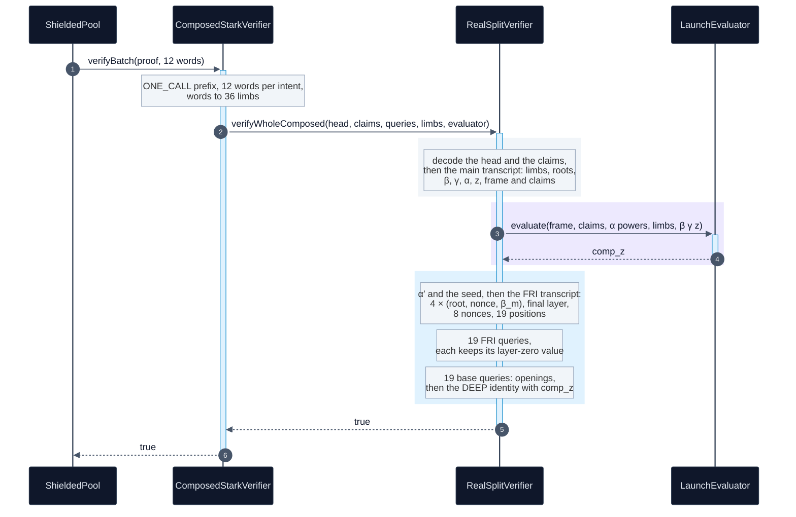

# Verifier overview

This document describes how the launch verifier checks a proof in one call: its steps, the
composition value it computes, the DEEP identity, the adapter and the shape it is built for. It is
for auditors and for anyone building a prover, a relayer or a second verifier.

The bytes are in [04-proof-codec.md](04-proof-codec.md), the challenges in
[05-transcript.md](05-transcript.md), commitments and FRI in
[06-merkle-and-fri.md](06-merkle-and-fri.md), and the constraints in
[07-constraints.md](07-constraints.md).

What is checked and what is not is stated once, in [20-security-status.md](20-security-status.md).

## Contents

1. [Notation](#notation)
2. [What is checked](#what-is-checked)
3. [One verification, end to end](#one-verification-end-to-end)
4. [The composition value at z](#the-composition-value-at-z)
5. [The DEEP identity](#the-deep-identity)
6. [FRI and the final layer](#fri-and-the-final-layer)
7. [The adapter](#the-adapter)
8. [Soundness figures](#soundness-figures)
9. [Shape is configuration](#shape-is-configuration)
10. [Two-round commitment](#two-round-commitment)
11. [Order of checks within a query](#order-of-checks-within-a-query)
12. [Contract map](#contract-map)
13. [Tests](#tests)

## Notation

Deployed values are read with `cast call` on `RealSplitVerifier`
[`0x59AA962433060D0206C3595afEb1793c621747eA`](https://sepolia.etherscan.io/address/0x59AA962433060D0206C3595afEb1793c621747eA).

| symbol | meaning | deployed value |
|---|---|---|
| $p$ | the Goldilocks prime $2^{64} - 2^{32} + 1$ | |
| $\mathbb{F}_{p^2}$ | $\mathbb{F}_p[X]/(X^2 - 7)$, elements written $c_0 + c_1 X$ | |
| $q$ | queries | 19 |
| $N$ | evaluation domain size, $2^{\texttt{logDomain}}$ | $2^{23}$ |
| $t$ | trace length, $2^{\texttt{logTraceLen}}$ | $2^{13}$ |
| $w$ | trace width | 44 |
| $w_1$ | `regionWidth`, the columns committed in round one | 34 |
| $n_P$ | periodic columns | 93 |
| $\omega$ | $7^{(p-1)/N}$, a primitive $N$-th root of unity | |
| $g$ | $7^{(p-1)/t}$, a primitive $t$-th root of unity | |
| $s$ | the coset shift | 7 |
| $z$ | the out-of-domain point, in $\mathbb{F}_{p^2}$ | drawn |
| $\mathrm{comp}_z$ | the composition value at $z$ | computed on chain |

Seven generates $\mathbb{F}_p^\times$, so it is a quadratic non-residue, $\omega$ and $g$ have the
stated orders, and $X^2 - 7$ is irreducible. Both facts follow from
$p - 1 = 2^{32} \cdot 3 \cdot 5 \cdot 17 \cdot 257 \cdot 65537$ by checking $7^{(p-1)/r} \ne 1$ for
each prime $r$.

A query at position $i \in [0, N)$ opens the committed polynomials at $x = s\,\omega^{i}$
(`RealQueryWalk.sol:696`).

## What is checked

`RealSplitVerifier.verifyWholeComposed` (`RealSplitVerifier.sol:216`) runs every step of a STARK
verifier in one call, and computes $\mathrm{comp}_z$ itself.

| step | where |
|---|---|
| decode at the deployed shape: canonical field elements, counts compared, no trailing bytes | `RealQueryWalk.readHead`, `readClaims`, `_spans` |
| replay the main transcript, public limbs first | `RealQueryVerify.mainCheckpointCoeffs`, `mainResume` |
| the mask slot 43 of the frame is zero | `RealQueryVerify.sol:426` |
| evaluate the 38 transitions and 62 boundaries at $z$ | `LaunchEvaluator.evaluate`, through `ProgramFormAir` |
| replay the FRI transcript: 4 round nonces, 8 query nonces, 19 positions | `RealQueryVerify.friChallenges` |
| FRI: every layer leaf authenticated, every fold checked, the final layer evaluated | `RealQueryWalk.friQuery` |
| FRI shape: 512 coefficients and 4 layers reach the degree bound $2^{17}$ | `RealSplitVerifier._friShape` |
| trace (both halves), composition and periodic openings authenticated | `RealQueryWalk._auths` |
| DEEP identity at every query, against the layer-zero value FRI opened there | `RealQueryWalk._deep`, `baseQuery` |
| every byte of `queries` consumed | `RealSplitVerifier.sol:241` |

What these checks establish, and what they leave to the prover, is in
[20-security-status.md](20-security-status.md).

## One verification, end to end

The call is a `view`: nothing is stored and no caller value stands in for $\mathrm{comp}_z$. The
order inside `verifyWholeComposed` is decode, main transcript, evaluator, DEEP coefficients and
seed, FRI transcript, FRI queries, base queries (`RealSplitVerifier.sol:223` to `:242`).

A free `eth_call` of `verifyBatch` on the adapter, with the proof and the 12 words of the first
launch transfer
[`0xe622a831…484e`](https://sepolia.etherscan.io/tx/0xe622a8310a7321f4b743ae9e4c745cb5bc824abdea1590e5f9eb845d11f5484e),
returns true.

The gas of one verification is in [12-gas.md](12-gas.md).

## The composition value at z

`LaunchEvaluator` (`0x619A5ecd…3FF6`) is a `ProgramFormEvaluatorBase` built from an image compiled
ahead of time.

The constructor refuses any image whose Keccak-256 is not `LaunchProgram.IMAGE_HASH`
(`ImageMismatch`), and `LaunchImageTest.test_thePinIsTheCompileOfTheTape` holds that hash to the
compile of the circuit tape.

`evaluate` refuses a public list whose length is not 36 (`NotThisCircuit`) and a frame, claim or
coefficient list of the wrong length.

With $T_c$ the 44 trace columns, $P_m$ the 93 periodic columns, $C_1, \dots, C_{38}$ the transition
constraints (straight-line programs over $T(z)$, $T(gz)$, $P(z)$ and the limbs of $\beta, \gamma$),
$E(z) = \prod_k (z - g^{\,t-k})$ over the rows the program exempts, and boundary $j$ pinning column
$c_j$ at row $r_j$ to $v_j$ (`ProgramFormAir.sol:4`):

$$
\mathrm{comp}_z = \frac{E(z)}{z^{t} - 1}\sum_{i=0}^{37} \alpha^{i}\, C_{i+1}\big(T(z), T(gz), P(z), \beta, \gamma\big)
\;+\; \sum_{j=0}^{61} \alpha^{38+j}\,\frac{T_{c_j}(z) - v_j}{z - g^{r_j}} .
$$

The statement of the spend enters as boundaries whose $v_j$ is a public limb $\pi_k$ read from
calldata. The evaluator refuses an image whose pins leave any of the 36 limbs unread
(`PinsNotContiguous`, `ProgramFormEvaluator.sol:76`). Every other $v_j$ is a constant of the
program.

One verifier serves every spend, and each proof is bound to its own statement.
[07-constraints.md](07-constraints.md) describes the constraints.

## The DEEP identity

Let $T_c(x)$ be the opened trace cell in column $c$, $C(x)$ the opened composition value and
$P_m(x)$ the opened periodic cell, all at the query point $x = s\,\omega^{i}$.

Let $o_{r,c}$ be the frame, the trace at $z$ for $r = 0$ and at $gz$ for $r = 1$, and
$k_n = \alpha'^{\,n}$ the 182 DEEP coefficients ([05](05-transcript.md#powers-of-one-draw)). The
verifier computes

$$
\mathrm{DEEP}(x) = \frac{\sum_{c=0}^{43} k_{c}\,\big(T_c(x) - o_{0,c}\big) + k_{88}\,\big(C(x) - \mathrm{comp}_z\big) + \sum_{m=0}^{92} k_{89+m}\,\big(P_m(x) - P_m(z)\big)}{x - z}
\;+\; \frac{\sum_{c=0}^{43} k_{44+c}\,\big(T_c(x) - o_{1,c}\big)}{x - g z}
$$

and requires it to equal the value in slot $\lfloor i / (N/4) \rfloor$ of the layer-zero leaf that
the FRI query at position $i$ opened and authenticated (`RealQueryWalk.sol:699`). The codeword the consistency
check reads is the codeword FRI tests.

**The mask pair.** Slot 42 of each frame row holds $M_{42} + X\,M_{43}$ and slot 43 holds zero.
The coefficients of column 43 are $k_{44r+43} = X\,k_{44r+42}$ (`RealQueryVerify.sol:450`), so the
two terms of each row combine into $k_{44r+42}\big(T_{42}(x) + X\,T_{43}(x) - o_{r,42}\big)$.

**How it is computed.** `RealQueryWalk.prepareDeep` folds every term that does not depend on $x$
into two constants, once per proof:
$K_0 = \sum_c k_c\,o_{0,c} + k_{88}\,\mathrm{comp}_z + \sum_m k_{89+m}\,P_m(z)$ and
$K_1 = \sum_c k_{44+c}\,o_{1,c}$.

Each query then multiplies only base-field row limbs by the coefficients and takes one inversion for
both denominators (`RealQueryWalk.sol:939`).

**What it binds.** The numerator over $x - z$ is a polynomial whose value at $z$ is a linear form in
the errors of the frame row at $z$, of $\mathrm{comp}_z$ and of the claims. Those values are fixed
before $\alpha'$ is drawn.

If any is wrong, the form is a nonzero polynomial in $\alpha'$ of degree at most 181, which vanishes
with probability at most $181/p^2 < 2^{-120}$.

A nonzero residue leaves a pole, and FRI rejects a function that far from low degree except with the
probability of the [soundness figures](#soundness-figures). The row at $gz$ is bound the same way.

## FRI and the final layer

Each FRI query folds at radix 4 through 4 layers. At layer $m$ it reads the leaf at
$q \bmod (N/4^{m+1})$, checks that the fold of layer $m - 1$ sits in the slot its index names, and
folds the four values under $\beta_m$.

After 4 folds the remaining polynomial is the 512 final coefficients, and the last fold must equal
$\sum_{k<512} c_k\,y^k$ at $y = (s\,\omega^{\,q \bmod N/2^{8}})^{2^{8}}$ (`ProductionAir.xFinal`,
`:226`). The verifier derives $y$ from the position and never reads a point from the proof.

The fold and the leaf rule are in [06-merkle-and-fri.md](06-merkle-and-fri.md).

## The adapter

The pool calls `ComposedStarkVerifier` at
[`0xf64c399696E10C84C73B66350b45bA0fCD860927`](https://sepolia.etherscan.io/address/0xf64c399696E10C84C73B66350b45bA0fCD860927).
It holds the evaluator and `wordsPerIntent` = 12 as immutables, and routes by batch size through
`verifierForSize`.

The launch adapter serves one size, one intent, with `RealSplitVerifier` `0x59AA9624…747eA`.

| input to `verifyBatch(proof, words)` | result |
|---|---|
| a 32-byte `proof` | true only if `attest` accepted a proof with that Keccak-256 digest for `keccak256(abi.encode(words))` |
| 192 bytes or fewer, or a first word other than `ONE_CALL` | false |
| no words, a count not a multiple of 12, or no verifier for that many intents | false |
| a `ONE_CALL` proof | the result of `verifyWholeComposed`, which reverts on any failed check |

`attest(proof, words)` runs the same verification, then records the digest of the proof and the hash
of its words (`ComposedStarkVerifier.sol:56`). A pool constructor can name that 32-byte digest as
its self-test proof, and `script/shield/DeployLaunch.s.sol` does so.

The adapter has no settler: `settler()` reads the zero address. The two trailing words of the
`ONE_CALL` encoding are never read ([04](04-proof-codec.md#the-one_call-encoding)).

## Soundness figures

`StagedStarkVerifier._outerTerms` (`:97`) computes the figures from the parameters of the verifier
it holds. With $q = 19$, rate bits $\log_2(1/\rho) = 6$, $\kappa = 25$ bits per query nonce,
$S = 8$ query nonces, $\kappa_r = 20$ bits per round nonce and $\log_2 N = 23$:

$$
\text{query} = q\Big(\tfrac{1}{2}\log_2\tfrac{1}{\rho} - \log_2\tfrac{7}{6}\Big) + \kappa + \log_2 S = 80.774533,
$$

$$
\text{commit} = 2\log_2 p - \Big(7\log_2 3.5 - \log_2 3 + 2\log_2 N + \tfrac{3}{2}\log_2\tfrac{1}{\rho}\Big) + \kappa_r = 81.933909,
$$

$$
\text{provable} = \big\lfloor \min(\text{query},\ \text{commit}) \big\rfloor = 80, \qquad
\text{conjectured} = q\log_2\tfrac{1}{\rho} + \kappa + \log_2 S = 142 .
$$

On chain, `soundnessTermsForSize(1)` returns `(80774533, 81933909)` in millionths of a bit and
`soundnessBits()` returns `(142, 80)`. `LaunchSoundnessTest.test_theLaunchPointIsAtLeastEightyBits`
pins both. Each constant is rounded so the figure errs low (`StagedStarkVerifier.sol:90` to `:95`).

The bounds behind the two terms are in [02-threat-model.md](02-threat-model.md).

## Shape is configuration

The constructor of `RealSplitVerifier` takes every dimension of the proof as an immutable, and
`shape()` packs them into `RealQueryVerify.Shape`. No field is read from the proof.

`test/shield/LaunchBase.sol` builds the verifier from `spec/launch-honest/structure.json` and
`layout.json` with the rules of `script/shield/EmitCodec.sol`, as `DeployLaunch.s.sol` does.

| immutable | meaning | deployed |
|---|---|---:|
| `nq` | queries | 19 |
| `logDomain` | $\log_2 N$ | 23 |
| `logTraceLen` | $\log_2 t$ | 13 |
| `traceWidth` | $w$ | 44 |
| `nCoeffs` | composition coefficients, 38 transitions and 62 boundaries | 100 |
| `grindBits` | bits per query nonce | 25 |
| `finalSearches` | chained query nonces | 8 |
| `roundGrindBits` | bits per FRI round nonce | 20 |
| `cosetShift` | $s$ | 7 |
| `nPeriodic` | $n_P$ | 93 |
| `periodicRoot` | root the periodic rows open against | `0xbb761493…21fdbd` |
| `nChal` | permutation challenges drawn | 2 |
| `regionWidth` | $w_1$ | 34 |
| `extChallenges` | $\beta, \gamma$ drawn in $\mathbb{F}_{p^2}$ | true |
| `powerCoeffs` | composition coefficients are $1, \alpha, \alpha^2, \dots$ | true |
| `powerDeep` | DEEP coefficients are $1, \alpha', \alpha'^2, \dots$ | true |
| `maskColumn` | first column of the mask pair, opened as one $\mathbb{F}_{p^2}$ value | 42 |
| `digestBytes` | Merkle digest width | 24 |
| `friRadix` | FRI folding radix | 4 |
| `finalAsCoefficients` | the final layer is a coefficient list | true |
| `logDegreeBound` | $\log_2$ of the DEEP codeword degree bound | 17 |
| `logFinal` | $\log_2$ of the final coefficient count | 9 |
| `format5` | FRI draws the only positions and carries the DEEP value | true |
| `recomputesCompZ` | recorded from the deployment, $\mathrm{comp}_z$ is always computed | true |

The values satisfy $\texttt{logDomain} = \lceil \log_2(11 \cdot 2^{13}) \rceil + 1 + 5 = 23$ for
constraint degree 11 and 5 extra blowup bits, and
$\texttt{logDegreeBound} = \texttt{logDomain} - 5 - 1 = 17$. The rate is $2^{17}/2^{23} = 1/64$.

For every proof `_friShape` requires $512 \cdot 4^{L} = 2^{17}$ for $L$ FRI roots, so $L = 4$.

The constructor refuses a configuration it cannot verify (`RealSplitVerifier.sol:76`):

| error | condition |
|---|---|
| `CosetShiftMismatch` | `cosetShift` differs from `ProductionAir.COSET_SHIFT`, which the FRI fold uses |
| `UnsupportedChallengeCount` | `nChal` is neither 0 nor 2 |
| `RegionWidthOutOfRange` | two rounds with `regionWidth` 0 or at least `traceWidth`, or a nonzero `regionWidth` with one round |
| revert string | a digest width other than 24 or 32 |
| `FormatFiveOnly` | `format5` false, one round, or a radix other than 4 |
| `FriShapeUnpinned` | coefficient form without a degree bound, a bound at least `logDomain`, `logFinal` above the bound, or an odd number of halvings between them |
| `GrindBitsOutOfRange` | `grindBits` or `roundGrindBits` above 64 |
| `GrindSearchesOutOfRange` | `finalSearches` above 64 |
| `MaskColumnOutOfRange` | a mask pair that does not fit inside the row |

The adapter constructor compares the declared outer query count and grinding bits of each size with
its verifier (`SoundnessMismatch`) and refuses a zero periodic root, a zero size or a zero verifier
(`BadConstruction`).

`ComposedStarkVerifier` refuses a zero evaluator (`ZeroEvaluator`) and any width other than 11 or 12
words (`BadIntentWidth`).

## Two-round commitment

The trace is committed in two rounds. The prover commits columns 0 to 33 under `traceRoot`. The
transcript absorbs that root and draws $\beta$ and $\gamma$. The prover then builds the permutation
columns 34 to 43, which depend on $\beta$ and $\gamma$, and commits them under `permRoot`.

The permutation columns cannot be chosen with knowledge of the challenges they are tested at.

On the side of the verifier:

- the head starts with `permRoot` and the `regionWidth` of the proof, which must equal 34
  (`RegionWidthMismatch`, `RealQueryWalk.sol:376`),
- each queried row is hashed as two leaves, columns $[0, 34)$ against `traceRoot` and
  $[34, 44)$ against `permRoot` (`TraceAuthFailed`, `CopyCommitMismatch`, `RealQueryWalk.sol:774`),
- $\beta$ and $\gamma$ reach the evaluator, and the copy constraint is evaluated at them
  ([05](05-transcript.md#beta-gamma-and-the-mask-pair)).

## Order of checks within a query

All 19 FRI queries run first, then all 19 base queries (`RealSplitVerifier.sol:239`). A FRI query
reads its four values at each layer, range-checks them, hashes the leaf and walks its path before
it folds. At layer 0 it keeps the value at its position for the base query.

`RealQueryWalk.baseQuery` (`:689`) first walks the section layout and range-checks every limb
(`_spans`), then computes $x = s\,\omega^{i}$, then authenticates the trace halves, the composition
value and the periodic row (`_auths`), and only then computes the DEEP value (`_deep`).

An opened value is a claim until its path is walked. Checking arithmetic first would report a
provenance failure as an arithmetic one.

## Contract map

| contract | role on the launch path |
|---|---|
| `ComposedStarkVerifier` | the adapter: `verifyBatch`, `attest`, public words to limbs, the evaluator |
| `StagedStarkVerifier` | its base: routing by batch size, `ONE_CALL` field slicing, soundness figures |
| `RealSplitVerifier` | the verifier: shape immutables, `verifyWholeComposed` |
| `RealQueryVerify` | the shape, the main and FRI transcript walks, the DEEP coefficient rule |
| `RealQueryWalk` | the head decoder and the per-query checks, reading calldata in place |
| `StarkTranscript` | the Fiat-Shamir transcript over Keccak-256 |
| `StarkMerkle` | domain-separated leaf and node hashing, path folding at 24 bytes |
| `StarkFieldExt`, `GoldilocksCore` | arithmetic in $\mathbb{F}_p$ and $\mathbb{F}_{p^2}$ |
| `ProductionAir` | on this path, only `COSET_SHIFT` and `xFinal` |
| `PublicWords` | 12 pool words to 36 limbs |
| `LaunchEvaluator`, `ProgramFormEvaluatorBase`, `ProgramFormAir`, `LaunchProgram` | $\mathrm{comp}_z$ from the pinned image |

The `StarkVerifier*` contracts and `verifier/air/` are not on the deployed path
([20-security-status.md](20-security-status.md)).

## Tests

| property | test |
|---|---|
| four launch proofs verify through the adapter with 12 words | `LaunchGateTest.test_everyHonestProofVerifiesWithTwelveWords` |
| the replay draws the $z$, $\beta$, $\gamma$ of the prover, and the evaluator returns its $\mathrm{comp}_z$ | `LaunchGateTest.test_theOraclesMatch` |
| a composition that is not the circuit is refused at the DEEP check | `LaunchGateTest.test_aCompositionTakenAsToldIsRefused` |
| a swapped statement, a tampered amount or recipient, a tampered nonce are refused | `LaunchGateTest.test_aStatementSwapIsRefused`, `test_aTamperedAmountIsRefused`, `test_aTamperedRecipientIsRefused`, `test_aTamperedNonceIsRefused` |
| a mask pair opened apart is refused | `LaunchGateTest.test_aMaskOpenedApartIsRefused` |
| the evaluator takes only its pinned image | `LaunchGateTest.test_eachEvaluatorServesOnlyItsCircuit`, `LaunchImageTest.test_thePinIsTheCompileOfTheTape` |
| every transcript event equals the vector | `LaunchTranscriptTest` ([05](05-transcript.md#tests-that-hold-the-order)) |
| the soundness terms and figures | `LaunchSoundnessTest` |
| a split of zero, a split past the width, and a split on one round are refused | `RoundTwoCodecTest.test_aRoundTwoDeploymentWithoutASplitIsRefused`, `test_aSplitPastTheWidthIsRefused`, `test_aSingleRoundDeploymentWithASplitIsRefused` |
