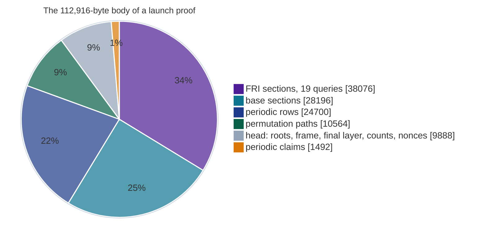
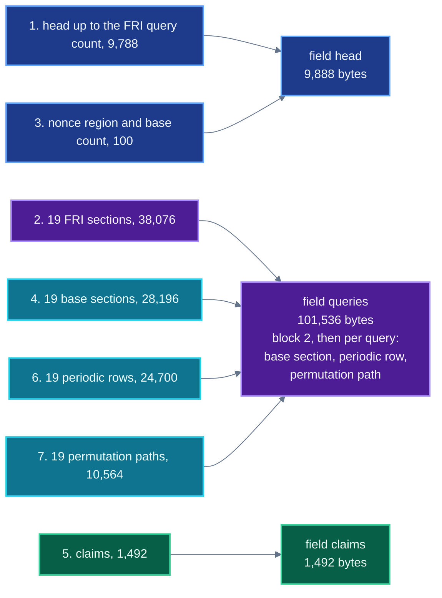

# Proof codec

This document gives the bytes of a launch proof, field by field, with the size of every section at
the deployed shape. It is for anyone writing a prover emitter, a relayer or a second decoder. The
decoder that runs on chain is `RealQueryWalk.readHead`, `readClaims`, `friQuery` and `baseQuery`.

`RealQueryVerify.sectionsOf` walks a whole proof body with the same field rules and returns the
offset of every section.

Every size below agrees with a parse of `spec/launch-honest/settlement.proof` and with the calldata
of the first launch transfer,
[`0xe622a831…484e`](https://sepolia.etherscan.io/tx/0xe622a8310a7321f4b743ae9e4c745cb5bc824abdea1590e5f9eb845d11f5484e).

The challenges drawn from these bytes are in [05-transcript.md](05-transcript.md), and the Merkle
and FRI rules in [06-merkle-and-fri.md](06-merkle-and-fri.md).

## Contents

1. [Primitives](#primitives)
2. [The package file](#the-package-file)
3. [The proof body](#the-proof-body)
4. [Sizes at the launch shape](#sizes-at-the-launch-shape)
5. [The `ONE_CALL` encoding](#the-one_call-encoding)
6. [What the proof carries and what the deployment fixes](#what-the-proof-carries-and-what-the-deployment-fixes)
7. [Refusals while decoding](#refusals-while-decoding)
8. [One value, three constants](#one-value-three-constants)

## Primitives

All integers are little-endian. A read past the end of its buffer reverts `OutOfBounds`, and
every field element is checked canonical where it is read (`RealQueryWalk.sol:486`, `:522`, `:741`).

```
u32     4 bytes LE                     counts and path lengths
u64     8 bytes LE                     grinding nonces
Fp      u64 LE with value < p          p = 2^64 - 2^32 + 1, else NonCanonicalFp
Fp2     Fp c0, then Fp c1              c0 + c1 X with X^2 = 7, 16 bytes
digest  24 raw bytes                   Keccak-256 truncated to its first 24 bytes
path    u32 k, then k digests          siblings from the leaf up to the root
```

A digest is held in memory as a `bytes32` whose first 24 bytes are the wire bytes and whose last
8 bytes are zero (`RealQueryWalk._digest`, `:407`). Merkle folding, the transcript and every
comparison read it at the same width.

A path carries its own length $k$. The verifier folds the $k$ siblings from the leaf, going left or
right by successive bits of the leaf index. It accepts only if the fold ends at the root and has
used every bit of the index (`RealQueryWalk.sol:285`, `StarkMerkle.sol:422`).

The depths below are those of a proof at the launch shape. A path of another length that still
reached the root would be a collision in truncated Keccak-256.

## The package file

The prover writes a package file: a 40-byte header, then the proof body. The verifier never reads
the header (`test/shield/LaunchBase.sol:51`, `:153`).

| bytes | field | value in the launch proofs |
|---|---|---|
| 0 to 3 | magic | ASCII `NOXP` |
| 4 to 5 | u16 format | 5 |
| 6 to 7 | u16 | 1 |
| 8 to 39 | parameter id, 32 bytes | `e5a79cfc…557589d`, the `params_id` of `spec/launch-honest/structure.json` |

The package file is 112,956 bytes: the 40-byte header and a 112,916-byte body. The transcript vector
`spec/launch-honest/transcript-kat.json` states `proof_bytes` = 112,956, and its `at` offsets count
from the start of the package file.

`spec/launch-honest/settlement.proof` is the body alone, 112,916 bytes.

## The proof body

The body is a head and then six blocks: the FRI sections, the nonce region, the base sections, the
claims, the periodic rows and the permutation paths. The data of one query is spread over four of
these blocks.

A reader that expects a query to be contiguous lands in the middle of a section and reads plausible
values from the wrong bytes.

```
offset   field                 size     rule
0        permRoot              24       round-two commitment: columns 34 to 43
24       regionWidth u32       4        must equal the deployment, 34             RegionWidthMismatch
28       traceRoot             24       round-one commitment: columns 0 to 33
52       compRoot              24       composition commitment
76       frameCount u32        4        must equal 2 * traceWidth = 88            OodFrameMismatch
80       frame[88]             1,408    Fp2 each: row at z, columns 0 to 43, then row at g z
1488     friRootCount u32      4        4 at the launch shape
1492     friRoots[4]           96       one per FRI layer
1588     finalCount u32        4        must equal 2^logFinal = 512               FriShapeNotTheDeployment
1592     final[512]            8,192    Fp2 coefficients, lowest degree first
9784     friQueryCount u32     4        read for bounds, never compared
9788     FRI section x 19      38,076   one per query, in position order
47864    queryNonce[8]         64       u64 each, in search order
47928    roundNonce[4]         32       u64 each, one per FRI layer
47960    baseQueryCount u32    4        read for bounds, never compared
47964    base section x 19     28,196   one per query, in position order
76160    claimCount u32        4        must equal nPeriodic = 93                 PeriodicCountMismatch
76164    claims[93]            1,488    Fp2 each: the periodic columns at z
77652    periodic row x 19     24,700   93 limbs and a path, one per query
102352   permutation path x 19 10,564   one per query
112916   end
```

The offsets are those `sectionsOf` returns on the launch proof, and the blocks tile the body with
no gap and no overlap.

**The frame.** Slot $c$ of row $k$ is $T_c(z_k)$ with $z_0 = z$ and $z_1 = g\,z$. The mask pair,
columns 42 and 43, is opened as one $\mathbb{F}_{p^2}$ value: slot 42 carries
$M_{42}(z_k) + X\,M_{43}(z_k)$ and slot 43 carries zero (`structure.json`, key `frame`).

The verifier refuses a nonzero slot 43 in either row with `MaskSlotNotZero(k)`
(`RealQueryVerify.sol:426`).

**The final layer** is the polynomial $F(Y) = \sum_{k=0}^{511} \texttt{final}[k]\,Y^k$, evaluated
by Horner (`RealQueryWalk._horner`, `:980`). Its length is its degree bound, so the deployment pins
the length.

**The nonce region** holds the 8 query nonces first and the 4 round nonces after them
(`RealQueryVerify.QUERY_NONCES_FIRST`, `:238`). The transcript takes them in protocol order: each
round nonce right after the root of its layer, and the query nonces after the final layer
([05](05-transcript.md)).

The region is $8 \cdot (8 + 4) = 96$ bytes (`RealQueryVerify.nonceBytes`, `:245`).

### FRI section

```
layers u32                    must equal friRootCount, 4                FoldChaseFailed
per layer m = 0, 1, 2, 3:
  v[4]    Fp2 x 4   64          the four values of the leaf, slots 0 to 3
  path              4 + 24 d_m  under friRoots[m], depth d_m = 21 - 2m
```

At layer $m$ the domain has $N_m = 2^{23 - 2m}$ points and a leaf holds the four values at
positions $i,\ i + N_m/4,\ i + N_m/2,\ i + 3N_m/4$. A query at position $q$ reads leaf
$q \bmod (N_m/4)$ (`RealQueryWalk.sol:167`). The depths are 21, 19, 17 and 15.

At layer 0 the value in slot $\lfloor q / (N/4) \rfloor$ is the DEEP value that base query $q$
checks (`RealQueryWalk.sol:181`). The base section carries no DEEP value of its own.

### Base section

```
rowWidth u32                  must equal traceWidth, 44                 TraceRowWidthMismatch
row[44]   Fp x 44   352         the whole trace row at the query position
tracePath           4 + 24*23   columns 0 to 33 under traceRoot
comp      Fp2       16          the composition value at the query position
compPath            4 + 24*23   under compRoot
```

The row is hashed as two leaves: columns 0 to 33 against `traceRoot` through `tracePath`, and
columns 34 to 43 against `permRoot` through the permutation path of the query
(`RealQueryWalk._auths`, `:770`).

### Claims, periodic rows and permutation paths

```
claims:            claimCount u32 = 93, then 93 Fp2         the periodic columns at z
periodic row, x19: 93 limbs (Fp), then a path of depth 23    under the periodicRoot of the deployment
perm path, x19:    a path of depth 23                        columns 34 to 43 of the row, under permRoot
```

The claims are absorbed into the transcript with the frame. The periodic row opens against a root
fixed at deployment, `0xbb761493…21fdbd`, and never against a root from the proof. A periodic limb
at or above $p$ reverts `NonCanonicalPeriodicLimb` once the row is summed (`RealQueryWalk.sol:915`).

## Sizes at the launch shape

Shape (`cast call` on `RealSplitVerifier` `0x59AA9624…747eA`): 19 queries, 44 columns, 93 periodic
columns, 24-byte digests, 4 FRI layers, 512 final coefficients, 8 query nonces, 4 round nonces,
and every Merkle path over the evaluation domain of depth 23.

| block | bytes | derivation |
|---|---:|---|
| package header | 40 | never read by the verifier |
| roots and region width | 76 | $24 + 4 + 24 + 24$ |
| frame | 1,412 | $4 + 88 \cdot 16$ |
| FRI roots | 100 | $4 + 4 \cdot 24$ |
| final layer | 8,196 | $4 + 512 \cdot 16$ |
| FRI query count | 4 | |
| FRI sections | 38,076 | $19 \cdot 2004$, with $2004 = 4 + \sum_{m=0}^{3} (64 + 4 + 24\,(21 - 2m))$ |
| nonce region | 96 | $8 \cdot (8 + 4)$ |
| base query count | 4 | |
| base sections | 28,196 | $19 \cdot 1484$, with $1484 = 4 + 44 \cdot 8 + (4 + 23 \cdot 24) + 16 + (4 + 23 \cdot 24)$ |
| claims | 1,492 | $4 + 93 \cdot 16$ |
| periodic rows | 24,700 | $19 \cdot 1300$, with $1300 = 93 \cdot 8 + 4 + 23 \cdot 24$ |
| permutation paths | 10,564 | $19 \cdot 556$, with $556 = 4 + 23 \cdot 24$ |
| **body** | **112,916** | the rows above, without the header |
| **package file** | **112,956** | $40 + 112{,}916$ |



Merkle siblings are most of the body. Each query opens eight paths: four FRI layers of depth 21,
19, 17 and 15, and four paths of depth 23 (trace, permutation, composition, periodic). At 24 bytes a
sibling, that is $19 \cdot 24 \cdot (72 + 4 \cdot 23) = 74{,}784$ bytes.

## The `ONE_CALL` encoding

The pool passes the verifier one `bytes` argument, cut from the body into three fields
(`test/shield/LaunchBase.sol:132`):

```
head    = body[0, 9788) ++ body[47864, 47964)        the head, then the nonce region and base count
claims  = body[76160, 77652)                          claimCount and the 93 claims
queries = the 19 FRI sections, then for each query in order:
          base section ++ periodic row ++ permutation path

proof   = abi.encode(ONE_CALL, head, claims, queries, 0, 0)
ONE_CALL = keccak256("NONOS-SHIELD-ONE-CALL-v1")
```



The FRI sections come first because each base query takes its DEEP value from the layer-zero leaf
that its FRI query opened and authenticated (`RealSplitVerifier.sol:239`).

| field | bytes in the first launch transfer |
|---|---:|
| head | 9,888 |
| claims | 1,492 |
| queries | 101,536 |
| the three fields together | 112,916 |
| `abi.encode(ONE_CALL, …)` | 113,216 |
| calldata of the whole `settleBatch` | 116,708 |

The `abi.encode` form adds six head words, one length word per field and the zero padding of the
claims to 1,504 bytes: $192 + (32 + 9888) + (32 + 1504) + (32 + 101536) = 113{,}216$. The last two
head words are zero and nothing reads them.

The rest of the calldata is the 12 public words, the residual, the attestation and the sealed notes
([17-client-data.md](17-client-data.md)).

`StagedStarkVerifier._field` (`:171`) reads each field as a length word at its offset and that many
bytes after it. Each read is a calldata slice, and a slice past the end of calldata reverts, so a
false offset or length cannot read outside the proof.

`ComposedStarkVerifier.verifyBatch` returns false for a proof of 192 bytes or fewer, or one whose
first word is not `ONE_CALL` (`ComposedStarkVerifier.sol:51`).

## What the proof carries and what the deployment fixes

No dimension of the proof is read from the proof. `RealSplitVerifier.shape()` packs the immutables
of the deployment into `RealQueryVerify.Shape`, and every decoder reads through it. The values are
tabulated in [03-verifier-overview.md](03-verifier-overview.md#shape-is-configuration).

| count on the wire | treatment |
|---|---|
| `regionWidth` | compared with 34 |
| `frameCount` | compared with $2 \cdot 44$ |
| `friRootCount` | any value decodes, then the FRI shape check requires $512 \cdot 4^{L} = 2^{17}$, so $L = 4$ |
| `finalCount` | compared with $2^9$ |
| `layers` in each FRI section | compared with `friRootCount` |
| `rowWidth` in each base section | compared with 44 |
| `claimCount` | compared with 93 |
| `friQueryCount`, `baseQueryCount` | read for bounds and discarded, the query count is `nq` = 19 |
| path lengths | folded as given, and the fold must use every bit of the index |

The deployment also fixes the number of nonces: `finalSearches` = 8 query nonces, and one round
nonce per FRI layer because `roundGrindBits` = 20 is nonzero.

Two coefficient counts are easy to confuse:

```
nCoeffs      = composition coefficients         38 transitions + 62 boundaries = 100
nDeepCoeffs  = 2 * traceWidth + 1 + nPeriodic   2 * 44 + 1 + 93 = 182
```

Both are powers of one drawn value at the launch shape, so each costs two squeezes in the
transcript whatever its length ([05](05-transcript.md)).

## Refusals while decoding

| error | meaning |
|---|---|
| `OutOfBounds` | a read ran past the buffer |
| `NonCanonicalFp` | a field element at or above $p$ |
| `NonCanonicalPeriodicLimb` | a periodic limb at or above $p$, checked when the row is summed |
| `RegionWidthMismatch` | the `regionWidth` of the proof is not 34 |
| `OodFrameMismatch` | the frame is not 88 values |
| `MaskSlotNotZero` | slot 43 of a frame row is not zero |
| `FriShapeNotTheDeployment` | the final layer is not 512 coefficients, or the FRI layers do not reach $2^{17}$ |
| `FoldChaseFailed` | a FRI section has a layer count other than the root count |
| `TraceRowWidthMismatch` | a base section row is not 44 limbs |
| `PeriodicCountMismatch` | the claim count is not 93 |
| `ClaimsNotTheDeployment` | claims are missing on a deployment with periodic columns, or present without them |
| `HeadTrailingBytes` | bytes after the head or after the claims |
| `ChunkLengthMismatch` | the `queries` field has bytes after its last section |
| `Panic(0x32)` | a final layer of zero coefficients |

Authentication and arithmetic failures, from `LayerAuthFailed` to `DeepMismatch`, are listed in
[06-merkle-and-fri.md](06-merkle-and-fri.md).

## One value, three constants

The number 7 is three unrelated constants: the coset shift (`ProductionAir.COSET_SHIFT`, compared
with the `cosetShift` immutable), the non-residue in $X^2 = 7$ (`StarkFieldExt.W`), and the
multiplicative generator from which the roots of unity come (`RealQueryVerify.GEN`).

Changing one does not change the others. `test/tools/audit/one-home-per-quantity.sh` counts
constants by name, and not by value, for this reason.
