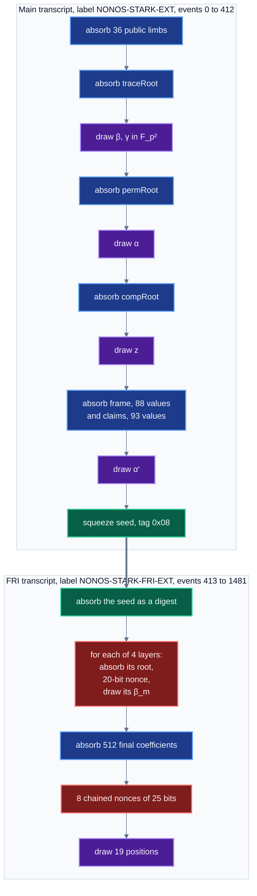

# Transcript

This document gives every absorb and every squeeze of the launch transcript, in order, with its tag
and its source. It is for anyone writing a prover, a replay tool or a second verifier.

One absorb out of order changes every later challenge, and the proof then fails at its first query
with an error that points elsewhere, usually a trace authentication or a DEEP mismatch.

`RealQueryVerify._mainCheckpoint` (`RealQueryVerify.sol:386`), `_deepCoeffs` (`:446`), `mainResume`
(`:461`) and `friChallenges` (`:483`) run the sequence below at the deployed shape. It has 1,482
events, and `spec/launch-honest/transcript-kat.json` lists every one of them with the state after
it.

The byte layout the absorbed values come from is in [04-proof-codec.md](04-proof-codec.md).

## Contents

1. [Construction](#construction)
2. [The whole sequence](#the-whole-sequence)
3. [The main transcript](#the-main-transcript)
4. [The FRI transcript](#the-fri-transcript)
5. [Event counts](#event-counts)
6. [Powers of one draw](#powers-of-one-draw)
7. [Beta, gamma and the mask pair](#beta-gamma-and-the-mask-pair)
8. [What the transcript does not absorb](#what-the-transcript-does-not-absorb)
9. [Grinding](#grinding)
10. [Tests that hold the order](#tests-that-hold-the-order)
11. [When a replay disagrees](#when-a-replay-disagrees)

## Construction

`StarkTranscript` is a Keccak-256 duplex over a 32-byte state $\sigma$. Write $H$ for Keccak-256,
$\|$ for concatenation, and $\mathrm{le}_8(\sigma)$ for the first 8 bytes of $\sigma$ read as a
little-endian integer. With $\ell$ an ASCII label and $\tau$ a one-byte tag:

$$
\begin{aligned}
\mathrm{new}(\ell) &: \ \sigma \leftarrow H(\ell) \\
\mathrm{absorb}(\tau, d) &: \ \sigma \leftarrow H(\tau \,\|\, \sigma \,\|\, d) \\
\mathrm{squeeze}(\tau) &: \ \sigma \leftarrow H(\tau \,\|\, \sigma), \quad u = \mathrm{le}_8(\sigma) \in [0, 2^{64})
\end{aligned}
$$

| operation | tag $\tau$ | data absorbed, or value returned | preimage bytes | source |
|---|---|---|---:|---|
| `absorbDigest` | `0x01` | the 24 wire bytes of a root, unpadded | 57 | `StarkTranscript.sol:67` |
| `absorbFp` | `0x02` | one field element, 8 bytes little-endian | 41 | `:78` |
| `challengeFp` | `0x03` | $u - p$ if $u \ge p$, else $u$. Not used at launch | 33 | `:174` |
| `challengeIndex` | `0x04` | $u \mathbin{\&} (2^{23} - 1)$ | 33 | `:304` |
| `verifyPow` | `0x05` | the nonce, 8 bytes little-endian, see [Grinding](#grinding) | 41 | `:310` |
| `challengeFp2` | `0x06`, `0x07` | $c_0$ from a squeeze under `0x06`, then $c_1$ under `0x07`, each reduced as `challengeFp` | 33 each | `:178` |
| seed | `0x08` | the state itself, handed to the FRI transcript | 33 | `RealQueryVerify.sol:469` |

An $\mathbb{F}_{p^2}$ value is absorbed as two `absorbFp` calls, $c_0$ then $c_1$. At 24 bytes a
digest preimage is $1 + 32 + 24 = 57$ bytes. Absorbing the digest padded to 32 bytes gives a
different state.

The batch forms `absorbFpArray`, `absorbFp2Array` and `challengeFp2Batch` hash the same preimages as
the loops they replace.

### Distribution of a challenge

If $u$ is uniform on $[0, 2^{64})$, the reduction $u \mapsto u - p\,[u \ge p]$ maps the $m$ values
$u \ge p$ onto $[0, m)$, which are then twice as likely as the rest. With $m = 2^{64} - p = 2^{32} - 1$,
the statistical distance from uniform on $\mathbb{F}_p$ is

$$
\tfrac12 \sum_{v} \Big| \Pr[v] - \tfrac1p \Big| \;=\; \frac{2m}{2^{64}} - \frac{m}{p} \;\approx\; 2^{-32}.
$$

`challengeIndex` keeps the low 23 bits of $u$, which is uniform on $[0, 2^{23})$ when $u$ is
uniform. The 19 positions are drawn with replacement and duplicates are kept. The probability of
any repeat is at most $\binom{19}{2} / 2^{23} = 171 / 2^{23} < 2^{-15}$.

## The whole sequence

The two transcripts are linked by the seed only. Everything the main transcript absorbed, the
public limbs included, is behind it, so the positions depend on the whole proof and are drawn
after every proof of work.

## The main transcript

Label `"NONOS-STARK-EXT"`. The event numbers are the indices of `transcript-kat.json`. The offsets
are body offsets ([04](04-proof-codec.md#the-proof-body)). The vector counts its `at` offsets from
the start of the package file, which begins with a 40-byte header.

| events | operation | tag | value | from |
|---|---|---|---|---|
| 0 | `new` | | label `NONOS-STARK-EXT` | |
| 1 to 36 | `absorbFp` x 36 | `0x02` | the 36 public limbs | `PublicWords.publicsOf` |
| 37 | `absorbDigest` | `0x01` | `traceRoot` | body 28 |
| 38, 39 | `challengeFp2` | `0x06`, `0x07` | $\beta$ | |
| 40, 41 | `challengeFp2` | `0x06`, `0x07` | $\gamma$ | |
| 42 | `absorbDigest` | `0x01` | `permRoot` | body 0 |
| 43, 44 | `challengeFp2` | `0x06`, `0x07` | $\alpha$, the composition coefficients are $\alpha^0, \dots, \alpha^{99}$ | |
| 45 | `absorbDigest` | `0x01` | `compRoot` | body 52 |
| 46, 47 | `challengeFp2` | `0x06`, `0x07` | $z$, the out-of-domain point | |
| 48 to 223 | `absorbFp` x 176 | `0x02` | the frame: 88 values, row at $z$ then row at $g z$, $c_0$ then $c_1$ | body 80 |
| 224 to 409 | `absorbFp` x 186 | `0x02` | the claims: 93 values $P_m(z)$, $c_0$ then $c_1$ | body 76164 |
| 410, 411 | `challengeFp2` | `0x06`, `0x07` | $\alpha'$, the DEEP coefficients are $\alpha'^0, \dots, \alpha'^{181}$ | |
| 412 | squeeze | `0x08` | the seed $\sigma_s$, the state after this squeeze | |

The public limbs enter first, as the prover absorbed them, so an accepted proof is bound to them.
`PublicWords.publicsOf` (`PublicWords.sol:33`) expands the 12 pool words into 36 limbs. Words 0 to 5
become four 64-bit limbs each, low limb first. Words 6 to 9 are one limb each.

The two address words, 10 and 11, must fit 160 bits and split into limbs of 48, 48, 48 and 16 bits,
low first, so every address has one encoding. A limb at or above $p$ reverts `NonCanonicalLimb`.

The state after event 409 is the checkpoint: it commits to the public limbs, the three roots, the
frame and the claims. `mainCheckpointCoeffs` returns it with $\beta$, $\gamma$, $z$ and the 100
composition coefficients, which go to the evaluator ([03](03-verifier-overview.md)).

## The FRI transcript

Label `"NONOS-STARK-FRI-EXT"`. It starts from its own label and absorbs the seed as a 24-byte
digest (`RealQueryVerify.sol:489`).

| events | operation | tag | value | from |
|---|---|---|---|---|
| 413 | `new` | | label `NONOS-STARK-FRI-EXT` | |
| 414 | `absorbDigest` | `0x01` | the first 24 bytes of the seed $\sigma_s$ | |
| 415 | `absorbDigest` | `0x01` | `friRoots[0]` | body 1492 |
| 416 | `verifyPow` | `0x05` | `roundNonce[0]`, 20 bits | body 47928 |
| 417, 418 | `challengeFp2` | `0x06`, `0x07` | $\beta_0$ | |
| 419 to 422 | the same | | `friRoots[1]`, `roundNonce[1]`, $\beta_1$ | body 1516, 47936 |
| 423 to 426 | the same | | `friRoots[2]`, `roundNonce[2]`, $\beta_2$ | body 1540, 47944 |
| 427 to 430 | the same | | `friRoots[3]`, `roundNonce[3]`, $\beta_3$ | body 1564, 47952 |
| 431 to 1454 | `absorbFp` x 1,024 | `0x02` | the 512 final coefficients, $c_0$ then $c_1$ | body 1592 |
| 1455 to 1462 | `verifyPow` x 8 | `0x05` | `queryNonce[0..7]`, 25 bits each, chained | body 47864 |
| 1463 to 1481 | `challengeIndex` x 19 | `0x04` | the positions $q_0, \dots, q_{18}$ | |

Each round nonce is checked and absorbed after the root of its layer and before the fold challenge
of that layer (`RealQueryVerify.sol:494`). The final layer is absorbed before the query nonces and
the positions, so a prover cannot choose the final polynomial after it sees the queries.

The positions are the only ones in the proof. FRI query $k$ folds at $q_k$, and base query $k$
opens the trace, composition and periodic rows at the same $q_k$
([03](03-verifier-overview.md#one-verification-end-to-end)).

## Event counts

| kind | count | from |
|---|---:|---|
| `new` | 2 | the two labels |
| `absorb_fp` | 1,422 | $36 + 2 \cdot 88 + 2 \cdot 93 + 2 \cdot 512 = 36 + 176 + 186 + 1024$ |
| `absorb_digest` | 8 | `traceRoot`, `permRoot`, `compRoot`, the seed, 4 FRI roots |
| `absorb_nonce` | 12 | 4 round nonces and 8 query nonces |
| `challenge_fp2`, $c_0$ and $c_1$ each | 9 | $\beta$, $\gamma$, $\alpha$, $z$, $\alpha'$, $\beta_0$ to $\beta_3$ |
| `challenge_seed` | 1 | tag `0x08` |
| `challenge_index` | 19 | the positions |
| **total** | **1,482** | $2 + 1422 + 8 + 12 + 18 + 1 + 19$ |

These are the counts of `spec/launch-honest/transcript-kat.json`, whose `events` field is 1,482.

## Powers of one draw

At launch both coefficient vectors are powers of one draw (`powerCoeffs` and `powerDeep` read true
on `0x59AA9624…747eA`):

$$
\alpha_i = \alpha^{i}, \quad 0 \le i < 100, \qquad\qquad k_n = \alpha'^{\,n}, \quad 0 \le n < 182 .
$$

Each vector costs one `challengeFp2`, two squeezes, whatever its length (`TS.powers`,
`StarkTranscript.sol:276`). The first coefficient of each is 1.

The DEEP coefficients are ordered frame row $z$ (44), frame row $g z$ (44), composition (1),
periodic claims (93), as `RealQueryVerify.nDeepCoeffs` (`:44`) counts them.

## Beta, gamma and the mask pair

$\beta$ and $\gamma$ are drawn in $\mathbb{F}_{p^2}$ after `traceRoot` and before `permRoot`
(`extChallenges` reads true).

The prover builds the permutation columns 34 to 43 from them and commits those under `permRoot`, so
those columns cannot be chosen with knowledge of the challenges they are tested at.

The verifier hands the evaluator $(\beta_0, \beta_1, \gamma_0, \gamma_1, z_0, z_1)$ in that order
(`RealSplitVerifier.sol:316`), and the launch program reads four challenge inputs
(`LaunchProgram.N_CHALLENGES`).

The mask pair enters the frame as one value in slot 42 with slot 43 zero. The verifier checks slot
43 of both rows after it draws $z$ and before it absorbs the frame (`RealQueryVerify.sol:426`). The
zeros are absorbed like any other cell.

After the DEEP coefficients are drawn, the coefficient of column 43 in each row is set to $X$ times
that of column 42 (`RealQueryVerify.sol:450`):

$$
k_{44r + 43} = X \cdot k_{44r + 42} = 7\,k_{44r+42,1} + k_{44r+42,0}\,X, \qquad r \in \{0, 1\}.
$$

This overwrites two of the 182 powers. It changes no transcript event.

## What the transcript does not absorb

`regionWidth`, the counts in the body, and every value opened at a query: rows, composition values,
periodic rows, FRI leaves and paths. They are authenticated against the absorbed roots instead.
$\mathrm{comp}_z$ is not absorbed either.

The verifier computes it from values absorbed before $\alpha'$ was drawn, the frame, the claims,
$\beta$, $\gamma$, $z$ and the public limbs, so it is fixed before the DEEP coefficients exist.

## Grinding

`verifyPow` computes $h = H(\texttt{0x05} \,\|\, \sigma \,\|\, \mathrm{le}_8(\mathrm{nonce}))$ and
accepts when

$$\mathrm{le}_8(h) < 2^{64 - b},$$

that is, when the word has at least $b$ leading zero bits (`StarkTranscript.sol:331`). On success
$h$ becomes the state. On failure the state is unchanged and the verifier reverts.

| grind | bits | count | refusal | expected prover work |
|---|---:|---:|---|---|
| round nonce, after each FRI root | 20 | 4 | `RoundGrindRejected(m)` | $4 \cdot 2^{20}$ hashes |
| query nonce, after the final layer | 25 | 8 | `FinalGrindRejected(i)` | $8 \cdot 2^{25} = 2^{28}$ hashes |

The 8 query nonces are chained: nonce $i$ is checked against the state that nonce $i - 1$ left, so
no nonce can be searched before the previous nonce is fixed. The soundness bound counts them as
$25 + \log_2 8 = 28$ bits (`StagedStarkVerifier._outerTerms`, `:97`).

The bits come from the immutables `roundGrindBits` = 20 and `grindBits` = 25 through the shape,
never from the proof.

## Tests that hold the order

| test | what it holds |
|---|---|
| `LaunchTranscriptTest.test_theMainTranscriptIsThePackages` | for four launch proofs: $\beta$, $\gamma$, the first four powers of $\alpha$, 100 coefficients, $z$ and the checkpoint state equal the vector |
| `LaunchTranscriptTest.test_theDeepCoefficientsAndSeedAreThePackages` | $\alpha'$, its first four powers, the last coefficient $\alpha'^{181}$, and the seed |
| `LaunchTranscriptTest.test_eachFoldNonceAndChallengeIsThePackages` | per layer: root, round nonce with 20 leading zero bits, then $\beta_m$ |
| `LaunchTranscriptTest.test_theSplitGrindAndThePositionsAreThePackages` | the 8 query nonces, the state after each, the 19 positions, and no event left over |
| `LaunchTranscriptTest.test_aQueryNonceSearchedAheadIsRefused` | two swapped query nonces revert `FinalGrindRejected(0)` |
| `LaunchTranscriptTest.test_aFoldNonceUnderItsBoundIsRefused` | one bit flipped in any round nonce reverts `RoundGrindRejected(m)` |
| `LaunchGateTest.test_theOraclesMatch` | the replay reaches the $z$, $\beta$ and $\gamma$ of the prover, and the evaluator its $\mathrm{comp}_z$ |
| `LaunchGateTest.test_aTamperedNonceIsRefused` | one bit off in any of the 12 nonces and the proof is refused |
| `RoundTwoCodecTest.test_theRoundTwoReplayIsTheOrderWrittenOutByHand` | the round-two order, trace root, $\beta$, $\gamma$, permutation root, against the same operations written out |
| `TranscriptAgainstOracleTest.test_thePointWeSqueezeIsThePointTheProverDrew` | the same library, at a larger two-round shape in `spec/emit-current`, reaches the $z$ its prover drew |

Matching $z$ is evidence for the whole sequence before it. $z$ is squeezed after every public
limb, the three roots, both permutation challenges and $\alpha$. Reaching the same state along a
different sequence takes a Keccak collision.

## When a replay disagrees

Check the inputs of the replay before changing the contract. A two-round proof replayed through a
one-round transcript does not fail on its own terms. It derives a $z$ the proof never opened.

Two sides that share a mistake agree, so compare against an independent value, such as the $z$ in
`oracle.json` or the states in `transcript-kat.json`, and never against a second run of the same
model.
