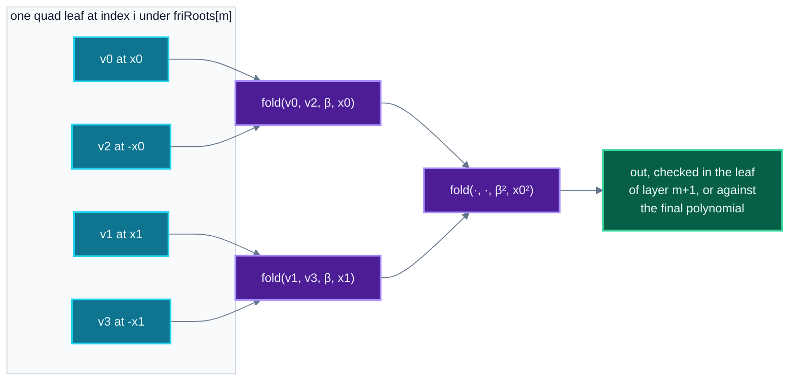
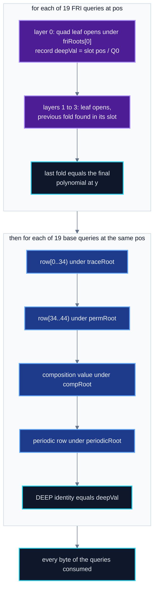

# Merkle and FRI

How the verifier authenticates opened values and runs the FRI low-degree test on the launch
stack: the leaf and node hashing rules, the tree each value opens under, how the DEEP value is read
from FRI layer zero, and the radix-4 fold with its chaining, final layer and grinding. For anyone
who writes a prover commitment, a decoder or an independent checker. Byte layouts are in
[04-proof-codec.md](04-proof-codec.md), and the transcript that draws every challenge and position
is in [05-transcript.md](05-transcript.md).

- [Notation](#notation)
- [Hashing rules](#hashing-rules)
- [Which tree each value opens under](#which-tree-each-value-opens-under)
- [Hashing rows from the wire](#hashing-rows-from-the-wire)
- [The two-half row check](#the-two-half-row-check)
- [The DEEP value in FRI layer zero](#the-deep-value-in-fri-layer-zero)
- [FRI at radix 4](#fri-at-radix-4)
- [Grinding](#grinding)
- [Order of the checks](#order-of-the-checks)
- [Refusals](#refusals)
- [Code on no deployed path](#code-on-no-deployed-path)

Every contract named here is in `contracts/shield/verifier/`. The deployed entry point is
`RealSplitVerifier.verifyWholeComposed`. It draws challenges with `RealQueryVerify` and runs every
per-query check with `RealQueryWalk`, which reads the proof where it lies in calldata.

## Notation

| symbol | meaning | value on the launch stack |
|---|---|---|
| $p$ | Goldilocks modulus $2^{64} - 2^{32} + 1$ | `RealQueryWalk.P` |
| $\mathbb{F}_{p^2}$ | $\mathbb{F}_p[X]/(X^2 - 7)$. Opened composition values, FRI values and every challenge live here | |
| $N$ | evaluation domain size, $2^{\texttt{logDomain}}$ | $2^{23}$ |
| $t$ | trace length, $2^{\texttt{logTraceLen}}$ | $2^{13}$ |
| $\omega$ | generator of the order-$N$ subgroup, $7^{(p-1)/N}$ (`RealQueryVerify.domainRoot`) | |
| $g$ | generator of the order-$t$ subgroup, $7^{(p-1)/t}$ | |
| $s$ | coset shift, `ProductionAir.COSET_SHIFT` | 7 |
| $w$ | trace width, `traceWidth` | 44 |
| $r_w$ | row split, `regionWidth` | 34 |
| $P$ | periodic columns, `nPeriodic` | 93 |
| $d$ | Merkle digest width in bytes, `digestBytes` | 24 |
| $L$ | FRI layers, one root each | 4 |
| $F$ | final layer coefficients, $2^{\texttt{logFinal}}$ | 512 |
| $H$ | Keccak-256 | |

The values are read by `eth_call` from `RealSplitVerifier` at
`0x59AA962433060D0206C3595afEb1793c621747eA` on Sepolia and agree with
`spec/launch-honest/structure.json` and `layout.json`. $L = 4$ follows from the checked FRI shape
([below](#final-layer-and-fri-shape)).

The constructor refuses a `cosetShift` other than `ProductionAir.COSET_SHIFT`
(`CosetShiftMismatch`), because the FRI fold uses that constant and the DEEP check uses the
configured one.

A field element on the wire and in every leaf preimage is 8 bytes little-endian. An element of
$\mathbb{F}_{p^2}$ is its two coefficients $c_0, c_1$ in that order.

## Hashing rules

All Merkle hashing is Keccak-256 over a domain tag followed by the payload. Each kind of preimage
has its own tag, so no leaf can be read as another kind of leaf or as an internal node
(`StarkMerkle`, `RealQueryWalk.DOM_QUAD`).

| kind | preimage | bytes on the launch stack | used for |
|---|---|---:|---|
| node | `"NONOS-STARK-MERKLE-NODE" ‖ left[..d] ‖ right[..d]` | $23 + 2d = 71$ | every internal node |
| wide leaf | `"NONOS-STARK-MERKLE-LEAF-WIDE" ‖ v_0 ‖ … ‖ v_{n-1}` | $28 + 8 \cdot 34 = 300$ and $28 + 8 \cdot 10 = 108$ | the two halves of a trace row |
| periodic leaf | `"NONOS-STARK-PERIODIC-WIDE" ‖ v_0 ‖ … ‖ v_{P-1}` | $25 + 8 \cdot 93 = 769$ | periodic rows |
| extension leaf | `"NONOS-STARK-MERKLE-LEAF-EXT" ‖ c0 ‖ c1` | 43 | composition values |
| quad leaf | `"NONOS-STARK-MERKLE-LEAF-QUAD" ‖ a.c0 ‖ a.c1 ‖ b.c0 ‖ b.c1 ‖ c.c0 ‖ c.c1 ‖ d.c0 ‖ d.c1` | 92 | FRI layers |

**Truncation.** Let $\mathrm{tr}_d(h)$ be the first $d$ bytes of a 32-byte digest $h$, left
aligned with a zero tail. A leaf digest is $\mathrm{tr}_d(H(\text{leaf preimage}))$ and a node is

$$\mathrm{node}(\ell, r) = \mathrm{tr}_d\big(H(\texttt{"NONOS-STARK-MERKLE-NODE"} \,\|\, \ell \,\|\, r)\big),$$

with $\ell$ and $r$ already $d$ bytes long (`StarkMerkle.hashNode`, `StarkMerkle.walk`). Roots on
the wire, roots in the transcript and siblings are all $d$ bytes. Every digest read from calldata is
masked to its first $d$ bytes (`RealQueryWalk._digest`, `StarkMerkle.walk`), so no byte past $d$
can reach a hash. A digest cut to $d$ bytes binds up to the birthday bound, $2^{8d/2}$ work, which
is $2^{96}$ at $d = 24$ (NatSpec on `StarkMerkle.hashNode`).
[02-threat-model.md](02-threat-model.md) discusses the width.

**Path layout.** A path on the wire is a u32 little-endian sibling count $k$, then $k$ siblings of
$d$ bytes each, packed with no padding (`RealQueryWalk._pathSpan`, `_path`).

**Path verification.** Given a leaf digest $h_0$, a leaf index $j$ and siblings
$\sigma_0, \dots, \sigma_{k-1}$, the verifier computes

$$h_{i+1} = \begin{cases} \mathrm{node}(h_i, \sigma_i) & \text{if } \lfloor j / 2^i \rfloor \equiv 0 \pmod 2 \\ \mathrm{node}(\sigma_i, h_i) & \text{otherwise} \end{cases}$$

and accepts only if $h_k$ equals the root and $\lfloor j / 2^k \rfloor = 0$ (`StarkMerkle.walk`).
The second condition refuses a path shorter than the bit length of the index. The count $k$ comes
from the proof. A path longer than the tree reaches the root only through a Keccak collision at
some level.

## Which tree each value opens under

With $\mathrm{pos}$ a query position in $[0, N)$ and $Q_m = N / 4^{m+1}$:

| root | leaf | leaf index | depth |
|---|---|---|---:|
| `traceRoot` | wide leaf over columns $0 \dots r_w - 1$ | $\mathrm{pos}$ | 23 |
| `permRoot` | wide leaf over columns $r_w \dots w - 1$ | $\mathrm{pos}$ | 23 |
| `compRoot` | extension leaf, one composition value | $\mathrm{pos}$ | 23 |
| `periodicRoot` | periodic leaf, all $P$ periodic values at the position | $\mathrm{pos}$ | 23 |
| `friRoots[m]` | quad leaf over layer $m$, a domain of $N/4^m$ points | $\mathrm{pos} \bmod Q_m$ | $21 - 2m$ |

The depths are those of the paths in `spec/launch-honest/settlement.proof`: 23 for every base
opening, and 21, 19, 17, 15 for the four FRI layers.

`periodicRoot` is a constructor immutable of `RealSplitVerifier` and is never read from the proof,
so the periodic columns are a property of the deployment. On Sepolia it reads
`0xbb7614937ae6d7e5e26e88610fae8ff9e5195fef4721fdbd` followed by eight zero bytes, the value in
`layout.json`.

Every other root comes from the proof head and is absorbed into a transcript before
any position that opens it is drawn. `traceRoot`, `permRoot` and `compRoot` enter the main
transcript before $z$ (`RealQueryVerify._mainCheckpoint`). Each FRI root enters the FRI transcript
before its fold challenge, and all of them before the positions (`friChallenges`).

## Hashing rows from the wire

A queried trace row ($w = 44$ values), a composition value and a periodic row ($P = 93$ values) are
hashed straight from the calldata they arrived in (`StarkMerkle.hashWire`). The wire already holds
each value as 8 little-endian bytes, which is the leaf preimage, so nothing is decoded and
re-encoded.

Canonicality is checked where the values are read. The trace row and the composition limbs are
checked below $p$ as the section is walked (`RealQueryWalk._spans`, `NonCanonicalFp`). Periodic
limbs are checked as they are summed into the DEEP combination (`RealQueryWalk._periodic`,
`NonCanonicalPeriodicLimb`). A value in $[p, 2^{64})$ would be a second encoding of a field element.
The prover commits each leaf with canonical values, so such bytes also fail their path.

The row width is fixed. `_spans` refuses a trace row whose declared width is not `traceWidth`
(`TraceRowWidthMismatch`), and the periodic row is always read as `nPeriodic` values with no count
on the wire.

## The two-half row check

The launch stack commits in two rounds (`nChal = 2`). Each queried row is authenticated as two wide
leaves at the same index (`RealQueryWalk._auths`):

```
row[0 .. 34)    -> traceRoot   trace path   TraceAuthFailed(q)
row[34 .. 44)   -> permRoot    perm path    CopyCommitMismatch(q)
```

Columns 34 to 43 hold the permutation accumulators and the mask pair, committed after $\beta$ and
$\gamma$ are drawn ([07-constraints.md](07-constraints.md)).

`regionWidth` is a constructor immutable that must satisfy $0 < r_w < w$ (`RegionWidthOutOfRange`).
The head carries a copy of it, and `RealQueryWalk.readHead` refuses a copy that differs
(`RegionWidthMismatch`). A split chosen by the proof could present two valid openings for a row that
was never committed as one.

`CopyCommitMismatch` is its own error because it means the columns committed after the permutation
challenges do not open.

In a base query section the permutation path comes last, after the periodic row and its path
([04](04-proof-codec.md)).

## The DEEP value in FRI layer zero

The launch stack has no separate DEEP commitment. The consistency check runs at the FRI positions,
and the DEEP value at position $\mathrm{pos}$ is read from the layer-zero leaf that FRI query $q$
opens and authenticates under `friRoots[0]` (`RealQueryWalk._layer`, case `m = 0`):

$$\text{leaf index} = \mathrm{pos} \bmod Q_0, \qquad \text{slot} = \lfloor \mathrm{pos} / Q_0 \rfloor \in \{0, 1, 2, 3\}, \qquad \mathtt{deepVal} = v^{(0)}_{\text{slot}}, \qquad Q_0 = N/4 .$$

The consistency check reads its value from the codeword that FRI tests. The DEEP identity is then
checked against that value (`RealQueryWalk.baseQuery`, `_deep`).

Let $x = s\,\omega^{\mathrm{pos}} \in \mathbb{F}_p$, let $\mathrm{row}_c \in \mathbb{F}_p$ be the
opened row, $o_{rw + c} \in \mathbb{F}_{p^2}$ the out-of-domain frame at $g^r z$ for
$r \in \{0, 1\}$, $\mathrm{comp} \in \mathbb{F}_{p^2}$ the opened composition value, $\pi_j$ the opened periodic
row, $\hat\pi_j$ the periodic claims at $z$, and $k_0, \dots, k_{2w+P}$ the DEEP coefficients. The
verifier computes

$$\mathrm{deep}(x) = \frac{\sum_{c=0}^{w-1} k_{c}\,(\mathrm{row}_c - o_{c}) + k_{2w}\,(\mathrm{comp} - \mathrm{comp}_z) + \sum_{j=0}^{P-1} k_{2w+1+j}\,(\pi_j - \hat\pi_j)}{x - z} + \frac{\sum_{c=0}^{w-1} k_{w+c}\,(\mathrm{row}_c - o_{w+c})}{x - g z}$$

and requires $\mathrm{deep}(x) = \mathtt{deepVal}$, else `DeepMismatch(q, got, want)` with both sides
in the error. There are $2w + 1 + P = 182$ coefficients (`RealQueryVerify.nDeepCoeffs`).

The code regroups the sum so a query multiplies base-field row limbs only. The constant parts
$\sum_c k_c o_c + k_{2w}\,\mathrm{comp}_z + \sum_j k_{2w+1+j}\hat\pi_j$ and $\sum_c k_{w+c} o_{w+c}$
do not depend on the query, so `RealQueryWalk.prepareDeep` computes them once per proof. Both
fractions share one inversion (`_inverses`). Products in $\mathbb{F}_{p^2}$ are written out as
$(a_0 + a_1X)(b_0 + b_1X) = (a_0b_0 + 7a_1b_1) + (a_0b_1 + a_1b_0)X$.

**Coefficients and the mask pair.** The coefficients are powers of one draw $\delta$,
$k_n = \delta^n$, with two exceptions (`RealQueryVerify._deepCoeffs`). The mask pair, columns 42
and 43, is opened as one $\mathbb{F}_{p^2}$ value $M_{42} + X M_{43}$ in frame slot 42, and frame
slot 43 must be zero at both $z$ and $gz$ (`MaskSlotNotZero`). Column 43 then takes the coefficient
$X$ times that of column 42:

$$k_{43} = X\,k_{42}, \qquad k_{87} = X\,k_{86},$$

so $k_{42}\,\mathrm{row}_{42} + k_{43}\,\mathrm{row}_{43} = k_{42}(\mathrm{row}_{42} + X\,\mathrm{row}_{43})$
and the two terms combine into one term on the opened pair.

$\mathrm{comp}_z$ is the value of the composition polynomial at $z$. `LaunchEvaluator` computes it
from the constraints of the circuit, the frame, the periodic claims, the composition coefficients
and the public limbs of this call ([07-constraints.md](07-constraints.md)). No caller supplies it.

## FRI at radix 4

Each FRI layer folds by four. One quad leaf holds the four values a fold consumes, one path
authenticates them, and a layer is two halvings, the first under $\beta_m$ and the second under
$\beta_m^2$. $\beta_m \in \mathbb{F}_{p^2}$ is drawn from the FRI transcript after `friRoots[m]`
and its round nonce are absorbed.

For a query position $\mathrm{pos}$ and layer $m \in \{0, 1, 2, 3\}$
(`RealQueryWalk.friQuery`, `_layer`):

$$Q_m = N / 4^{m+1}, \qquad i_m = \mathrm{pos} \bmod Q_m .$$

The four values $v_0, v_1, v_2, v_3$ are the layer-$m$ values at $i_m$, $i_m + Q_m$,
$i_m + 2Q_m$ and $i_m + 3Q_m$, 64 bytes on the wire in that order. They open as one quad leaf at
index $i_m$ under `friRoots[m]`, else `LayerAuthFailed(q, m)`. With

$$\mathrm{fold}(a, b, \beta, x) = \frac{a + b}{2} + \beta \cdot \frac{a - b}{2x},$$

$$x_0 = \big(s\,\omega^{i_m}\big)^{4^m}, \qquad x_1 = x_0\,\zeta, \qquad \zeta = \omega^{N/4},$$

the output of the layer is

$$\mathrm{out}_m = \mathrm{fold}\big(\mathrm{fold}(v_0, v_2, \beta_m, x_0),\ \mathrm{fold}(v_1, v_3, \beta_m, x_1),\ \beta_m^2,\ x_0^2\big)$$

(`RealQueryWalk._quadFold`, `_fold2`).

The code carries $1/x_0$ from layer to layer. With $k = \lfloor i_{m-1} / Q_m \rfloor$ the next
inverse is $(1/x_0)^4\,\zeta^{k}$, and $\zeta^{k} = (\zeta^{-1})^{4-k}$, so one inversion per query
suffices.



The pairing is correct because $\omega^{4^m}$ has order $N/4^m$. The value at $i_m + 2Q_m$ sits
at $x_0\,\omega^{4^m \cdot 2Q_m} = -x_0$ and the value at $i_m + 3Q_m$ at $-x_1$, so each inner fold
combines $f(y)$ and $f(-y)$. $\zeta$ is a primitive fourth root of unity, so $x_1^2 = -x_0^2$ and
the outer fold again pairs a point with its negation, at $x_0^2$.

Writing $f(x) = f_e(x^2) + x f_o(x^2)$, one halving maps $f$ to $f_e + \beta f_o$, a polynomial of
half the degree.

**Chaining.** For $m \ge 1$ the output of layer $m-1$ must equal the value at its own position in
layer $m$, which is one of the four values opened there:

$$\mathrm{out}_{m-1} = v^{(m)}_{k}, \qquad k = \lfloor i_{m-1} / Q_m \rfloor,$$

else `FoldChaseFailed(q)`. After the last layer the output must equal the final polynomial at the
final point of this query, which the verifier computes from the position:

$$y = \big(s\,\omega^{\mathrm{pos} \bmod (N / 4^L)}\big)^{4^L}, \qquad \mathrm{out}_{L-1} = \sum_{k=0}^{F-1} c_k\, y^{k}$$

(`ProductionAir.xFinal` with `nFolds = 2L`, and `RealQueryWalk._horner`). At the launch shape
$N/4^L = 2^{15}$ and $4^L = 256$. A query whose layer count differs from the number of FRI roots, a
broken chain, or a final mismatch reverts `FoldChaseFailed(q)`. `Radix4.t.sol` holds the fold and
the leaf order, and `yul/RealQueryWalkDiff.t.sol` holds the calldata walk to its memory reference.

### Final layer and FRI shape

The final layer is a list of $F$ coefficients $c_k \in \mathbb{F}_{p^2}$, lowest degree first
(`finalAsCoefficients = true`). Its length is the degree check: $F$ coefficients describe a
polynomial of degree below $F$. The deployment fixes the length and the number of folds, and
`RealSplitVerifier._friShape` checks on every head that

$$\mathtt{finalCount} = 2^{\mathtt{logFinal}}, \qquad \mathtt{finalCount} \cdot 4^{L} = 2^{\mathtt{logDegreeBound}} .$$

On chain $\mathtt{logFinal} = 9$ and $\mathtt{logDegreeBound} = 17$, so $512 \cdot 4^4 = 2^{17}$
over a domain of $2^{23}$, a rate of $2^{-6} = 1/64$. A proof that folds a different number of
times, or stops at a different size, reverts `FriShapeNotTheDeployment`. The constructor refuses a
shape that whole folds cannot reach (`FriShapeUnpinned`). Every final coefficient is absorbed into
the FRI transcript before the query nonces are checked.

## Grinding

Two kinds of proof of work run in the FRI transcript (`RealQueryVerify.friChallenges`,
[05](05-transcript.md)). A nonce $n$ passes $b$ bits when the first 8 bytes of
$H(\texttt{0x05} \,\|\, \sigma \,\|\, n_{\mathrm{le}})$, read as a little-endian u64, have at least
$b$ leading zero bits. The state $\sigma$ advances to that hash only on success
(`StarkTranscript.verifyPow`).

| grind | where | bits | on failure |
|---|---|---:|---|
| round nonce, one per FRI layer | after `friRoots[m]` is absorbed, before $\beta_m$ is drawn | `roundGrindBits` = 20 | `RoundGrindRejected(m)` |
| query nonces, 8 chained | after the final layer, before the positions | `grindBits` = 25 each | `FinalGrindRejected(i)` |

Each query nonce is checked against the state the previous one left, so no nonce can be
searched before the nonce ahead of it is found (`LaunchTranscript.t.sol`,
`test_aQueryNonceSearchedAheadIsRefused`).

The 19 positions are drawn after the last nonce, and the base queries use the same positions, so the
proof of work covers the consistency check as well as FRI.

On the wire the nonce region sits between the FRI sections and the base sections: the 8 query
nonces, then the 4 round nonces, each a u64 little-endian (`RealQueryWalk._nonces`,
`RealQueryVerify.QUERY_NONCES_FIRST`). What the grinding adds to soundness is in
[20-security-status.md](20-security-status.md).

## Order of the checks



`RealSplitVerifier._fri` walks every FRI query first and keeps each DEEP value. `_bases` then walks
every base query. Within a base query every opening is authenticated before its values enter
arithmetic (`RealQueryWalk.baseQuery`: `_spans`, `_auths`, then `_deep`). A queries blob with bytes
left over reverts `ChunkLengthMismatch`.

## Refusals

Refusals on the path of a launch proof, from the head decoder, the transcript and the calldata walk:

| error | where | meaning |
|---|---|---|
| `OutOfBounds` | `RealQueryWalk` | a read past the end of a section |
| `HeadTrailingBytes` | `readHead`, `readClaims` | the head or the claims carry bytes past their end |
| `PeriodicCountMismatch(claimed)` | `readClaims` | the claim count is not `nPeriodic` |
| `NonCanonicalFp` | `RealQueryWalk._read`, `_spans`, `readFp2Array` | a limb is $\ge p$ |
| `NonCanonicalPeriodicLimb` | `RealQueryWalk._periodic` | a periodic value is $\ge p$ |
| `RegionWidthMismatch(declared, expected)` | `readHead`, `_auths` | the row split of the head is not the deployment split |
| `OodFrameMismatch(cells)` | `readHead` | the frame is not $2w = 88$ values |
| `MaskSlotNotZero(row)` | `RealQueryVerify._mainCheckpoint` | frame slot 43 is not zero at $z$ (row 0) or $gz$ (row 1) |
| `TraceRowWidthMismatch(width)` | `_spans` | the declared row width is not `traceWidth` |
| `TraceAuthFailed(q)` | `_auths` | the low half of the row does not open under `traceRoot` |
| `CopyCommitMismatch(q)` | `_auths` | the high half does not open under `permRoot` |
| `CompAuthFailed(q)` | `_auths` | the composition value does not open under `compRoot` |
| `PeriodicAuthFailed(q)` | `_auths` | the periodic row does not open under `periodicRoot` |
| `DeepMismatch(q, …)` | `baseQuery` | the DEEP identity fails, both sides are in the error |
| `LayerAuthFailed(q, m)` | `_layer` | the leaf of FRI layer $m$ does not open |
| `FoldChaseFailed(q)` | `friQuery`, `_layer` | wrong layer count, broken chain, or final value mismatch |
| `FriShapeNotTheDeployment(roots, finalCount)` | `RealSplitVerifier._friShape` | the final size or layer count differs from the deployment |
| `RoundGrindRejected(m)` | `StarkTranscript.grindRound` | round nonce $m$ falls short of 20 bits |
| `FinalGrindRejected(i)` | `friChallenges` | query nonce $i$ falls short of 25 bits |
| `ChunkLengthMismatch(consumed, supplied)` | `verifyWholeComposed` | the queries blob has trailing bytes |

`GrindRejected` (one query nonce) and `FinalLayerNotConstant` (a constant-form final layer) belong
to shapes this deployment does not use.

## Code on no deployed path

The constructor accepts only this codec: two rounds, radix 4, the DEEP value read from FRI layer
zero (`FormatFiveOnly`).

`StarkMerkle` also carries the base leaf (`"NONOS-STARK-MERKLE-LEAF"`),
the pair leaf for radix 2 (`"NONOS-STARK-MERKLE-LEAF-PAIR"`) and 32-byte forms of every walk.

`RealQueryVerify` carries a memory form of the query walk (`verifyFri`, `verifyBase`) with the same
wire format and refusals. The entry point does not call it. `test/shield/reference/RealQueryWalkRef.sol`
is the reference twin of the calldata walk, and `test/shield/DeployedSurface.t.sol` pins the
contracts the entry point reaches.
