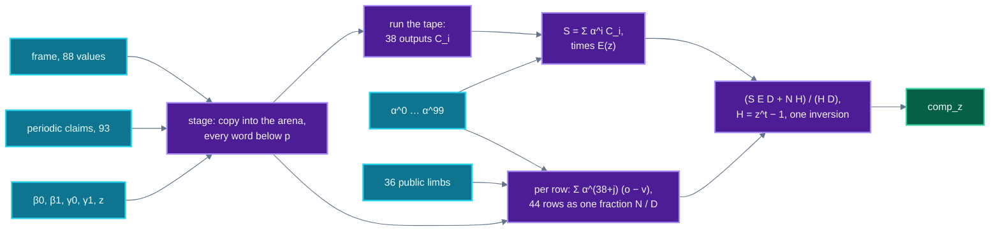

# Constraints

The launch circuit as the verifier sees it: its 44 columns, 38 transition constraints, 62 boundary
constraints, the 36 public pins, the copy constraint and the mask pair, and how `LaunchEvaluator`
turns them into $\mathrm{comp}_z$ on chain. Read this before relying on what a verified proof
guarantees, and before changing the program or its image. What is checked and what is not is
listed once, in [20-security-status.md](20-security-status.md).

- [What the chain checks](#what-the-chain-checks)
- [The launch circuit at a glance](#the-launch-circuit-at-a-glance)
- [Columns and regions](#columns-and-regions)
- [Transition constraints](#transition-constraints)
- [The exempt row](#the-exempt-row)
- [Boundary constraints](#boundary-constraints)
- [The 36 public pins](#the-36-public-pins)
- [The copy constraint](#the-copy-constraint)
- [The mask pair](#the-mask-pair)
- [Periodic columns](#periodic-columns)
- [The composition value at z](#the-composition-value-at-z)
- [The image, pinned by hash](#the-image-pinned-by-hash)
- [Tests](#tests)
- [Code on no accept path](#code-on-no-accept-path)

Contracts named here are in `contracts/shield/verifier/` and tests in `test/shield/` unless a path
is given. Every structural number below is read from `spec/launch-program/program.bin`, the blob
whose hash `LaunchProgram.PROGRAM_HASH` pins, or from `transition-tape.json` beside it, unless
another source is named.

## What the chain checks

`RealSplitVerifier.verifyWholeComposed` replays the transcript and hands the out-of-domain frame,
the periodic claims, the composition coefficients, $(\beta, \gamma, z)$ and the 36 public limbs to
`LaunchEvaluator.evaluate`. The evaluator returns $\mathrm{comp}_z$, the value of the composition
polynomial at $z$, and the DEEP check at every query uses that value
([06-merkle-and-fri.md](06-merkle-and-fri.md#the-deep-value-in-fri-layer-zero)).

No caller supplies $\mathrm{comp}_z$. `ComposedStarkVerifier` holds the evaluator in an immutable,
and on Sepolia its `evaluator()` reads `0x619A5ecdEe779Ec4455bbFa2eC3a5f4f9DEE3FF6`, the deployed
`LaunchEvaluator`.

The DEEP term binds $\mathrm{comp}_z$ to the committed composition polynomial. Evaluating the
constraints at $z$ binds that polynomial to the circuit. The two together tie the trace to the
38 transitions and 62 boundaries below, and the pins tie it to the words in calldata.

## The launch circuit at a glance

| quantity | value | source |
|---|---:|---|
| trace length $t$ | $2^{13}$ | `logTraceLen()` on chain, blob header `logT` |
| columns | 44 | `traceWidth()` on chain |
| columns under the trace root | 0 to 33 | `regionWidth()` = 34 |
| columns under the permutation root | 34 to 43 | |
| frame | 88 values, 44 at $z$ and 44 at $gz$ | blob header `nFrame` |
| periodic columns | 93 | `nPeriodic()`, blob header `nPer` |
| challenge inputs | 4: $\beta_0, \beta_1, \gamma_0, \gamma_1$ | `LaunchProgram.N_CHALLENGES` |
| transition constraints | 38 | blob header `nOut` |
| ops on the transition tape | 2802: 28 constants, 185 inputs, 991 additions, 267 subtractions, 1331 multiplications, 0 inversions | `transition-tape.json` `counts` |
| exempt rows | 1, row $t - 1$ | blob header `nExempt` |
| boundary constraints | 62 on 44 distinct rows: 26 constants and 36 pins | blob header `nBnd`, `nRows` |
| composition coefficients | $100 = 38 + 62$, the powers $1, \alpha, \alpha^2, \dots$ of one draw | `nCoeffs()`, `powerCoeffs()` on chain |
| constraint degree | 11 | `structure.json` |

The on-chain values are read from `RealSplitVerifier` at `0x59AA962433060D0206C3595afEb1793c621747eA`
and `LaunchEvaluator` at `0x619A5ecdEe779Ec4455bbFa2eC3a5f4f9DEE3FF6` on Sepolia.
`LaunchEvaluator.N_PUBLIC()` reads 36.

## Columns and regions

The tape shows which cells each constraint reads. The regions below are named by those reads.

```mermaid
%%{init: {'theme':'base','themeVariables':{'fontFamily':'Inter, -apple-system, Segoe UI, Helvetica, Arial, sans-serif','fontSize':'14px','lineColor':'#64748b','primaryColor':'#0f172a','primaryTextColor':'#0f172a','primaryBorderColor':'#334155','clusterBkg':'#f8fafc','clusterBorder':'#cbd5e1','edgeLabelBackground':'#ffffff','titleColor':'#0f172a'}}}%%
flowchart LR
    classDef state fill:#0e7490,stroke:#22d3ee,color:#ecfeff,stroke-width:2px
    classDef help fill:#1e3a8a,stroke:#60a5fa,color:#eff6ff,stroke-width:2px
    classDef acc fill:#4c1d95,stroke:#a78bfa,color:#f5f3ff,stroke-width:2px
    classDef mask fill:#0f172a,stroke:#64748b,color:#e2e8f0,stroke-width:1px

    subgraph TR["traceRoot: columns 0 to 33, committed first"]
        direction TB
        S["0 to 7<br/>state, stepped<br/>to the next row"]:::state
        H1["8 to 12<br/>bit and helper cells"]:::help
        H2["13 to 28<br/>squares, then<br/>squares of squares"]:::help
        SW["29 to 33<br/>a bit and four<br/>selected cells"]:::help
    end
    subgraph PR["permRoot: columns 34 to 43, committed after β and γ"]
        direction TB
        A["34 to 41<br/>four accumulators<br/>in F_p², two columns each"]:::acc
        M["42, 43<br/>mask pair"]:::mask
    end
    TR -->|"β, γ drawn<br/>after traceRoot"| PR
```



| columns | root | what the constraints make of them |
|---|---|---|
| 0 to 7 | trace | the state. Transitions 0 to 7 fix cells 0 to 7 of the next row from the current row. No transition reads cells 8 to 33 of the next row |
| 8 | trace | a bit, $c_8(1 - c_8) = 0$ under selectors (transition 8) |
| 9 to 12 | trace | helper cells, read by transitions 0 to 7, 9 and 11, and wired in the third copy group |
| 13 to 20 | trace | $c_{13+i} = c_i^2$ for $i = 0 \dots 7$ under selectors (transitions 9 to 16) |
| 21 to 28 | trace | $c_{21+i} = c_{13+i}^2$ for $i = 0 \dots 7$ under selectors (transitions 17 to 24) |
| 29 | trace | a bit $b$, $b(1 - b) = 0$ under selectors (transition 25) |
| 30 to 33 | trace | $c_{30+i} = (1 - b)\,c_i + b\,c_{4+i}$ for $i = 0 \dots 3$ under selectors (transitions 26 to 29) |
| 34 to 41 | permutation | four accumulators $A_k = c_{34+2k} + X c_{35+2k}$, $k = 0 \dots 3$ ([below](#the-copy-constraint)) |
| 42, 43 | permutation | the mask pair, read by no constraint ([below](#the-mask-pair)) |

Transitions 8 to 12 also carry a second term under selector $P_7$, with cell 0 as a factor. The
selectors are periodic columns, so which rows a relation applies to is fixed at deployment.

## Transition constraints

The 38 transitions are straight-line programs over $\mathbb{F}_{p^2}$ on one tape of 2802 ops. An
op is a constant, an input, an addition, a subtraction or a multiplication. The inputs are the 88
frame values, the 93 periodic claims and the four challenge limbs, in that order. Output $i$ names
the op whose value is $C_i$.

| outputs | reads | degree |
|---|---|---:|
| 0 to 7 | cells 0 to 28 at $z$, cells 0 to 7 at $gz$, periodic claims among $P_0 \dots P_{54}$ | 6 |
| 8 to 24 | the bit and square relations of the table above, selectors $P_1, P_2, P_4, P_5, P_7$ | 3 |
| 25 to 29 | cells 0 to 7 and 29 to 33, selectors $P_2, P_5, P_{31}, P_{53}$ | 4 |
| 30 to 37 | the copy constraint: two outputs per accumulator, one per component | 11 |

The degree column counts each trace cell and each periodic claim as degree one, over the tape. Its
largest value is the constraint degree of `structure.json`, which sets the evaluation domain,
$N = 2^{\lceil \log_2(11t) \rceil + 1 + 5} = 2^{23}$ with 5 extra blowup bits. The tape loads all 88 frame values, and no output depends on cells 42 and 43
or on cells 8 to 33 at $gz$.

## The exempt row

Transitions hold on every row but the last, where the next row wraps to row 0. The blob lists one
exempt point, $g^{t-1}$, and the evaluator multiplies the transition sum by

$$E(z) = \prod_k (z - e_k) = z - g^{\,t-1}.$$

`spec/launch-honest/oracle.json` records `exempt_rows = [8191]` and $E(z)$ at the honest $z$, and
$z_0 - g^{8191} \bmod p$ equals its `exempt_at_z` first component.

## Boundary constraints

A boundary $j$ fixes frame cell $c_j$ at trace row $r_j$ to a value $v_j$. The value is a constant
of the program or, for a pin, public limb $\pi_k$ read from calldata. Boundary $j$ takes the
composition coefficient $\alpha^{38+j}$. In blob order:

| boundaries | column | rows | value |
|---|---|---|---|
| 0, 1 | 0, 4 | 0 | 0 |
| 2, 3 | 0 | 2632, 2696 | 0 |
| 4, 7 | 4 | 2760, 3016 | `0x53504E44`, the ASCII word `SPND` |
| 5, 8 | 4 | 2824, 3080 | `0x4E554C4C`, the ASCII word `NULL` |
| 6, 9 | 5 | 2760, 3016 | 0 |
| 10 to 45 | 0 | $5388 + k$ | public limb $\pi_k$, $k = j - 10$ |
| 46 to 61 | 34 to 41 | 0 and 6032 | $A_k = 1$: the $c_0$ column 1 and the $c_1$ column 0 |

The distinct rows are 0, 2632, 2696, 2760, 2824, 3016, 3080, the 36 rows 5388 to 5423, and 6032:
44 in all. The compile checks that every column is a frame cell, every row index is in range and
every constant is below $p$ (`BadBoundary`).

## The 36 public pins

The pool passes 12 words. `PublicWords.publicsOf(words, 12)` expands them into 36 Goldilocks limbs,
and `ComposedStarkVerifier` hands those limbs to the verifier, which absorbs them into the
transcript before the trace root and passes them to the evaluator. Pin $k$ reads limb $\pi_k$ at
column 0, row $5388 + k$, with coefficient $\alpha^{48+k}$ (`oracle.json`: `public_pins_from = 48`).

| word | name | limbs $k$ | rows | split |
|---|---|---|---|---|
| 0 | `noteRoot` | 0 to 3 | 5388 to 5391 | four 64-bit limbs, low first |
| 1 | `assocRoot` | 4 to 7 | 5392 to 5395 | four 64-bit limbs |
| 2, 3 | `nf0`, `nf1` | 8 to 15 | 5396 to 5403 | four 64-bit limbs each |
| 4, 5 | `outCm0`, `outCm1` | 16 to 23 | 5404 to 5411 | four 64-bit limbs each |
| 6 | `publicAmount` | 24 | 5412 | one limb |
| 7 | `fee` | 25 | 5413 | one limb |
| 8 | `assetId` | 26 | 5414 | one limb |
| 9 | `clearingPrice` | 27 | 5415 | one limb |
| 10 | `recipient` | 28 to 31 | 5416 to 5419 | $48 + 48 + 48 + 16$ bits, low first |
| 11 | `feeRecipient` | 32 to 35 | 5420 to 5423 | $48 + 48 + 48 + 16$ bits |

An address word wider than 160 bits reverts `NonCanonicalLimb`, so every address has one encoding.
Every other limb must be below $p$, else the same error.

The evaluator constructor refuses an image whose pins do not read limbs 0 to 35, each of them
(`PinsNotContiguous`), and `evaluate` refuses a call whose publics are not 36 (`NotThisCircuit`).
One verifier serves every spend, and each proof is bound to its own statement.

## The copy constraint

Four grand products run in columns 34 to 41. Group $k$ wires nine trace cells
$w_{k,0}, \dots, w_{k,8}$. Each cell has an identity label $9\,\iota + j$ and a wiring label
$\sigma_{k,j}$, where $\iota = P_{56}$ and $\sigma_{k,j} = P_{57 + 9k + j}$ are periodic columns.
With the selector $S = P_{55}$, transitions $30 + 2k$ and $31 + 2k$ are the two components of

$$S\Big[A_k(gx)\prod_{j=0}^{8}\big(w_{k,j} + \beta\,\sigma_{k,j} + \gamma\big) - A_k(x)\prod_{j=0}^{8}\big(w_{k,j} + \beta\,(9\iota + j) + \gamma\big)\Big] + (1 - S)\big(A_k(gx) - A_k(x)\big) = 0 .$$

| group $k$ | accumulator columns | wired cells $w_{k,0} \dots w_{k,8}$ | wiring labels |
|---|---|---|---|
| 0 | 34, 35 | 0, 1, 2, 3, 4, 5, 6, 7, 30 | $P_{57} \dots P_{65}$ |
| 1 | 36, 37 | 0, 1, 2, 3, 8, 29, 31, 32, 33 | $P_{66} \dots P_{74}$ |
| 2 | 38, 39 | 0, 1, 5, 9, 10, 11, 12, 13, 20 | $P_{75} \dots P_{83}$ |
| 3 | 40, 41 | 0, 2, 3, 14, 15, 16, 17, 18, 19 | $P_{84} \dots P_{92}$ |

Boundaries 46 to 61 set every $A_k$ to 1 at row 0 and at row 6032. Which rows the selector $S$
covers is in the periodic table under the deployed root, outside the tape.

**Pair arithmetic.** $\beta$ and $\gamma$ live in $\mathbb{F}_{p^2}$ and are drawn after the trace
root is absorbed and before the permutation root (`RealQueryVerify._mainCheckpoint`). The tape
reads them limb by limb, $\beta = \beta_0 + \beta_1 X$ and $\gamma = \gamma_0 + \gamma_1 X$.

The verifier passes the point $[\beta_0, \beta_1, \gamma_0, \gamma_1, z_0, z_1]$, and the evaluator
stages each of the four limbs as its own input cell with a zero second component
(`ProgramFormAir.stageCalldata`). Each accumulator is two base columns, each factor is the pair
$(w + \beta_0 \lambda + \gamma_0) + (\beta_1 \lambda + \gamma_1) X$ for a label $\lambda$, and the tape
writes every product out as

$$(a_0 + a_1X)(b_0 + b_1X) = (a_0b_0 + 7a_1b_1) + (a_0b_1 + a_1b_0)X .$$

Drawing $\beta$ and $\gamma$ in $\mathbb{F}_{p^2}$ keeps the soundness of the product argument off
the 64-bit bound of the base field. `test_theChallengeCountIsNotGuessed` compiles the tape as if it
read two challenge inputs and requires the compile to refuse it.

## The mask pair

Columns 42 and 43 are filled by the prover with fresh randomness and are read by no transition and
no boundary. They are committed under the permutation root and opened as one
$\mathbb{F}_{p^2}$ value $M_{42} + X M_{43}$ in frame slot 42. Frame slot 43 must be zero at both
$z$ and $gz$ (`MaskSlotNotZero`), and DEEP gives column 43 the coefficient $X$ times that of
column 42 ([06](06-merkle-and-fri.md#the-deep-value-in-fri-layer-zero)).

On chain `maskColumn()` reads 42. Hiding is a property of the prover. The verifier checks soundness
only.

## Periodic columns

The 93 periodic columns are committed once, under `periodicRoot`, a constructor immutable that the
proof never supplies ([06](06-merkle-and-fri.md#which-tree-each-value-opens-under)). The proof
carries their 93 values at $z$ as claims, absorbed into the main transcript with the frame, and each
base query opens the periodic row under the root. DEEP binds each claim to that row.

| columns | read by | role on the tape |
|---|---|---|
| $P_0 \dots P_5$, $P_7 \dots P_{30}$, $P_{32} \dots P_{52}$, $P_{54}$ | transitions 0 to 24 | selectors and constants of the state step and the helper cells |
| $P_2, P_5, P_{31}, P_{53}$ | transitions 25 to 29 | selectors of the bit and the selected cells |
| $P_{55}$ | transitions 30 to 37 | the copy selector $S$ |
| $P_{56}$ | transitions 30 to 37 | $\iota$, the base of the identity labels |
| $P_{57} \dots P_{92}$ | transitions 30 to 37 | the wiring labels $\sigma$, nine per group |
| $P_6$ | no transition | carried in the claims and in DEEP |

The wiring of the copy constraint is part of the deployment: a different wiring has a different
periodic root and needs a new verifier.

## The composition value at z

`ProgramFormAir` computes, over $\mathbb{F}_{p^2} = \mathbb{F}_p[X]/(X^2 - 7)$,

$$\mathrm{comp}_z = \frac{E(z)}{z^{t} - 1}\sum_{i=0}^{37} \alpha^{i}\, C_i\big(\mathbf{o}, \hat{\boldsymbol\pi}, \beta_0, \beta_1, \gamma_0, \gamma_1\big) \;+\; \sum_{j=0}^{61} \alpha^{38+j}\,\frac{o_{c_j} - v_j}{z - g^{r_j}},$$

where $\mathbf{o}$ is the frame, 88 values at $z$ and $gz$, $\hat{\boldsymbol\pi}$ the 93 periodic
claims, $C_i$ transition $i$ from the tape, $E(z) = z - g^{t-1}$, and boundary $j$ fixes frame
cell $c_j$ (a cell at $z$ for every launch boundary) at row $r_j$ to $v_j$. The coefficients are
$1, \alpha, \alpha^2, \dots, \alpha^{99}$ for one draw $\alpha$, in draw order
(`RealQueryVerify._mainCheckpoint`, `StarkTranscript.powers`).



**How it runs.** `ProgramFormAir.runCalldata` interprets a compiled image. The stage copies the
frame, the claims and the point into cells of an arena at a fixed address and checks every word
and the first 36 public words below $p$ (`NonCanonical`). The instruction stream then runs the tape.
Constants are loaded from a table, and a multiply whose only reader is the next add or subtract is
fused into it.

The boundaries are grouped by row, so each row costs one term
$S_r / (z - x_r)$. With $d = z - x_r$ and $\bar d$ its conjugate, $S_r / d = S_r \bar d / n$ where
$n = d \bar d = d_0^2 - 7 z_1^2 \in \mathbb{F}_p$, and all rows fold into one fraction $N / D$
with $D \in \mathbb{F}_p$. The final value is

$$\mathrm{comp}_z = \frac{S\,E\,D + N\,H}{H\,D}, \qquad H = z^{t} - 1,$$

with one inversion in $\mathbb{F}_{p^2}$.

A zero $D$ or $H$ reverts with no data. Wrong array lengths (frame 88, claims 93, coefficients 100)
also revert with no data.

## The program blob

`ProgramFormAir.compile` reads a circuit as a blob, big endian, checks every field once, and lowers
it to an image the interpreter runs without checks.

```
u16 nOps  u16 nOut  u16 nBnd  u16 nRows  u16 nFrame  u16 nPer  u8 logT  u8 nExempt
nExempt x u64                      exempt points g^(t-k)
nOps ops:  u8 kind, then           0 const u64 u64 | 1 input u16 | 2 add u16 u16
                                   3 sub u16 u16   | 4 mul u16 u16 | 5 inv u16
nOut x u16                         the op whose value is transition i
nRows x u64                        g^row for each distinct boundary row
nBnd x (u8 col, u16 rowIdx, u8 src, then u64 value if src == 0 else u8 k)
                                   src 0: a constant of the circuit, src 1: public word k
```

An input `k` reads the frame, then the periodic claims, then the challenge limbs, each one whole
$\mathbb{F}_{p^2}$ value. The compiler maps each operand to the memory cell of the value it names,
drops values nothing reads, fuses a multiply into the add or subtract that reads it next, and groups
the boundaries by row. `spec/launch-program/program.bin` is the launch circuit in this format:
2,802 ops, 38 transitions, 62 boundaries on 44 rows.

## The image, pinned by hash

Compiling the tape costs more gas than one transaction may carry, so the evaluator is deployed with
an image compiled ahead of time (`ProgramFormImage.pinned`). The constructor takes the image only
if its Keccak-256 equals `LaunchProgram.IMAGE_HASH` (`ImageMismatch`), then stores it as the code of
a data contract and copies it into memory on every call.

| artifact | bytes | Keccak-256 | constant |
|---|---:|---|---|
| transition part, `spec/launch-program/tape.bin` | 14,074 | `0x21dd9f3614d7159308b5fd99bf0f7b294428e807408e7876f423d8543ff2a08f` | `LaunchProgram.TAPE_HASH`, `TAPE_LENGTH` |
| boundary part | 844 | | `LaunchProgram.BOUNDARIES`, inline |
| whole blob, `program.bin` | 14,918 | `0x73e6c39ab9bf995da6971568b6f73a93114adad19ea9e6ac8c1ac7b314092cb7` | `LaunchProgram.PROGRAM_HASH` |
| image, `image.bin` | 21,306 | `0x4b138b8b3087493eac15bd2ddc2878114a2efe15f41ca96b9473b49b0d116e69` | `LaunchProgram.IMAGE_HASH` |

`LaunchImage.t.sol` (`test_thePinIsTheCompileOfTheTape`) compiles `tape.bin` with its boundary part
and slot map by the same compiler that `ProgramFormEvaluator` runs at construction, and requires the
result, and `image.bin`, to hash to `IMAGE_HASH`. It also requires the tape and boundary part to
concatenate to `program.bin`.

On Sepolia `LaunchEvaluator.image()` returns one data contract,
`0xd495809981624e9c74D5c4cAbF83160f1013B3d9`, of 21,306 bytes. Its code after the leading `STOP`
byte hashes to `IMAGE_HASH`, read with `cast code` and `cast keccak`.

## Tests

| property | test |
|---|---|
| the pin is the compile of the tape, and the tape and boundaries are the program | `LaunchImage.t.sol` |
| four real proofs verify through `verifyBatch` with 12 words: `honest`, `spend`, `withdraw-a`, `withdraw-b` | `LaunchGate.t.sol`, `test_everyHonestProofVerifiesWithTwelveWords` |
| the replay reaches $z$, $\beta$ and $\gamma$ of the prover, and the evaluator returns $\mathrm{comp}_z$ of the prover, for all four | `test_theOraclesMatch` |
| every address limb is exercised by the withdrawals | `test_theWithdrawalsExerciseEveryAddressLimb` |
| each evaluator takes only its own circuit, and `N_PUBLIC` is 36 | `test_eachEvaluatorServesOnlyItsCircuit` |
| the tape reads four challenge inputs | `test_theChallengeCountIsNotGuessed` |
| the mask pair is opened as one value, and a pair opened apart is refused | `test_theMaskPairIsOpenedAsOneValue`, `test_aMaskOpenedApartIsRefused` |
| refused: a bent trace, a value balanced only mod $p$, a dummy note worth $p$, a wrong nullifier, a composition that is not that of the circuit, a statement swap, a tampered amount, a tampered recipient, any of the twelve nonces off by one bit | the negative tests of `LaunchGate.t.sol`, with their control `test_theForgeryControlIsAccepted` |
| $\beta$, $\gamma$, $\alpha$, $z$, the DEEP coefficients and the seed match the prover | `LaunchTranscript.t.sol` |

## Code on no accept path

`ProductionAir`, `ProductionComposeAir` and `ProductionDeepQuery` hold the transition of a recursion
AIR. The launch verifier reads only `ProductionAir.COSET_SHIFT` and `ProductionAir.xFinal` from them,
through `RealQueryWalk`. `DeployedSurface.t.sol` holds the import closure of `RealSplitVerifier` to a
declared list.

`LaunchEvaluator` imports `ProgramFormEvaluator.sol` and `LaunchProgram.sol`, and through them
`ProgramFormAir`, `ProgramFormProgram` and `IProgramFormEvaluator`. The `ProgramFormEvaluator`
contract in that file serves an 11-word circuit with 32 limbs, and is not the launch evaluator.
