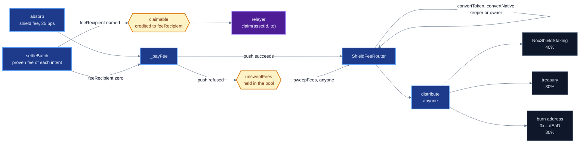

# Fees, liveness, governance

How fees leave the pool and reach the relayer, stakers, the treasury and the burn address, which
failures can and cannot stop a deposit or a settlement, and who may change what, after which delay.
For operators running the stack and auditors checking its privileges.

Every figure is a constant in the code (file:line), a named test, a receipt, or a value read on
Sepolia by `eth_call` at block 11,778,648 against the launch pool
`0x8e377752C8890E23A1E9F40eBbD41183Fc6949e2`. What the verifier checks and what it does not is in
[Security status](20-security-status.md).

- [Fee flow](#fee-flow)
- [Parameters](#parameters)
- [Fee arithmetic](#fee-arithmetic)
- [Relay fees and `claim`](#relay-fees-and-claim)
- [Deferred fees](#deferred-fees)
- [What can still revert a settlement](#what-can-still-revert-a-settlement)
- [`ShieldFeeRouter`](#shieldfeerouter)
- [`NoxShieldStaking`](#noxshieldstaking)
- [Who may settle](#who-may-settle)
- [Beta mode](#beta-mode)
- [Privileges](#privileges)
- [Owners on Sepolia](#owners-on-sepolia)

## Fee flow



Two kinds of fee leave the pool. The **shield fee** is taken from every deposit and goes to the fee
router. The **proven fee** is word 7 of each intent. It goes to the address in word 11,
`feeRecipient`, by credit, or to the fee router when word 11 is zero.

The router receives fees in the asset they were charged in. NOX, asset 1 on the launch pool, arrives
as NOX and is split as it is. Any other asset is first swapped into NOX through an approved DEX
router. The pool never waits on the router: a push the router refuses is held and swept later.

## Parameters

| parameter | contract | set by | bound in code | Sepolia |
|---|---|---|---|---|
| `shieldFeeBps` | pool | constructor, `setFeeBps` | at most `MAX_FEE_BPS = 50` (`ShieldedPool.sol:75`, `:458`) | 25 |
| `unshieldFeeBps` | pool | constructor, `setFeeBps` | at most 50. Stored and published, and settlement never reads it (`ShieldedPool.sol:456`) | 25 |
| proven fee on a public leg | proof | word 7 | $10^4\,\phi \le 50\,P$ (`ShieldedPool.sol:710`) | |
| proven fee on a transfer | proof | word 7 | $\phi \le$ `maxRelayFee[asset]` (`ShieldedPool.sol:708`) | |
| `maxRelayFee[0]`, native | pool | `setMaxRelayFee` | at most $2^{64} - 1$ units (`ShieldedPool.sol:540`) | $10^{15}$ units, 0.001 ETH at scale 1 |
| `maxRelayFee[1]`, NOX | pool | `setMaxRelayFee` | the same | $10^{10}$ units, 10 NOX at scale $10^9$ |
| `feeRecipient` | proof | word 11 | nonzero only with $\phi > 0$ (`ShieldedPool.sol:703`) | |
| `residualBandBps` | pool | initialised to 200, `setResidualBand` | at most `MAX_BAND_BPS = 1,000` (`ShieldedPool.sol:77`) | 200 |
| `stakingBps`, `treasuryBps`, `burnBps` | router | constructor, `setSplits` | sum $10^4$, treasury at most 5,000 (`ShieldFeeRouter.sol:219`) | 4,000, 3,000, 3,000 |
| staking `cooldown` | staking | constructor only | at most `MAX_COOLDOWN = 30 days` (`NoxShieldStaking.sol:25`) | 604,800 s |

The two relay fee caps were set by transactions `0x11197557…0f92` (block 11,772,258) and
`0x1cbad178…c338` (block 11,772,259), each emitting `MaxRelayFeeSet`. The fee router is
`0xEBE49155459833d865737cA1288122a354f11df6` and the staking contract is
`0x739e06586305c4a543d5cFd5fE5506aA289cf397` ([Deployments and receipts](19-deployments-and-receipts.md)).

## Fee arithmetic

Write $s$ for the scale of the asset, the base units per note unit, fixed when the asset is
registered. Amounts in the public words and in notes count units. Every amount that moves on chain
is units times $s$ (`ShieldedPool.sol:133`). All divisions round toward zero.

**Deposit** (`ShieldLedger.splitDeposit`, `ShieldLedger.sol:10`). A depositor sends $a$ base units,
a whole number of units $u = a/s$, and with $b_s$ = `shieldFeeBps`:

$$
f_u = \left\lfloor \frac{u\, b_s}{10^4} \right\rfloor, \qquad v_u = u - f_u, \qquad
\text{fee paid} = f_u\, s, \qquad \text{note value} = v_u .
$$

The commitment binds $v_u$, and `totalShielded` grows by $v_u s$ (`ShieldedPool.sol:363` to `:379`).
With $b_s \le 50$ the fee is at most 0.5% of $a$, and $(f_u + v_u)\,s = a$ loses nothing.
`check_aDepositSplitLosesNothing` and `check_aDepositFeeNeverExceedsTheAmount`
(`test/shield/halmos/ShieldLedger.halmos.t.sol`) prove both for all inputs.

**Settlement** (`ShieldedPool._decodeIntent`, `:706` to `:712`, and `_settleIntents`, `:723`). With
$P$ the `publicAmount` word and $\phi$ the `fee` word, both in units:

$$
P = 0:\ \ \phi \le \mathtt{maxRelayFee}[\text{asset}], \qquad
P > 0:\ \ 10^4\,\phi \le 50\,P,
$$

$$
\mathtt{totalShielded} \mathrel{-}= (P + \phi)\,s, \qquad \text{recipient receives } P\,s, \qquad
\text{fee } \phi\,s \text{ to feeRecipient or the router}.
$$

The circuit balances the inputs against the outputs plus $P$ plus $\phi$, so the spent notes pay the
fee on top of the public amount. The cap on a public leg uses the constant `MAX_FEE_BPS`, and the
owner-set `unshieldFeeBps` never enters it.

A transfer has no amount to take a share of, so its fee
has an absolute cap per asset. Spending a whole note of $v_u$ units as $P + \phi = v_u$ leaves
nothing behind: `test_anUnshieldWithAFeeStrandsNothing` (`test/shield/FeeRecipient.t.sol`).

On the launch pool every one of the 43 settlements is a transfer that pays its cap: 21 pay
$10^{15}$ wei in asset 0 and 22 pay $10^{19}$ base units, 10 NOX, in asset 1 (the 43
`IntentUnshielded` events of the pool, all with `amount` 0).

**Split** (`ShieldFeeRouter.distribute`, `ShieldFeeRouter.sol:132`). With $N$ the whole NOX balance
of the router and $b_{st}, b_{tr}, b_{bu}$ the three shares:

$$
n_{st} = \left\lfloor \frac{N\, b_{st}}{10^4} \right\rfloor,\qquad
n_{tr} = \left\lfloor \frac{N\, b_{tr}}{10^4} \right\rfloor,\qquad
n_{bu} = N - n_{st} - n_{tr}.
$$

`burnBps` does not enter the arithmetic. The burn leg takes the remainder, so
$n_{st} + n_{tr} + n_{bu} = N$ and, since $b_{st} + b_{tr} + b_{bu} = 10^4$,

$$
0 \;\le\; n_{bu} - \frac{N\, b_{bu}}{10^4} \;<\; 2 .
$$

`test_DistributeExactToTheWei` and `testFuzz_DistributeConservesEveryWei`
(`test/shield/ShieldFeeRouter.t.sol`) hold the conservation.

## Relay fees and `claim`

Word 11 names who receives the fee of the intent. A wallet sets it to the address of the relayer
that submits the transfer, so the sender never submits from an address of its own. The word is
part of the proven statement, so the relayer can submit the transfer or drop it, and cannot redirect
the fee.

| `feeRecipient` | where $\phi s$ goes | when |
|---|---|---|
| zero | the fee router through `_payFee`, held in `unsweptFees` if refused | after the accounting of every intent, with the recipient payouts (`:743`) |
| nonzero | `claimable[assetId][feeRecipient]`, emitting `PayoutCredited` | in the accounting pass, before any external call (`:736`) |

A named fee recipient is never pushed to. It collects with `claim(assetId, to)` (`:847`), which pays
the whole credit to `to` and reverts `NothingToClaim` on zero.

A contract fee recipient has no call
during settlement in which to revert or burn gas. The credit counts in `totalClaimable`, and the
solvency bound below covers it. An intent with a fee recipient pays no protocol fee on its
settlement. The protocol takes its share at deposit.

On Sepolia `totalClaimable` is $2.1 \cdot 10^{16}$ wei in asset 0 and $2.2 \cdot 10^{20}$ base
units in asset 1, the 43 relay fees. The relayer `0xB6eB6aeFad95152C0d4f5fF4552915CB27548A6F`
holds a credit of $10^{19}$ in asset 1, from settlement `0xbed088f0…d04f`.

## Deferred fees

A batch is one proof over many intents. If delivering a fee could revert, a router that refuses
payment or a token that blocks the router would void every intent in the batch and stop deposits.
`_payFee` (`ShieldedPool.sol:906`) records a failed push and returns:

```solidity
_payFee(assetId, amount)   // push to feeRouter. On failure: unsweptFees[assetId] += amount, emit FeeDeferred
unsweptFees[assetId]       // held on top of totalShielded
sweepFees(assetId)         // anyone. Zeroes the balance, then pays all of it to the current feeRouter
```

| asset | push | counts as failure |
|---|---|---|
| native (asset 0) | `call{value: amount, gas: NATIVE_PUSH_GAS}`, `NATIVE_PUSH_GAS = 50,000` (`:858`) | the call returns `false` |
| ERC-20 | `_pushToken`: a `transfer` call in assembly with `TOKEN_PUSH_GAS = 100,000`, between two reads of the balance of the pool (`:861`, `:868`) | the call fails, or returns anything other than no data or one word equal to 1. Only what did not leave the pool is held |

A held fee is owed to the router and never comes out of shielded balances. The balance of the pool
in asset $k$ covers every obligation at once:

$$
\mathrm{balance}_k \;\ge\; \mathtt{totalShielded}_k + \mathtt{unsweptFees}_k + \mathtt{totalClaimable}_k .
$$

`invariant_ThePoolCoversEverythingItOwes` (`test/shield/ShieldInvariants.t.sol`) checks it after
every call sequence of the invariant campaign. On Sepolia both sides are equal in both assets:
81.9945 ETH $= 81.9735 + 0 + 0.021$, and 20,947,500 NOX $= 20{,}947{,}280 + 0 + 220$.

`sweepFees` pays through `_payOut`, which reverts on failure and leaves the fee held.
`FeeRouterLiveness.t.sol` covers a router that takes nothing, a router that burns its gas, and
delivery of the held amount once the router accepts. The launch pool has emitted no `FeeDeferred`.

Payouts to a public-leg recipient follow the same rule. `_payOrCredit` (`:827`) credits a refused
payout to the recipient, who collects it with `claim` ([The pool](08-pool.md)).

## What can still revert a settlement

The deferral covers every way a token push can fail: a revert, `false`, 1 to 31 bytes, a word
other than 1, more than 32 bytes, and a token that burns the gas it is given, which is at most
`TOKEN_PUSH_GAS`. Only the first word of return data is copied, so a large return costs the pool
nothing.

`HostileTokenReturns.t.sol` settles a batch against each case next to a native intent,
and the native intent is paid every time. These still revert `settleBatch`:

| case | cause in code | who can avoid it |
|---|---|---|
| the residual swap fails, falls below its floor, or swaps an asset into itself | `BatchClearing.routeResidual`, `ResidualBelowBand`, `SameAssetResidual` (`:755`) | the submitter, who chooses the route and may pass `amountIn = 0` to skip it |
| an intent debits more than `totalShielded` holds for its asset | `ShieldedBalanceUnderflow` (`:801`) | no one. The pool refuses to pay out value it does not record |
| the tree has no room for $2n$ leaves | `TreeIsFull` | no one ([The tree](09-tree.md)) |

A token that moves the balance and then returns malformed data is paid once, because the pool
measures its own balance before crediting (`test_aTokenThatDeliversThenAnswersBadlyIsPaidOnce`).
Asset registration is owner-only, because it fixes the scale of the asset for good (`ShieldedPool.sol:316`).

## `ShieldFeeRouter`

`contracts/shield/ShieldFeeRouter.sol`. Receives fees in any pool asset, buys NOX with them, and
splits the NOX.

| function | caller | effect |
|---|---|---|
| `convertToken(router, amountIn, minNoxOut, path, deadline)` | keeper or owner | ERC-20 to NOX through an approved router. Requires `amountIn > 0`, `minNoxOut > 0`, `path.length >= 2`, a path that ends in NOX and does not start with it. The allowance is reset to zero after the swap, and NOX received is measured by balance change |
| `convertNative(router, amountIn, minNoxOut, path, deadline)` | keeper or owner | native to NOX through `swapExactETHForTokens`, with the same router, amount and endpoint checks |
| `distribute()` | anyone | splits the whole NOX balance as in [Fee arithmetic](#fee-arithmetic). Reverts `NothingToDistribute` on a zero balance |
| `setSplits(st, tr, bu)` | owner, immediate | sum $10^4$, `tr` at most 5,000 |
| `setKeeper(k)` | owner, immediate | zero leaves only the owner able to swap |
| `proposeStaking` / `executeStaking` | owner / anyone | `TIMELOCK_DELAY = 2 days` (`ShieldFeeRouter.sol:27`) |
| `proposeTreasury` / `executeTreasury` | owner / anyone | 2 days |
| `proposeRouter` / `executeRouterApproval` | owner / anyone | 2 days |
| `revokeRouter` | owner, immediate | does not cancel a pending approval |

The contract checks only that `minNoxOut` is nonzero. The slippage bound is whatever the keeper or
owner passes, so the account that holds the keeper role decides the price at which fee assets sell.

The staking leg is paid by `forceApprove` followed by `staking.notifyRewardAmount(n_st)`, so the
router must be the `rewardNotifier` of the staking contract. If it is not, `distribute` reverts
`NotNotifier`, no leg is paid, and the NOX stays in the router. On Sepolia `rewardNotifier` is the
router, and the router holds 52,500.0475 NOX and 0.207235 ETH not yet distributed or swapped.

A failure anywhere in the router, `distribute` included, does not reach the pool. The pool only
transfers to the router, and a refused transfer is held.

The pool can replace its fee router behind `FEE_ROUTER_DELAY = 2 days` (`ShieldedPool.sol:79`). The
verifier, the hasher and the association registry are immutable in the pool (`ShieldedPool.sol:92`,
`:95`, `GoldilocksIncrementalTree.sol:16`), and `invariant_CustodyPinsUnchanged` holds them fixed.

## `NoxShieldStaking`

`contracts/shield/NoxShieldStaking.sol`. Stake NOX and earn a pro-rata share of the staking leg of
the router. Rewards enter only through `notifyRewardAmount`, which only `rewardNotifier` may call.
The contract mints nothing.

| function | effect |
|---|---|
| `stake(amount)` | credits the balance increase received, so a fee-on-transfer token is credited what arrived |
| `initiateUnstake(amount)` | moves `amount` out of the stake, where it stops earning, and sets `releaseAt = now + cooldown` for the whole pending amount |
| `withdrawUnstaked()` | pays the whole pending amount once `releaseAt` has passed |
| `cancelUnstake()` | re-stakes the pending amount without waiting |
| `claimRewards()` | pays accrued rewards, and does nothing when they are zero |
| `notifyRewardAmount(amount)` | `rewardNotifier` only. Pulls NOX and adds it to the accumulator |
| `setRewardNotifier(notifier)` | owner only, nonzero. The only power of the owner beyond ownership transfer |

Topping up a pending unstake restarts the cooldown for the whole pending amount
(`test_ToppingUpCooldownResetsTimer`).

**Accumulator** (`NoxShieldStaking.sol:142`). Let $S$ be `totalStaked` (balances in cooldown
excluded), $R$ be `rewardPerTokenStored`, $c$ be `carriedRewards`, $\rho = 10^{27}$ be `PRECISION`,
and $r$ the NOX a notification delivered. A notification computes $T = r + c$ and then

$$
S = 0:\quad \text{burn } T,\; c' = 0, \qquad\qquad
S > 0:\quad \Delta = \left\lfloor \frac{T \rho}{S} \right\rfloor,\;
R' = R + \Delta,\;
c' = T - \left\lceil \frac{\Delta S}{\rho} \right\rceil .
$$

With nothing staked, no staker earned the reward, so it goes to the burn address. Carried forward,
it would go whole to whoever stakes next.

An account with stake $s_a$ and checkpoint $R_a$ has earned
$\mathtt{rewardsOf}_a + \lfloor s_a (R - R_a)/\rho \rfloor$, and every stake change first moves that
into `rewardsOf` and sets $R_a = R$. Summed over accounts and notifications $k$, what is owed is at
most $\sum_k \Delta_k S_k / \rho \le \sum_k \lceil \Delta_k S_k / \rho \rceil$, the total booked. The
booked share rounds up because the floor of a sum can exceed the sum of floors: booked with a floor,
one wei could be both carried and owed. $\Delta S \le T\rho$ keeps $c' \ge 0$.

So the contract always holds every stake, every pending unstake, every owed reward and $c$.
`invariant_solvent` and `invariant_rewardsNeverExceedWhatWasNotified`
(`invariants/periphery/NoxShieldStaking.invariant.t.sol`), `testFuzz_NotifyNeverStrandsValue`,
`test_RewardsWithNoStakersAreBurned` (`NoxShieldStaking.t.sol`) and
`test_roundingNeverOverCommitsAcrossNotifications` hold these.

The staking contract on Sepolia, `0x739e06586305c4a543d5cFd5fE5506aA289cf397`, runs a build without these two rules. Its
`totalStaked` is 0, and a mainnet deployment uses the code in this repository.

## Who may settle

Two rules in `SettlerGate` decide, and `settleBatch` admits a caller if either holds
(`ShieldedPool.sol:395`):

```solidity
// SettlerGate.open
if (settler == address(0)) return true;           // no settler: anyone
if (caller == settler) return true;               // the settler, always
return nowTs >= lastSettlement + window;          // anyone, once the window has lapsed

// SettlerGate.inOpenSlot
return nowTs % epoch >= epoch - slot;             // anyone, in the last `slot` of every epoch
```

As a predicate, with $\sigma$ the settler, $c$ the caller, $L$ = `lastSettlement`,
$t$ = `block.timestamp`, $W$ = `SETTLER_WINDOW`, $E$ = `SETTLEMENT_EPOCH` and $S$ = `OPEN_SLOT`:

$$
\mathrm{admit}(\sigma, c, L, t) \;=\; [\sigma = 0] \;\lor\; [c = \sigma] \;\lor\; [t \ge L + W] \;\lor\; [t \bmod E \ge E - S].
$$

| constant | value | purpose |
|---|---|---|
| `SETTLER_WINDOW` | 24 hours (`:81`) | the priority period of the settler after each settlement |
| `SETTLEMENT_EPOCH` | 24 hours (`:83`) | the period of the open slot |
| `OPEN_SLOT` | 1 hour (`:84`) | at the end of every epoch, anyone may settle |
| `SETTLER_DELAY` | 48 hours (`:86`) | timelock on changing the settler |

On Sepolia `settler()` is the zero address, so the first term holds and **anyone may settle**. A
sender can submit its own proof with no relayer. The relayer settlement `0xbed088f0…d04f` came
from `0xB6eB…8A6F` and the other 42 from `0xc973CaD63834CFf7ab426F18C11D113C3898031c`.

If an owner installs a settler, these properties hold:

- **No veto.** If the settler stops settling, anyone holding a valid proof may settle $W$ after the
  last settlement.
- **Bounded exclusion.** However often the settler settles, the slot $[kE + E - S,\ (k+1)E)$ opens
  to every caller once per epoch, so no valid intent is kept out for longer than one epoch. The
  settler orders what it settles inside its window and cannot alter a proven value.
- **Change visibility.** A settler change becomes executable $2W$ after it is proposed, and
  `proposeSettler` emits `SettlerProposed`. `executeSettlerChange` also resets $L$, so a new
  settler starts with a full window.

The `check_*` properties in `test/shield/halmos/SettlerGate.halmos.t.sol` prove both rules for all
inputs, including `check_theOpenSlotIsNeverMoreThanAnEpochAway`.

`SettlerWindow.t.sol` exercises
them through the pool: `test_aSettlementRestartsTheWindow`,
`test_aSettlerChangeWaitsLongerThanTheWindow` and
`test_anActiveSettlerCannotExcludeAnyoneBeyondOneEpoch`.

The adapter `ComposedStarkVerifier` stores an immutable `settler` (`StagedStarkVerifier.sol:12`),
which reads zero on Sepolia. Its `verifyBatch` is a view with no caller check.

Who may settle is separate from whether a settlement is sound. See
[Security status](20-security-status.md).

## Beta mode

The pool carries a beta gate: an allowlist, per-address and pool-wide caps, and `betaRefund`, which
returns a pro-rata share of what the notes of an asset still hold and then winds the pool down for
good (`ShieldedPool.sol:563`). `endBetaMode` switches all of it off, one way (`:552`).

On the launch pool `betaMode()` reads false. `endBetaMode` emitted `BetaModeEnded` in transaction
`0xcbd9542e…c9d5` (block 11,775,568). With beta mode off, deposits are open to any address with no
cap, `betaRefund` reverts `BetaModeAlreadyEnded`, and `betaWoundDown` stays false. `BetaGate.t.sol`
covers the gate and the refund arithmetic.

## Privileges

Pool privileges are listed with their bounds in [the pool](08-pool.md). Across the stack:

| privilege | contract | function | delay | effect |
|---|---|---|---|---|
| fee bps | pool | `setFeeBps` | none | each at most 50 bps. Only the shield fee is charged |
| relay fee cap on transfers | pool | `setMaxRelayFee` | none | per asset, in units, at most $2^{64} - 1$ |
| register an asset | pool | `registerAsset` | none | fixes its scale, 1 to $10^{18}$, for good |
| residual band | pool | `setResidualBand` | none | at most 1,000 bps |
| replace fee router | pool | `proposeFeeRouter`, `executeFeeRouterChange` | 2 days | redirects all future protocol fees, cancellable |
| replace settler | pool | `proposeSettler`, `executeSettlerChange` | 48 hours | sets ordering priority. Zero opens settlement. Cancellable |
| whitelist DEX router | pool | `proposeRouter`, `executeRouterApproval` | 2 days | allows a residual route |
| revoke DEX router | pool | `revokeRouter` | none | removes a route |
| pause deposits | pool | `setDepositsPaused` | none | stops `absorb` only |
| attestation verifier | pool | `setAttestationVerifier` | none | changes only the `attested` flag of `BatchSettled` |
| beta allowlist, registrar, caps, pause, open deposits | pool | `setBetaDepositor`, `setDepositorRegistrar`, `setBetaCaps`, `setBetaPaused`, `setOpenDeposits` | none | read only while `betaMode` is true. No effect on the launch pool |
| fee split | router | `setSplits` | none | treasury at most 50% |
| keeper | router | `setKeeper` | none | swaps into NOX only, through approved routers, at a slippage bound it chooses |
| staking or treasury address | router | `proposeStaking`, `proposeTreasury` and their `execute*` | 2 days | redirects the staking or treasury leg |
| whitelist DEX router | router | `proposeRouter`, `executeRouterApproval` | 2 days | allows a swap route |
| revoke DEX router | router | `revokeRouter` | none | removes a route |
| reward notifier | staking | `setRewardNotifier` | none | cannot move stakes or rewards. A notifier other than the router makes `distribute` revert |
| ownership | all three | `transferOwnership`, `acceptOwnership`, `renounceOwnership` | two-step | `Ownable2Step`. Renouncing freezes every owner function |

Every change that sends value to a new address waits 2 days or more. Changes bounded by a cap in
code, and changes that only narrow what can happen, are immediate, because a delay on an emergency
stop defeats it.

Two immediate changes move value without a new address: `setSplits` shifts value
between the three fixed legs within the treasury cap, and `setKeeper` hands the swap price to a
new account.

No owner function moves shielded value, held payouts or stakes. Pauses do not stop exits:
`test_exitAlwaysPossible_underEveryPause` (`FeeExactness.t.sol`) and
`test_noStateInWhichFundsCannotLeaveWithoutAProof` (`SettlerWindow.t.sol`).

## Owners on Sepolia

Read by `eth_call` at block 11,778,648:

| contract | address | `owner()` |
|---|---|---|
| pool | `0x8e377752C8890E23A1E9F40eBbD41183Fc6949e2` | Safe `0xD4251BA8bD4F68690BaB9f27d544819cFBE11854` |
| fee router | `0xEBE49155459833d865737cA1288122a354f11df6` | the same Safe |
| staking | `0x739e06586305c4a543d5cFd5fE5506aA289cf397` | the same Safe |
| faucet | `0x871bc3AD5DA20c399d631817637cB5FB29eB04B4` | the same Safe |

The Safe is version 1.4.1 with a threshold of 2 of 3 owners (`VERSION`, `getThreshold`,
`getOwners`): `0x9B917d43Ef99C8a440BBa268c632c1092c744877`,
`0x5d9489Ee17C1B960e8feeA482528bA4eb9cd631b` and `0x7098C4b08a190FF36da1F6bFE57898f9E0A365dE`.

The `keeper` of the router is the zero address, so only the Safe can swap fees. Its `treasury` is
`0x7098C4b08a190FF36da1F6bFE57898f9E0A365dE`, an externally owned account that is also an owner of
the Safe. `pendingOwner()` is zero on every contract above. The pool has no pending fee router or
settler proposal, and the router has no pending staking or treasury change.
