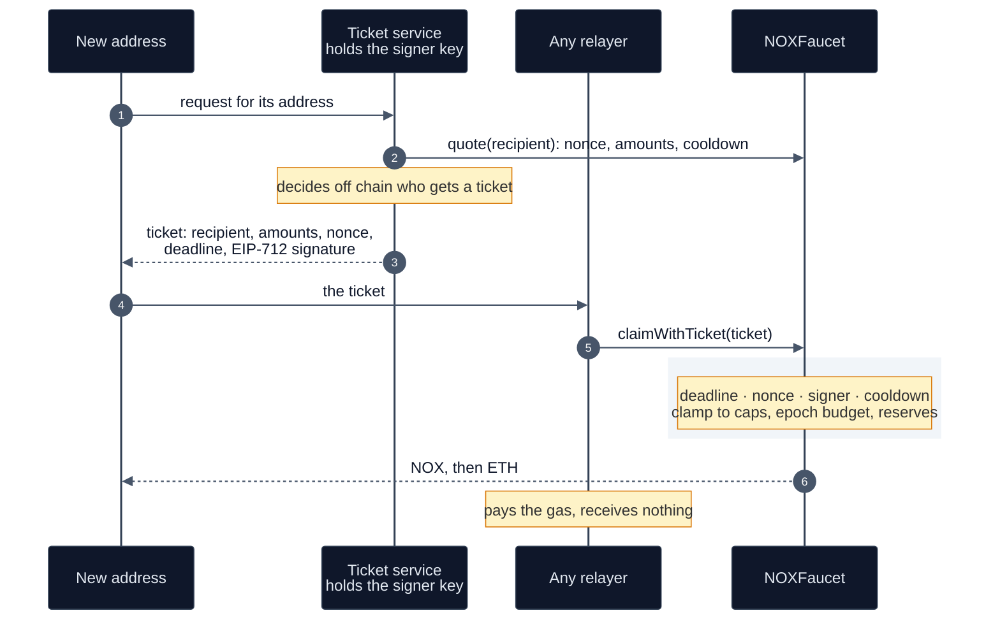

# Faucet

`contracts/faucet/NOXFaucet.sol` is the testnet faucet. It pays Sepolia ETH and NOX together,
against a ticket signed under EIP-712, to the recipient the ticket names. This document is for
frontend builders who issue tickets and operators who fund and tune the faucet.

Line references are to `NOXFaucet.sol`, and tests are in `test/faucet/NOXFaucet.t.sol`. The faucet
holds no shielded value and plays no part in a proof or a settlement.

Sepolia: `0x871bc3AD5DA20c399d631817637cB5FB29eB04B4`.

- [Paying both, to a named recipient](#paying-both-to-a-named-recipient)
- [`claimWithTicket`](#claimwithticket)
- [`claim`](#claim)
- [Clamping](#clamping)
- [Cooldown and epochs](#cooldown-and-epochs)
- [`quote`](#quote)
- [Owner functions](#owner-functions)
- [What a leaked signing key can take](#what-a-leaked-signing-key-can-take)
- [Sepolia configuration](#sepolia-configuration)

## Paying both, to a named recipient

A new address holds nothing. NOX alone cannot move without gas, and ETH alone leaves a second
request, so the faucet pays both in one transaction.

`claimWithTicket` pays the `recipient` named in the ticket, and `msg.sender` only pays gas. Any
relayer can submit a ticket, so an address with a zero balance can be funded without first holding
ETH (`test_aRecipientWithZeroEthIsFundable`). The relayer receives nothing
(`test_theRelayerReceivesNothing`). The event records both parties (`:47`):

```solidity
event Claimed(address indexed recipient, address indexed relayer, uint256 ethAmount, uint256 noxAmount, bool ticketed);
```



## `claimWithTicket`

```solidity
function claimWithTicket(
    address recipient, uint256 ethAmount, uint256 noxAmount,
    uint256 nonce, uint256 deadline, bytes calldata sig
) external nonReentrant whenNotPaused
```

The EIP-712 domain is name `"NOXFaucet"`, version `"1"`, the chain id and the address of the
faucet (`:78`). On Sepolia `eip712Domain()` returns chain 11155111 and `0x871bc3AD…04B4`. The
struct is

```
Claim(address recipient,uint256 ethAmount,uint256 noxAmount,uint256 nonce,uint256 deadline)
```

and the signed digest is

$$
d = \mathrm{keccak256}\big(\texttt{0x1901} \,\|\, \mathrm{domainSeparator} \,\|\,
\mathrm{keccak256}(\mathrm{abi.encode}(\texttt{CLAIM\_TYPEHASH}, r, e, n, \nu, \tau))\big)
$$

with $r$ the recipient, $e$ and $n$ the requested ETH and NOX in wei, $\nu$ the nonce and $\tau$ the
deadline in Unix seconds (`:111`). `claimDigest(recipient, ethAmount, noxAmount, nonce, deadline)`
returns $d$ (`:210`), so a client does not reimplement the typed-data hashing.

Checks, in order (`:105` to `:113`):

| check | revert |
|---|---|
| `recipient != address(0)` | `ZeroAddress` |
| `block.timestamp <= deadline` | `TicketExpired` |
| `nonce == nonces[recipient]` | `BadNonce(expected, given)` |
| `ECDSA.recover(d, sig) == signer` | `BadSignature` |

The nonce then increments (`:115`). Each ticket is single-use (`test_aTicketCannotBeReplayed`),
tickets for one recipient redeem in nonce order, a ticket cannot be redirected to another recipient
(`test_aTicketCannotBeRedirected`), and the domain binds it to one faucet
(`test_aTicketDoesNotCrossToAnotherFaucet`).

If the payout reverts, the nonce increment reverts
with it.

The amounts of a ticket are requests. `_dispense` clamps them, so a ticket signed for more than the
caps pays no more than the caps (`test_aTicketCannotRaiseItsOwnLimit`).

Who gets a ticket is decided off chain by whoever holds the signing key. The contract bounds what
that key can pay out ([below](#what-a-leaked-signing-key-can-take)).

## `claim`

```solidity
function claim() external nonReentrant whenNotPaused
```

The unsigned path (`:120`). It requests the per-claim caps for `msg.sender` and reverts
`OpenClaimsDisabled` unless `openClaims` is true. Its only per-address limit is the cooldown
(`test_openClaimsStillRespectTheCooldown`), so a caller with many addresses can take the whole epoch
budget.

The constructor leaves `openClaims` false (`test_openClaimsAreOffByDefault`), and it reads
false on Sepolia.

## Clamping

`_dispense(to, e_req, n_req)` (`:126`) first applies the cooldown, then clamps each amount. Write
$E_{\max}, N_{\max}$ for the per-claim caps, $B_E, B_N$ for the epoch budgets, $s_E, s_N$ for the
amounts spent this epoch, $F$ for `ethFloor`, and $\beta_E, \beta_N$ for the ETH and NOX balances
of the faucet. With $x^+ = \max(x, 0)$:

$$
e = \min\!\big(e_{\text{req}},\; E_{\max},\; (B_E - s_E)^+,\; (\beta_E - F)^+\big),
\qquad
n = \min\!\big(n_{\text{req}},\; N_{\max},\; (B_N - s_N)^+,\; \beta_N\big).
$$

`ethFloor` is an ETH balance the faucet will not pay below (`test_theFaucetWillNotSpendBelowItsFloor`).
`sweep` ignores it. A request the reserves or budget cannot fully cover is trimmed and paid
(`test_aPartialClaimIsTrimmedNotRefused`).

If $e = n = 0$ the claim reverts: `EpochExhausted` when both epoch remainders are zero,
`NothingToPay` otherwise (`:152`). The revert undoes the cooldown write, so a claim that pays nothing
does not start the cooldown of the recipient.

Otherwise $s_E \mathrel{+}= e$ and $s_N \mathrel{+}= n$, then NOX is transferred, then ETH is sent by
`call` (`:157` to `:164`). A failed ETH send reverts `EthSendFailed` and undoes the whole claim, NOX
included (`test_aRecipientThatRefusesEthRevertsTheWholeClaim`).

## Cooldown and epochs

With $\ell$ = `lastClaimAt[recipient]` and $\kappa$ = `cooldown`, a claim at time $t$ requires
(`:128`)

$$
\ell = 0 \;\lor\; t \ge \ell + \kappa ,
$$

and otherwise reverts `StillCooling` with the argument $\ell + \kappa$, the time the address becomes
eligible. An address that has never claimed has $\ell = 0$ and no cooldown. The cooldown timestamp
and the spent counters are written before any transfer, and `nonReentrant` guards both claim paths,
so a reentrant claim is refused.

Epochs roll without a keeper. The epoch index is $\lfloor t / \texttt{epochLength} \rfloor$. When
it differs from the stored `epochId`, the next claim sets `epochId` to it and resets $s_E$ and $s_N$
to zero (`:134`, `test_theEpochBudgetRefills`). `setEpoch` also starts a fresh epoch.

## `quote`

```solidity
function quote(address recipient) external view returns (
    bool claimable, uint64 nextEligible, uint256 ethAmount, uint256 noxAmount,
    uint256 nonce, uint256 epochEthLeft, uint256 epochNoxLeft
)
```

One call gives a client everything it renders (`:172`): whether a claim would pay now, when the
cooldown ends (0 if the address has never claimed), the amounts after every clamp, the nonce to
sign, and the epoch budget left.

It treats a spent counter from an earlier epoch as zero, as the
next claim would. The amounts assume a request at the per-claim caps, and a ticket for less pays
less. `test_quoteMatchesWhatAClaimActuallyPays` holds `quote` to `_dispense`.

$$
\texttt{claimable} = \lnot\,\texttt{paused} \;\land\; t \ge \texttt{nextEligible} \;\land\; (e \ne 0 \lor n \ne 0).
$$

`claimable` is false while the faucet is paused (`test_quoteReportsAPausedFaucet`). It does not
read `openClaims` and does not check for a ticket (`:206`). It reports whether the recipient would
be paid, and says nothing about whether the caller may claim.

`reserves()` returns the ETH and NOX balances (`:220`). The ETH figure includes the floor.

## Owner functions

All are `onlyOwner` and take effect immediately. Ownership is `Ownable2Step`
(`test_ownershipHandoverIsTwoStep`), and `test_onlyTheOwnerTurnsTheKnobs` checks the gate.

| function | sets | checks |
|---|---|---|
| `setSigner(s)` | ticket signer | nonzero. Outstanding tickets from the old key stop verifying (`test_rotatingTheSignerInvalidatesOutstandingTickets`) |
| `setLimits(maxEth, maxNox, cd, floor)` | per-claim caps, cooldown, ETH floor | none |
| `setEpoch(length, ethBudget, noxBudget)` | epoch length and budgets | length nonzero (`ZeroEpoch`). Starts a fresh epoch with zero spent |
| `setOpenClaims(open)` | the unsigned path | none |
| `pause()`, `unpause()` | both claim paths (`test_pauseStopsBothPaths`) | none |
| `sweep(to, ethAmount, noxAmount)` | withdraws to `to`, ignoring the floor | `to` nonzero |

The faucet accepts ETH through `receive()`, which emits `Funded(from, amount)` (`:280`,
`test_fundingEmitsAndCounts`). NOX is funded by plain transfer and emits only the `Transfer` of the
token.

## What a leaked signing key can take

A holder of the signing key can issue tickets to any number of addresses. Every payout still passes
the clamps, and the epoch budget is shared by all recipients, so the key can take at most
$B_E$ ETH and $B_N$ NOX per epoch until the owner calls `setSigner`
(`test_aLeakedSignerCannotDrainTheFaucet`).

The cooldown and per-claim caps keep it from streaming
the budget to one address (`test_aLeakedSignerCannotStreamToOneAddress`). The owner can also
`pause` both paths at once.

## Sepolia configuration

Read by `eth_call` at block 11,778,648. These values change with owner calls and claims, so re-read
them before relying on them.

| field | value |
|---|---|
| `owner` | `0xD4251BA8bD4F68690BaB9f27d544819cFBE11854`, the Safe that owns the shield contracts ([Fees, liveness, governance](10-fees-liveness-governance.md#owners-on-sepolia)) |
| `signer` | `0x74e13F14f4D1f28AC4c2FF0344EBdFC3253E7A57` |
| `NOX` | `0x3E5249A65CA513D5e11260222e0D26f46b465d36`, asset 1 of the launch pool |
| `maxEthPerClaim` | 0.1 ETH |
| `maxNoxPerClaim` | 40,000 NOX |
| `cooldown` | 86,400 s |
| `epochLength` | 86,400 s |
| `epochEthBudget` | 8 ETH |
| `epochNoxBudget` | 3,200,000 NOX |
| `ethFloor` | 0 |
| `openClaims` | false |
| `paused` | false |
| `pendingOwner` | the zero address |
| `reserves()` | 41.7 ETH, 19,079,000 NOX |

At the full epoch budget every day, the ETH reserve lasts $41.7 / 8 \approx 5.2$ days and the NOX
reserve $19{,}079{,}000 / 3{,}200{,}000 \approx 6.0$ days. This is an estimate: reserve divided by
epoch budget. Refilling is manual.

With `openClaims` false, every claim needs a ticket from `signer`. The faucet pays only while a
frontend or service issues tickets with that key. A funded, unpaused faucet with no ticket service
pays nobody, and nothing on chain shows it.
