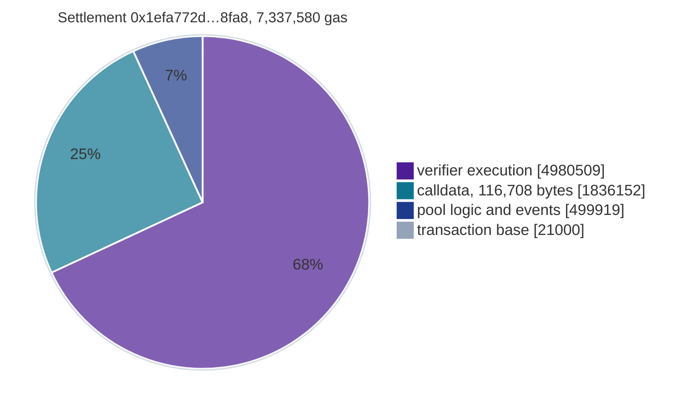

# Gas

What each operation of the launch stack costs, measured on Sepolia. It is for anyone who sends a
settlement, runs a relayer, prices a transfer, or deploys a stack. Every figure is the `gasUsed` of
a mined receipt or a value read on chain, and every transaction hash is in
[19-deployments-and-receipts.md](19-deployments-and-receipts.md). The levers that set these
numbers are in [18-gas-research.md](18-gas-research.md).

## Contents

- [A private transfer](#a-private-transfer)
- [Where the gas of one settlement goes](#where-the-gas-of-one-settlement-goes)
- [Why settlements differ](#why-settlements-differ)
- [Deposits](#deposits)
- [Publishing a root](#publishing-a-root)
- [Configuration calls](#configuration-calls)
- [Deployment](#deployment)
- [In dollars](#in-dollars)
- [Limits of one transaction](#limits-of-one-transaction)

## A private transfer

A settlement is one `settleBatch` transaction. It verifies the whole proof with every constraint
evaluated on chain, marks two nullifiers spent, appends two leaves, emits two 1,186-byte sealed
notes and credits the relay fee.

| | value | source |
|---|---:|---|
| settlements on the launch pool | 43 | `BatchSettled` events of `0x8e377752…49e2` |
| lowest gasUsed | 7,066,977 | `0xaa801a3d…bf39`, block 11,773,001 |
| highest gasUsed | 7,882,382 | `0x105e4e25…5e06`, block 11,773,030 |
| calldata of every settlement | 116,708 bytes | transaction input, all 43 |
| signed transaction | 116,825 to 116,826 bytes | `eth_getRawTransactionByHash`, three samples |
| status | 1 on all 43 | receipts |

## Where the gas of one settlement goes

Settlement `0x1efa772d…8fa8` (block 11,775,200) used 7,337,580 gas. Under EIP-7623 a transaction
pays

$$
\text{gasUsed} = 21{,}000 + \max\big(4T + E,\ 10T\big), \qquad T = z + 4n,
$$

with $z$ the zero bytes of calldata, $n$ the nonzero bytes and $E$ the execution gas. The calldata
is 116,708 bytes, 2,598 zero and 114,110 nonzero, so $T = 459{,}038$ and $4T = 1{,}836{,}152$. The
floor $10T = 4{,}590{,}380$ is below $4T + E$ and does not bind.

The verifier part is measured on its own. `eth_estimateGas` of `verifyBatch(proof, words)` on the
adapter `0xf64c3996…0927`, with the proof and words of this settlement, returns 6,797,269. That
call carries 113,732 bytes of calldata, 1,996 of them zero, so its own $4T$ is 1,795,760. Its
execution is $6{,}797{,}269 - 21{,}000 - 1{,}795{,}760 = 4{,}980{,}509$. The pool logic is what remains.

| part | gas | share | how it is obtained |
|---|---:|---:|---|
| verifier execution | 4,980,509 | 67.9% | `eth_estimateGas` of `verifyBatch`, less its base and its calldata |
| calldata | 1,836,152 | 25.0% | $4T$ over the settlement calldata |
| pool logic and events | 499,919 | 6.8% | $7{,}337{,}580 - 21{,}000 - 1{,}836{,}152 - 4{,}980{,}509$ |
| transaction base | 21,000 | 0.3% | intrinsic gas |

The verifier row rests on an estimate by the node at the latest block. The other rows follow from
the receipt and the calldata.

## Why settlements differ

Every settlement carries a proof of the same shape and calldata of the same length. The spread
comes from the tree. `settleBatch` appends both outputs by deferred insertion
(`GoldilocksIncrementalTree._insertLeafDeferred`), and leaf $i$ costs $\tau(i)$ calls to the
Poseidon hasher, $\tau(i)$ the number of trailing one bits of $i$
([09-tree.md](09-tree.md#deferred-insertion)). Grouped by $\tau(i_0) + \tau(i_1)$ over the two
output leaves:

| hashes for the two outputs | settlements | gasUsed |
|---:|---:|---|
| 1 | 19 | 7,066,977 to 7,086,413 |
| 2 | 13 | 7,203,510 to 7,241,481 |
| 3 | 5 | 7,337,580 to 7,342,374 |
| 4 | 2 | 7,477,858 to 7,479,249 |
| 5 | 2 | 7,610,180 to 7,611,241 |
| 6 | 1 | 7,744,702 |
| 7 | 1 | 7,882,382 |

Each extra hash adds about 135,000 gas. The highest settlement appends leaves 127 and 128, and
$\tau(127) = 7$.

## Deposits

`absorb` inserts one leaf by the same deferred rule. 85 deposits reached the launch pool, 80 of
them in the launch record. Asset 0 is the native coin. Asset 1 is the testnet NOX token, and a
deposit of it adds a `transferFrom` and two balance reads.

| asset | $\tau(i)$ | deposits | gasUsed |
|---:|---:|---:|---|
| 0 | 0 | 22 | 229,490 to 349,190 |
| 0 | 1 | 13 | 364,542 to 398,754 |
| 0 | 2 | 3 | 499,618 |
| 0 | 3 | 3 | 634,682 |
| 0 | 4 | 2 | 769,746 |
| 1 | 0 | 21 | 283,327 to 395,527 |
| 1 | 1 | 11 | 418,391 to 462,191 |
| 1 | 2 | 5 | 553,455 to 597,255 |
| 1 | 3 | 3 | 688,519 to 732,319 |
| 1 | 4 | 1 | 823,583 |
| 1 | 5 | 1 | 958,623 |

One hash costs 135,064 gas in `absorb`: the single-valued native rows 499,618, 634,682 and 769,746
step by that amount, and the NOX rows 823,583 and 958,623 by 135,040. The spread inside a row is
not decomposed here.

## Publishing a root

`commitRoot` folds the frontier through all 32 levels, 32 calls to `hash2` whatever the leaf
count, and publishes one root for every leaf inserted before it. Anyone may call it.

| call | gasUsed |
|---|---:|
| first `commitRoot` of the pool, 2 leaves | 4,424,015 |
| the six that followed, 44 to 171 leaves | 4,406,893 to 4,408,882 |

One root serves every deposit before it. Over $m$ deposits a root costs about $4{,}408{,}882 / m$
gas per deposit.

## Configuration calls

Owner calls go through the Safe, so their gasUsed includes the `execTransaction` wrapper.

| call | gasUsed |
|---|---:|
| `registerAsset(NOX, 1e9)`, through the Safe | 139,013 |
| `setBetaCaps`, through the Safe | 75,996 to 113,032 |
| `setMaxRelayFee`, through the Safe | 90,365 and 90,377 |
| `setOpenDeposits(true)`, through the Safe | 68,139 |
| `endBetaMode()`, through the Safe | 69,752 |
| `AssociationSetRegistry.publishRoot` | 55,380 to 75,280 |

## Deployment

| contract | gasUsed | block |
|---|---:|---:|
| `PoseidonGoldilocks` | 1,921,383 | 11,758,283 |
| `AssociationSetRegistry` | 220,074 | 11,761,496 |
| `NoxShieldStaking` | 1,162,012 | 11,761,497 |
| `ShieldFeeRouter` | 1,848,604 | 11,761,499 |
| `RealSplitVerifier` | 4,523,512 | 11,772,146 |
| `LaunchEvaluator`, with the data contract that holds its image | 5,687,769 | 11,772,147 |
| `ComposedStarkVerifier` | 1,380,943 | 11,772,149 |
| `attest` of the honest launch proof | 6,748,211 | 11,772,150 |
| `ShieldedPool` | 11,664,986 | 11,772,152 |

The five transactions of `script/shield/DeployLaunch.s.sol` total 30,005,421 gas. The `attest`
row is a whole verification plus one storage write and one event
([13-deployment.md](13-deployment.md#6-attest)).

## In dollars

A cost is $\text{gas} \times \text{base fee} \times \text{ETH/USD}$. The reference is mainnet block
26,036,876: `baseFeePerGas` 77,032,392 wei (0.077 gwei), and ETH at $2,762.47 from
`latestRoundData()` of the Chainlink ETH/USD feed `0x5f4eC3Df…8419` at that block. Priority fees
are left out.

| operation | gas | at 0.077 gwei | at 1 gwei | at 5 gwei |
|---|---:|---:|---:|---:|
| private transfer, lowest | 7,066,977 | $1.50 | $19.52 | $97.61 |
| private transfer, highest | 7,882,382 | $1.68 | $21.77 | $108.87 |
| of which the verifier | 4,980,509 | $1.06 | $13.76 | $68.79 |
| deposit, lowest | 229,490 | $0.05 | $0.63 | $3.17 |
| deposit, highest | 958,623 | $0.20 | $2.65 | $13.24 |
| publish a root | 4,424,015 | $0.94 | $12.22 | $61.11 |

The gas is what the receipts say. The dollars move with the base fee and the price of ETH.

## Limits of one transaction

| limit | value | launch figure |
|---|---:|---|
| transaction size relayed by execution clients | 131,072 bytes | a signed settlement is 116,826 bytes, 14,246 under |
| gas per transaction (EIP-7825) | 16,777,216 | the highest settlement is 7,882,382, 8,894,834 under |
| runtime code size (EIP-170) | 24,576 bytes | the evaluator image is 21,306 bytes in one data contract (`LaunchEvaluator.image()`) |
| initcode size (EIP-3860) | 49,152 bytes | the 112,916-byte proof body cannot be a constructor argument, so the pool self-test takes a 32-byte digest from `attest` |

The gas headroom lets a sender pad `eth_estimateGas` in the usual way. A 130% pad on the highest
settlement is 10,247,097 gas, under the cap.
