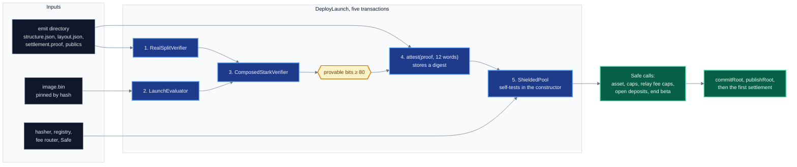

# Deployment

How the launch stack goes on chain: the order of the transactions, where each constructor
argument comes from, the checks each constructor runs, and the owner calls that open the pool. It
is for whoever deploys a stack or audits a deployment. The addresses and receipts of the deployed
stack are in [19-deployments-and-receipts.md](19-deployments-and-receipts.md), and their gas in
[12-gas.md](12-gas.md#deployment).

## Contents

1. [Overview](#1-overview)
2. [Parameters](#2-parameters)
3. [`RealSplitVerifier`](#3-realsplitverifier)
4. [`LaunchEvaluator` and its pinned image](#4-launchevaluator-and-its-pinned-image)
5. [`ComposedStarkVerifier`](#5-composedstarkverifier)
6. [`attest`](#6-attest)
7. [`ShieldedPool`](#7-shieldedpool)
8. [Companion contracts](#8-companion-contracts)
9. [Owner calls](#9-owner-calls)
10. [Before the first spend](#10-before-the-first-spend)

## 1. Overview

`script/shield/DeployLaunch.s.sol` deploys the four launch contracts and verifies one real proof
in five transactions. Every shape parameter comes from the emit directory of the prover, and the
evaluator image comes from `spec/launch-program/image.bin`.



The script refuses to start unless `layout.json` has `format5` true and `n_chal` 2. It reads six
environment variables:

| variable | meaning | default |
|---|---|---|
| `EMIT` | emit directory | `spec/launch-honest` |
| `IMAGE` | compiled evaluator image | `spec/launch-program/image.bin` |
| `SAFE` | owner of the pool | none |
| `HASHER` | `PoseidonGoldilocks` | none |
| `REGISTRY` | `AssociationSetRegistry` | none |
| `FEE_ROUTER` | `ShieldFeeRouter` | none |

```sh
EMIT=spec/launch-honest SAFE=<safe> HASHER=<hasher> REGISTRY=<registry> FEE_ROUTER=<router> \
  forge script script/shield/DeployLaunch.s.sol --rpc-url <rpc> --broadcast <signer flags>
```

The largest transaction is the pool at 11,664,986 gas. Forge pads its estimate to 130%, 15,164,482,
which stays under the 16,777,216 cap of EIP-7825.

## 2. Parameters

No verifier reads a shape field from a proof. Each value below is read from the emit and fixed in
an immutable, and `cast call` on the deployed verifier returns the same values
([19](19-deployments-and-receipts.md#state-read-on-chain)).

| argument | source in the emit | launch value |
|---|---|---:|
| `nq` | `structure.outer_n_queries` | 19 |
| `logDomain` | `structure.log_domain` | 23 |
| `logTraceLen` | `structure.log_trace_len` | 13 |
| `traceWidth` | `structure.trace_width` | 44 |
| `nCoeffs` | `structure.n_coeffs` | 100 |
| `grindBits` | `layout.final_grind.bits` when present, else `structure.grind_bits` | 25 |
| `cosetShift` | `structure.coset_shift` | 7 |
| `nPeriodic` | `layout.outer_n_periodic` | 93 |
| `periodicRoot` | `layout.outer_periodic_root_keccak_at_deployment_rate` | `0xbb761493…fdbd` |
| `recomputesCompZ` | literal in the script | true |
| `nChal` | `layout.n_chal` | 2 |
| `regionWidth` | `structure.region_width` | 34 |
| `finalAsCoefficients` | `layout.final_layer_coefficients` | true |
| `digestBytes` | `layout.digest_bytes` | 24 |
| `friRadix` | `layout.fri_radix` | 4 |
| `logDegreeBound` | `log_domain − extra_blowup_bits − 1` | 17 |
| `logFinal` | `layout.fri_final_log` | 9 |
| `format5` | literal in the script | true |
| `extChallenges` | `layout.ext_challenges` | true |
| `powerCoeffs`, `powerDeep` | `layout.coeff_rule`, `layout.deep_rule` equal to `"powers"` | true, true |
| `roundGrindBits` | `layout.round_grind_bits` | 20 |
| `finalSearches` | `layout.final_grind.searches` | 8 |
| `maskColumn` | `trace_width − 2` when `structure.frame` is present | 42 |

`script/shield/EmitCodec.sol` reads the layout keys for the scripts and the tests alike, so the two
cannot read a key differently. An unknown coefficient rule is refused. `structure.grind_bits` is 28,
the total of the split grind, $25 + \log_2 8$.

The deployer checks two rules against the artifact that no contract checks:

1. **Domain identity.** $\log_2 N = \lceil \log_2(d\,t) \rceil + 1 + e$ and $\log_2 N \le 32$, the
   two-adicity of $p - 1$. At the launch shape $\lceil \log_2(11 \cdot 2^{13}) \rceil + 1 + 5 = 23$.
2. **The circuit behind the root.** `periodicRoot` and the image hash name the circuit. A verifier
   deployed with another emit verifies another circuit.

`DeployLaunch` also stops before `attest` unless the adapter reports at least 80 provable bits
(`FLOOR_BITS`). No contract compares `soundnessBits()` with a floor.

## 3. `RealSplitVerifier`

```solidity
constructor(
    uint256 nq, uint256 logDomain, uint256 logTraceLen, uint256 traceWidth, uint256 nCoeffs,
    uint256 grindBits, uint256 cosetShift, uint256 nPeriodic, bytes32 periodicRoot,
    bool recomputesCompZ, Codec memory codec
)
```

The launch arguments are `(19, 23, 13, 44, 100, 25, 7, 93, 0xbb761493…, true,
(2, 34, true, 24, 4, 17, 9, true, true, true, true, 20, 8, 42))`, the codec in the field order of
`RealSplitVerifier.Codec`. The constructor reverts when:

| condition | error |
|---|---|
| `cosetShift` is not `ProductionAir.COSET_SHIFT` (7) | `CosetShiftMismatch` |
| `nChal` is neither 0 nor 2 | `UnsupportedChallengeCount` |
| `nChal = 2` and `regionWidth` is not in $(0, w)$, or `nChal = 0` and `regionWidth` is not 0 | `RegionWidthOutOfRange` |
| `digestBytes` is not 24 or 32, with zero read as 32 | require |
| `format5` is false, `nChal` is 0, or `friRadix` is not 4 | `FormatFiveOnly` |
| a coefficient-form final layer with `logDegreeBound = 0`, or `logDegreeBound ≥ logDomain`, or `logFinal > logDegreeBound`, or `logDegreeBound − logFinal` odd | `FriShapeUnpinned` |
| `grindBits` or `roundGrindBits` above 64 | `GrindBitsOutOfRange` |
| `finalSearches` above 64 | `GrindSearchesOutOfRange` |
| `maskColumn` nonzero and `maskColumn + 1 ≥ traceWidth` | `MaskColumnOutOfRange` |

At the launch shape $(17 - 9)/2 = 4$ radix-4 folds reach the 512-coefficient final layer. Every
proof head is checked against that shape again at verification (`FriShapeNotTheDeployment`).

## 4. `LaunchEvaluator` and its pinned image

```solidity
constructor(bytes memory image_)
```

The evaluator takes an image compiled ahead of time, because compiling the program on chain costs
more gas than one transaction may carry (`LaunchEvaluator.sol:9`). The constructor runs, in order:

1. `ProgramFormImage.pinned`: `keccak256(image_)` must equal `LaunchProgram.IMAGE_HASH`,
   `0x4b138b8b…6e69`, else `ImageMismatch`.
2. The pins must read public words 0 to $n - 1$, each of them, else `PinsNotContiguous`. For the
   launch circuit $n = 36$.
3. An image above $2 \cdot 24{,}575$ bytes reverts `ImageTooLarge`. The image is stored in one or
   two data contracts whose code is a `STOP` byte then the data, and a data contract whose code
   length is not the data length plus one reverts `ImageNotDeployed`.

The launch image is 21,306 bytes and fits one data contract. Before deploying, run

```sh
forge test --match-contract LaunchImageTest
```

`test_thePinIsTheCompileOfTheTape` compiles `spec/launch-program/tape.bin` with
`ProgramFormImage.compiled`, the compiler `ProgramFormEvaluator` runs at construction, and asserts
that the result hashes to `IMAGE_HASH`, that `image.bin` hashes to the same value, and that the tape
and the boundary table together are `program.bin` (`PROGRAM_HASH`). The compile checks the tape
against `TAPE_HASH` and its length of 14,074 bytes first.

## 5. `ComposedStarkVerifier`

```solidity
constructor(
    uint256[] memory sizes, RealSplitVerifier[] memory verifiers, Soundness[] memory soundness,
    address settler, IProgramFormEvaluator evaluator, uint256 wordsPerIntent
)
```

`DeployLaunch` passes `sizes = [1]`, the verifier, `soundness = [(19, 5, 25, 0, 0, 0)]`, a zero
settler, the evaluator and 12 words per intent. The soundness tuple is the outer queries, extra
blowup bits and grind bits, then an inner stage of zeros: the launch circuit is proved directly for
the chain. The constructor reverts when:

| condition | error |
|---|---|
| `sizes` is empty or the three arrays differ in length | `BadConstruction` |
| a size is zero or repeated, or a verifier is the zero address | `BadConstruction` |
| the verifier reports a zero `periodicRoot`, or the declared outer figure is zero | `BadConstruction` |
| the declared outer queries or grind differ from the `nq()` or `grindBits()` of the verifier | `SoundnessMismatch` |
| `evaluator` is the zero address | `ZeroEvaluator` |
| `wordsPerIntent` is neither 11 nor 12 | `BadIntentWidth` |

It emits `SoundnessDeclared(1, 142, 80, 0, periodicRoot)`, the figures `soundnessBits()` returns.
With $q = 19$, $e = 5$, $\kappa = 25$ and $S = 8$ the conjectured figure is
$q(e + 1) + \kappa + \log_2 S = 142$. The provable figure is the floor of the smaller of the query
and commit terms, 80 ([03-verifier-overview.md](03-verifier-overview.md#soundness-figures)).

## 6. `attest`

The pool constructor verifies one real proof. A proof body of 112,916 bytes cannot be a
constructor argument under the 49,152-byte initcode limit of EIP-3860, so the proof is verified in
its own transaction first:

1. `DeployLaunch._whole` cuts `settlement.proof` into `abi.encode(ONE_CALL, head, claims, queries, 0, 0)`
   ([04-proof-codec.md](04-proof-codec.md#the-one_call-encoding)) and packs the 36 limbs of
   `publics-array.json` into 12 words.
2. `attest(proof, words)` runs the whole composed verification, with comp_z computed on chain by
   the evaluator, and reverts `NotAccepted` on refusal.
3. It stores `attested[keccak256(proof)] = keccak256(abi.encode(words))` and emits `Attested`.

From then on `verifyBatch(digest, words)` with a 32-byte proof returns true only for the words the
digest was attested with. The deployed digest is in
[19](19-deployments-and-receipts.md#the-launch-stack).

## 7. `ShieldedPool`

```solidity
constructor(
    address safe, IStarkVerifier verifier, IPoseidonGoldilocks hasher, IAssociationSetRegistry registry,
    address feeRouter, uint16 shieldFeeBps, uint16 unshieldFeeBps, uint256 nativeScale,
    uint256 wordsPerIntent, DeploymentSelfTest memory selfTest
)
```

`DeployLaunch` passes the Safe, the adapter, the hasher, the registry, the fee router, 25 and 25
bps, native scale 1 (one note unit is one wei) and 12 words per intent. The constructor runs, in
order:

1. `GoldilocksIncrementalTree`: 32 calls to `hasher.hash2` build the empty-subtree digests, then
   the empty root is published.
2. `Ownable(safe)`: the Safe is the owner.
3. A zero verifier, registry or fee router reverts `ZeroAddress`. A fee above `MAX_FEE_BPS` (50)
   reverts `FeeBpsTooHigh`. A native scale of zero reads as 1, and one above $10^{18}$ reverts
   `BadScale`. A word count other than 11 or 12 reverts `BadWordsPerIntent`.
4. `hash2(hash2Left, hash2Right)` and `hashFields(fieldsInput)` are compared with the expected
   digests, else `HasherSelfTestFailed`.
5. The note commitment of `(noteValue, noteAssetId, noteOwnerCommit)`, computed by the pool with
   the hasher under test, is compared with the prover value, else `NoteCommitmentSelfTestFailed`.
   A mismatch would insert leaves no proof can open.
6. `verifier.verifyBatch(digest, words)` must return true, else `VerifierSelfTestFailed`.
7. The native coin is registered as asset 0 at the native scale.

The expected digests come from a vector file, never from the hasher under test. The pool starts
with `betaMode` true, `openDeposits` false, every deposit cap at zero, and no settler, so deposits
are closed until the owner opens them and anyone may settle.

`DeployLaunch` reads the vector from `spec/shield-selftest-b.json`. This tree carries the same
vector values as `spec/shield-selftest.json`, so the script needs one of the two names changed
before it runs here.

## 8. Companion contracts

The pool takes the hasher, the registry and the fee router as addresses. On Sepolia they were
deployed before the launch contracts and are shared with the pool ([19](19-deployments-and-receipts.md#the-launch-stack)).

| contract | constructor | reverts when |
|---|---|---|
| `PoseidonGoldilocks` | none | the permutation fails its built-in vectors, `KatFailed` |
| `AssociationSetRegistry` | none | |
| `NoxShieldStaking` | `(safe, nox, cooldown)` | `nox` is zero, or `cooldown` exceeds `MAX_COOLDOWN` (30 days) |
| `ShieldFeeRouter` | `(safe, nox, staking, treasury, stakingBps, treasuryBps, burnBps)` | `nox`, `staking` or `treasury` is zero, the three shares do not sum to 10,000, or `treasuryBps` exceeds `MAX_TREASURY_BPS` |

## 9. Owner calls

After the pool exists the Safe configures it. The launch pool received these, in this order
([19](19-deployments-and-receipts.md#configuration)):

| call | effect |
|---|---|
| `registerAsset(NOX, 1e9)` | asset 1, one note unit is $10^9$ base units |
| `setBetaCaps(assetId, addrCap, totalCap)` | per-address and pool-wide deposit caps in base units, zero until set |
| `setMaxRelayFee(0, 1e15)`, `setMaxRelayFee(1, 1e10)` | the largest relay fee, in note units, of an intent with no public leg |
| `setOpenDeposits(true)` | deposits open to every address while beta mode lasts |
| `endBetaMode()` | lifts the allowlist and the caps and closes `betaRefund`, one way |

`setMaxRelayFee` defaults to zero, and a zero cap refuses any relay fee on a private transfer in
that asset. `registerAsset` is owner-only because the scale of an asset is permanent.

A settler is optional. `proposeSettler` takes effect through `executeSettlerChange` after
`SETTLER_DELAY` (48 hours). The launch pool has none, so anyone with a valid proof settles at any
time ([10-fees-liveness-governance.md](10-fees-liveness-governance.md#who-may-settle)).

## 10. Before the first spend

Deposits update the frontier of the tree and publish no root. Before a spend can be proven:

1. `pool.commitRoot()`, callable by anyone, folds the frontier and publishes a root.
2. `registry.publishRoot(root, uri)` registers an association root. The registry refuses a zero or
   non-canonical digest and records any other.
3. The proof names a note root among the last 128 and a registered association root.

Before a settlement is sent, `SettleLaunch.s.sol` checks it against the live verifier and sends
nothing:

```sh
PROOF=<package proof> PUBLICS=<publics.json> \
  forge script script/shield/SettleLaunch.s.sol --sig "verifyOnly()" --rpc-url <rpc>
```

`run()` does the same check, then sends `settleBatch` with the two sealed notes from `BLOB0` and
`BLOB1`. A signed settlement is 116,826 bytes, under the 131,072-byte limit that nodes relay
([12-gas.md](12-gas.md#limits-of-one-transaction)).
