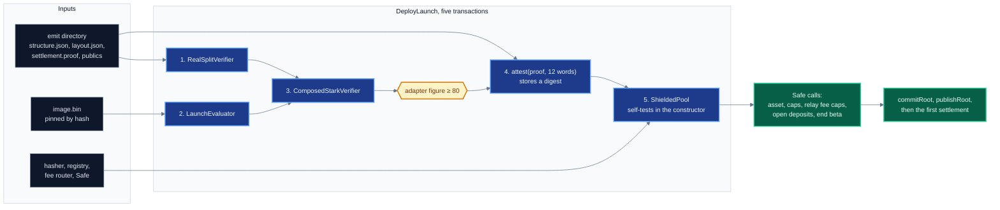

# Deployment

How a stack goes on chain. Sections 1 to 10 describe the launch stack (superseded), and section 11
the 12-word stack live on Sepolia since block 11,786,912: the order of the transactions, where each constructor
argument comes from, the checks each constructor runs, and the owner calls that open the pool. It
is for whoever deploys a stack or audits a deployment. The addresses and receipts of the deployed
stack are in [19-deployments-and-receipts.md](19-deployments-and-receipts.md), and their gas in
[12-gas.md](12-gas.md#deployment).

## Contents

1. [Overview](#1-overview)
2. [Parameters](#2-parameters)
3. [`RealSplitVerifier`](#3-realsplitverifier)
4. [`LaunchEvaluator` and its pinned image](#4-launchevaluator-and-its-pinned-image)
5. [`ComposedStarkVerifier`](#5-composedstarkverifier)
6. [`attest`](#6-attest)
7. [`ShieldedPool`](#7-shieldedpool)
8. [Companion contracts](#8-companion-contracts)
9. [Owner calls](#9-owner-calls)
10. [Before the first spend](#10-before-the-first-spend)
11. [The 12-word deployment](#11-the-12-word-deployment)

## 1. Overview

`script/shield/DeployLaunch.s.sol` deploys the four launch contracts and verifies one real proof
in five transactions. Every shape parameter comes from the emit directory of the prover, and the
evaluator image comes from `spec/launch-program/image.bin`.


```mermaid
%%{init: {'theme':'base','themeVariables':{'fontFamily':'Inter, -apple-system, Segoe UI, Helvetica, Arial, sans-serif','fontSize':'14px','lineColor':'#64748b','primaryColor':'#0f172a','primaryTextColor':'#0f172a','primaryBorderColor':'#334155','clusterBkg':'#f8fafc','clusterBorder':'#cbd5e1','edgeLabelBackground':'#ffffff','titleColor':'#0f172a'}}}%%
flowchart LR
    classDef input fill:#0f172a,stroke:#64748b,color:#e2e8f0,stroke-width:1px
    classDef step fill:#1e3a8a,stroke:#60a5fa,color:#eff6ff,stroke-width:2px
    classDef gate fill:#fef3c7,stroke:#d97706,color:#78350f,stroke-width:2px
    classDef owner fill:#065f46,stroke:#34d399,color:#ecfdf5,stroke-width:2px

    subgraph IN["Inputs"]
        direction TB
        EM["emit directory<br/>structure.json, layout.json,<br/>settlement.proof, publics"]:::input
        IM["image.bin<br/>pinned by hash"]:::input
        CO["hasher, registry,<br/>fee router, Safe"]:::input
    end

    subgraph TX["DeployLaunch, five transactions"]
        direction TB
        V["1. RealSplitVerifier"]:::step
        E["2. LaunchEvaluator"]:::step
        A["3. ComposedStarkVerifier"]:::step
        F{{"adapter figure ≥ 80"}}:::gate
        AT["4. attest(proof, 12 words)<br/>stores a digest"]:::step
        P["5. ShieldedPool<br/>self-tests in the constructor"]:::step
        V --> A
        E --> A
        A --> F --> AT --> P
    end

    S["Safe calls:<br/>asset, caps, relay fee caps,<br/>open deposits, end beta"]:::owner
    R["commitRoot, publishRoot,<br/>then the first settlement"]:::owner

    EM --> V
    EM --> AT
    IM --> E
    CO --> P
    P --> S --> R
```

The script refuses to start unless `layout.json` has `format5` true and `n_chal` 2. It reads six
environment variables:

| variable | meaning | default |
|---|---|---|
| `EMIT` | emit directory | `spec/launch-honest` |
| `IMAGE` | compiled evaluator image | `spec/launch-program/image.bin` |
| `SAFE` | owner of the pool | none |
| `HASHER` | `PoseidonGoldilocks` | none |
| `REGISTRY` | `AssociationSetRegistry` | none |
| `FEE_ROUTER` | `ShieldFeeRouter` | none |

```sh
EMIT=spec/launch-honest SAFE=<safe> HASHER=<hasher> REGISTRY=<registry> FEE_ROUTER=<router> \
  forge script script/shield/DeployLaunch.s.sol --rpc-url <rpc> --broadcast <signer flags>
```

The largest transaction is the pool at 11,664,986 gas. Forge pads its estimate to 130%, 15,164,482,
which stays under the 16,777,216 cap of EIP-7825.

## 2. Parameters

No verifier reads a shape field from a proof. Each value below is read from the emit and fixed in
an immutable, and `cast call` on the deployed verifier returns the same values
([19](19-deployments-and-receipts.md#state-read-on-chain)).

| argument | source in the emit | launch value |
|---|---|---:|
| `nq` | `structure.outer_n_queries` | 19 |
| `logDomain` | `structure.log_domain` | 23 |
| `logTraceLen` | `structure.log_trace_len` | 13 |
| `traceWidth` | `structure.trace_width` | 44 |
| `nCoeffs` | `structure.n_coeffs` | 100 |
| `grindBits` | `layout.final_grind.bits` when present, else `structure.grind_bits` | 25 |
| `cosetShift` | `structure.coset_shift` | 7 |
| `nPeriodic` | `layout.outer_n_periodic` | 93 |
| `periodicRoot` | `layout.outer_periodic_root_keccak_at_deployment_rate` | `0xbb761493…fdbd` |
| `recomputesCompZ` | literal in the script | true |
| `nChal` | `layout.n_chal` | 2 |
| `regionWidth` | `structure.region_width` | 34 |
| `finalAsCoefficients` | `layout.final_layer_coefficients` | true |
| `digestBytes` | `layout.digest_bytes` | 24 |
| `friRadix` | `layout.fri_radix` | 4 |
| `logDegreeBound` | `log_domain − extra_blowup_bits − 1` | 17 |
| `logFinal` | `layout.fri_final_log` | 9 |
| `format5` | literal in the script | true |
| `extChallenges` | `layout.ext_challenges` | true |
| `powerCoeffs`, `powerDeep` | `layout.coeff_rule`, `layout.deep_rule` equal to `"powers"` | true, true |
| `roundGrindBits` | `layout.round_grind_bits` | 20 |
| `finalSearches` | `layout.final_grind.searches` | 8 |
| `maskColumn` | `trace_width − 2` when `structure.frame` is present | 42 |

`script/shield/EmitCodec.sol` reads the layout keys for the scripts and the tests alike, so the two
cannot read a key differently. An unknown coefficient rule is refused. `structure.grind_bits` is 28,
the total of the split grind, $25 + \log_2 8$.

The deployer checks two rules against the artifact that no contract checks:

1. **Domain identity.** $\log_2 N = \lceil \log_2(d\,t) \rceil + 1 + e$ and $\log_2 N \le 32$, the
   two-adicity of $p - 1$. At the launch shape $\lceil \log_2(11 \cdot 2^{13}) \rceil + 1 + 5 = 23$.
2. **The circuit behind the root.** `periodicRoot` and the image hash name the circuit. A verifier
   deployed with another emit verifies another circuit.

`DeployLaunch` also stops before `attest` unless the adapter reports at least 80 bits
(`FLOOR_BITS`). That figure covers the query and commit terms only. The DEEP batching round, which
sets the launch point's provable figure, 54.4 bits under the 2020 theorem and 80.0 under the 2025
proximity gaps (a preprint), is not in it
([02](02-threat-model.md#the-deep-batching-round)). No contract compares `soundnessBits()` with a
floor.

## 3. `RealSplitVerifier`

```solidity
constructor(
    uint256 nq, uint256 logDomain, uint256 logTraceLen, uint256 traceWidth, uint256 nCoeffs,
    uint256 grindBits, uint256 cosetShift, uint256 nPeriodic, bytes32 periodicRoot,
    bool recomputesCompZ, Codec memory codec
)
```

The launch arguments are `(19, 23, 13, 44, 100, 25, 7, 93, 0xbb761493…, true,
(2, 34, true, 24, 4, 17, 9, true, true, true, true, 20, 8, 42))`, the codec in the field order of
`RealSplitVerifier.Codec`. The constructor reverts when:

| condition | error |
|---|---|
| `cosetShift` is not `ProductionAir.COSET_SHIFT` (7) | `CosetShiftMismatch` |
| `nChal` is neither 0 nor 2 | `UnsupportedChallengeCount` |
| `nChal = 2` and `regionWidth` is not in $(0, w)$, or `nChal = 0` and `regionWidth` is not 0 | `RegionWidthOutOfRange` |
| `digestBytes` is not 24 or 32, with zero read as 32 | require |
| `format5` is false, `nChal` is 0, or `friRadix` is not 4 | `FormatFiveOnly` |
| a coefficient-form final layer with `logDegreeBound = 0`, or `logDegreeBound ≥ logDomain`, or `logFinal > logDegreeBound`, or `logDegreeBound − logFinal` odd | `FriShapeUnpinned` |
| `grindBits` or `roundGrindBits` above 64 | `GrindBitsOutOfRange` |
| `finalSearches` above 64 | `GrindSearchesOutOfRange` |
| `maskColumn` nonzero and `maskColumn + 1 ≥ traceWidth` | `MaskColumnOutOfRange` |

At the launch shape $(17 - 9)/2 = 4$ radix-4 folds reach the 512-coefficient final layer. Every
proof head is checked against that shape again at verification (`FriShapeNotTheDeployment`).

## 4. `LaunchEvaluator` and its pinned image

```solidity
constructor(bytes memory image_)
```

The evaluator takes an image compiled ahead of time, because compiling the program on chain costs
more gas than one transaction may carry (`LaunchEvaluator.sol:9`). The constructor runs, in order:

1. `ProgramFormImage.pinned`: `keccak256(image_)` must equal `LaunchProgram.IMAGE_HASH`,
   `0x4b138b8b…6e69`, else `ImageMismatch`.
2. The pins must read public words 0 to $n - 1$, each of them, else `PinsNotContiguous`. For the
   launch circuit $n = 36$.
3. An image above $2 \cdot 24{,}575$ bytes reverts `ImageTooLarge`. The image is stored in one or
   two data contracts whose code is a `STOP` byte then the data, and a data contract whose code
   length is not the data length plus one reverts `ImageNotDeployed`.

The launch image is 21,306 bytes and fits one data contract. Before deploying, run

```sh
forge test --match-contract LaunchImageTest
```

`test_thePinIsTheCompileOfTheTape` compiles `spec/launch-program/tape.bin` with
`ProgramFormImage.compiled`, the compiler `ProgramFormEvaluator` runs at construction, and asserts
that the result hashes to `IMAGE_HASH`, that `image.bin` hashes to the same value, and that the tape
and the boundary table together are `program.bin` (`PROGRAM_HASH`). The compile checks the tape
against `TAPE_HASH` and its length of 14,074 bytes first.

## 5. `ComposedStarkVerifier`

```solidity
constructor(
    uint256[] memory sizes, RealSplitVerifier[] memory verifiers, Soundness[] memory soundness,
    address settler, IProgramFormEvaluator evaluator, uint256 wordsPerIntent
)
```

`DeployLaunch` passes `sizes = [1]`, the verifier, `soundness = [(19, 5, 25, 0, 0, 0)]`, a zero
settler, the evaluator and 12 words per intent. The soundness tuple is the outer queries, extra
blowup bits and grind bits, then an inner stage of zeros: the launch circuit is proved directly for
the chain. The constructor reverts when:

| condition | error |
|---|---|
| `sizes` is empty or the three arrays differ in length | `BadConstruction` |
| a size is zero or repeated, or a verifier is the zero address | `BadConstruction` |
| the verifier reports a zero `periodicRoot`, or the declared outer figure is zero | `BadConstruction` |
| the declared outer queries or grind differ from the `nq()` or `grindBits()` of the verifier | `SoundnessMismatch` |
| `evaluator` is the zero address | `ZeroEvaluator` |
| `wordsPerIntent` is neither 11 nor 12 | `BadIntentWidth` |

It emits `SoundnessDeclared(1, 142, 80, 0, periodicRoot)`, the figures `soundnessBits()` returns.
With $q = 19$, $e = 5$, $\kappa = 25$ and $S = 8$ the conjectured figure is
$q(e + 1) + \kappa + \log_2 S = 142$. The adapter's second figure is the floor of the smaller of the query
and commit terms, 80 ([03-verifier-overview.md](03-verifier-overview.md#soundness-figures)). The
provable figure is set by the DEEP batching round, which the adapter does not compute: 54.4 bits
under the 2020 theorem, 80.0 under the 2025 proximity gaps (a preprint).

## 6. `attest`

The pool constructor verifies one real proof. A proof body of 112,916 bytes cannot be a
constructor argument under the 49,152-byte initcode limit of EIP-3860, so the proof is verified in
its own transaction first:

1. `DeployLaunch._whole` cuts `settlement.proof` into `abi.encode(ONE_CALL, head, claims, queries, 0, 0)`
   ([04-proof-codec.md](04-proof-codec.md#the-one_call-encoding)) and packs the 36 limbs of
   `publics-array.json` into 12 words.
2. `attest(proof, words)` runs the whole composed verification, with comp_z computed on chain by
   the evaluator, and reverts `NotAccepted` on refusal.
3. It stores `attested[keccak256(proof)] = keccak256(abi.encode(words))` and emits `Attested`.

From then on `verifyBatch(digest, words)` with a 32-byte proof returns true only for the words the
digest was attested with. The deployed digest is in
[19](19-deployments-and-receipts.md#the-launch-stack-superseded).

## 7. `ShieldedPool`

```solidity
constructor(
    address safe, IStarkVerifier verifier, IPoseidonGoldilocks hasher, IAssociationSetRegistry registry,
    address feeRouter, uint16 shieldFeeBps, uint16 unshieldFeeBps, uint256 nativeScale,
    uint256 wordsPerIntent, DeploymentSelfTest memory selfTest
)
```

`DeployLaunch` passes the Safe, the adapter, the hasher, the registry, the fee router, 25 and 25
bps, native scale 1 (one note unit is one wei) and 12 words per intent. The constructor runs, in
order:

1. `GoldilocksIncrementalTree`: 32 calls to `hasher.hash2` build the empty-subtree digests, then
   the empty root is published.
2. `Ownable(safe)`: the Safe is the owner.
3. A zero verifier, registry or fee router reverts `ZeroAddress`. A fee above `MAX_FEE_BPS` (50)
   reverts `FeeBpsTooHigh`. A native scale of zero reads as 1, and one above $10^{18}$ reverts
   `BadScale`. A word count other than 11 or 12 reverts `BadWordsPerIntent`.
4. `hash2(hash2Left, hash2Right)` and `hashFields(fieldsInput)` are compared with the expected
   digests, else `HasherSelfTestFailed`.
5. The note commitment of `(noteValue, noteAssetId, noteOwnerCommit)`, computed by the pool with
   the hasher under test, is compared with the prover value, else `NoteCommitmentSelfTestFailed`.
   A mismatch would insert leaves no proof can open.
6. `verifier.verifyBatch(digest, words)` must return true, else `VerifierSelfTestFailed`.
7. The native coin is registered as asset 0 at the native scale.

The expected digests come from a vector file, never from the hasher under test. The pool starts
with `betaMode` true, `openDeposits` false, every deposit cap at zero, and no settler, so deposits
are closed until the owner opens them and anyone may settle.

`DeployLaunch` reads the vector from `spec/shield-selftest-b.json`. This tree carries the same
vector values as `spec/shield-selftest.json`, so the script needs one of the two names changed
before it runs here.

## 8. Companion contracts

The pool takes the hasher, the registry and the fee router as addresses. On Sepolia they were
deployed before the launch contracts and are shared with the pool ([19](19-deployments-and-receipts.md#the-launch-stack-superseded)).

| contract | constructor | reverts when |
|---|---|---|
| `PoseidonGoldilocks` | none | the permutation fails its built-in vectors, `KatFailed` |
| `AssociationSetRegistry` | none | |
| `NoxShieldStaking` | `(safe, nox, cooldown)` | `nox` is zero, or `cooldown` exceeds `MAX_COOLDOWN` (30 days) |
| `ShieldFeeRouter` | `(safe, nox, staking, treasury, stakingBps, treasuryBps, burnBps)` | `nox`, `staking` or `treasury` is zero, the three shares do not sum to 10,000, or `treasuryBps` exceeds `MAX_TREASURY_BPS` |

## 9. Owner calls

After the pool exists the Safe configures it. The launch pool received these, in this order
([19](19-deployments-and-receipts.md#configuration)):

| call | effect |
|---|---|
| `registerAsset(NOX, 1e9)` | asset 1, one note unit is $10^9$ base units |
| `setBetaCaps(assetId, addrCap, totalCap)` | per-address and pool-wide deposit caps in base units, zero until set |
| `setMaxRelayFee(0, 1e15)`, `setMaxRelayFee(1, 1e10)` | the largest relay fee, in note units, of an intent with no public leg |
| `setOpenDeposits(true)` | deposits open to every address while beta mode lasts |
| `endBetaMode()` | lifts the allowlist and the caps and closes `betaRefund`, one way |

`setMaxRelayFee` defaults to zero, and a zero cap refuses any relay fee on a private transfer in
that asset. `registerAsset` is owner-only because the scale of an asset is permanent.

A settler is optional. `proposeSettler` takes effect through `executeSettlerChange` after
`SETTLER_DELAY` (48 hours). The launch pool has none, so anyone with a valid proof settles at any
time ([10-fees-liveness-governance.md](10-fees-liveness-governance.md#who-may-settle)).

## 10. Before the first spend

Deposits update the frontier of the tree and publish no root. Before a spend can be proven:

1. `pool.commitRoot()`, callable by anyone, folds the frontier and publishes a root.
2. `registry.publishRoot(root, uri)` registers an association root. The registry refuses a zero or
   non-canonical digest and records any other.
3. The proof names a note root among the last 128 and a registered association root.

Before a settlement is sent, `SettleLaunch.s.sol` checks it against the live verifier and sends
nothing:

```sh
PROOF=<package proof> PUBLICS=<publics.json> \
  forge script script/shield/SettleLaunch.s.sol --sig "verifyOnly()" --rpc-url <rpc>
```

`run()` does the same check, then sends `settleBatch` with the two sealed notes from `BLOB0` and
`BLOB1`. A signed settlement is 116,826 bytes, under the 131,072-byte limit that nodes relay
([12-gas.md](12-gas.md#limits-of-one-transaction)).

## 11. The 12-word deployment

The 12-word pool is a new pool beside the launch pool, not an upgrade of it. It was deployed on Sepolia on
26 September 2026, from block 11,786,912: 24 transactions, all successful, 67,278,690 gas. Every
receipt is in [19-deployments-and-receipts.md](19-deployments-and-receipts.md#the-12-word-pool). It takes format 7 proofs in three
query shapes (docs/16 and docs/17 of the prover), checks each asset's standard amounts and flat
relay fee through `AmountPolicy`, and can be paused for a bounded time
([08-pool.md](08-pool.md), [20-security-status.md](20-security-status.md)).

### Order

`script/shield/DeployShapes.s.sol` deploys the whole stack from `spec/shapes` in one run and refuses to
start unless `spec/shapes` is the stack named by env:

| env | checked against |
|---|---|
| `IMAGE_HASH` | keccak256 of `spec/shapes/image.bin`, the evaluator image the straight-line evaluator was generated from |
| `PERIODIC_ROOT` | the periodic root every walk holds; each walk must also open 59 periodic columns |
| `PARAM_A`, `PARAM_AP`, `PARAM_B` | `spec/shapes/params.json`, and the adapter must map them to shapes 1, 2 and 3 |

Then, in order:

1. The evaluator: three code chunks from `spec/shapes/chunk*.hex` and `ShapesStraightEvaluatorAt`, whose
   constructor refuses a chunk whose code hash is not the one it was generated with.
2. The three prepares and walks, and `ComposedStarkVerifierShapes`, whose constructor holds every
   walk to its declared shape (queries, grind, radix, round grind, digest size, independent DEEP
   coefficients). Every shape must declare at least 80 provable bits. The constructor also takes
   `IMAGE_HASH` and the code hash of every contract of the stack, which the script computes from the
   build (the chunk files as they are, each compiled runtime with its immutables filled by the
   addresses it was constructed with), and refuses any deployed code that differs, with
   `CodeMismatch`. `stack()` then returns the image hash and every address and code hash in one
   call, the evaluator, its chunks, then each shape's prepare and walk, to check against
   MANIFEST.md.
3. `attest` on the pinned shape A proof in `spec/shapes/transfer-eth-shape1`. The pool's constructor runs
   its self-test on that digest and those public words, and refuses a verifier whose weakest shape
   is under the floor.
4. The hasher, unless `HASHER` names one: `PoseidonGoldilocksFast` from `spec/poseidon-fast`
   (`HASHER_STANDARD=true` deploys `PoseidonGoldilocks` instead). Its bytecode is the output of
   `script/tools/poseidon_fast/gen.py`, and `test/shield/PoseidonFast.t.sol` regenerates it and
   compares byte for byte, checks the pinned vectors, and runs it against `PoseidonGoldilocks` on
   every entry point, with identical outputs and identical revert data (2,000 fixed inputs and
   2,000 fuzz runs per test). Its constructor runs the pinned vectors and deploys nothing if they
   fail, and the pool's constructor checks the launch vectors again. Then the association
   registry, unless `REGISTRY` names one.
5. The pool and its companions, below.

### The pool and its companions, in order

1. `ShieldedPool`, owned by the deployer while it is configured.
2. `registerAsset(NOX, NOX_SCALE)`, when `NOX_TOKEN` is set.
3. `AmountPolicy.initRanges`: every asset's range and flat fee at once. Defaults, each
   overridable by env:

   | asset | range | flat fee |
   |---|---|---|
   | ETH, one unit is one wei | $10^{15}$ to $10^{19}$ wei | $10^{15}$ wei |
   | NOX, one unit is $10^9$ base units | $10^9$ to $10^{15}$ units (1 to 1,000,000 NOX) | $10^{10}$ units (10 NOX) |

   An asset without a range cannot be deposited or settled, so there is no moment with the rules
   off. The Sepolia deployment overrode both defaults, so the flat fee is 0.5% of the smallest
   withdrawal:

   | asset | env | range | flat fee |
   |---|---|---|---|
   | ETH | `ETH_MIN_EXP=16`, `ETH_MAX_EXP=19`, `ETH_FEE=5e13` | 0.01 to 10 ETH in practice (20 and 50 exceed a note's maximum) | 0.00005 ETH |
   | NOX | `NOX_MIN_EXP=12`, `NOX_MAX_EXP=15`, `NOX_FEE=5e9` | 1,000 to 5,000,000 NOX | 5 NOX |
4. `AmountPolicy.setGuardian(GUARDIAN)`.
5. `setOpenDeposits(true)` and `endBetaMode()`, unless `OPEN=false`.
6. `RelayerRegistry(policy)` and `RootBounty(pool, BOUNTY, BOUNTY_INTERVAL)`: 0.001 ETH at most every
   10 minutes by default.
7. `transferOwnership(SAFE)` on the pool and on the policy. Both are `Ownable2Step`: the Safe
   completes each with `acceptOwnership()`, two Safe transactions, and until it does the deployer
   remains owner. Check `pendingOwner()` on both before handing over the relayer.

```sh
FEE_ROUTER=<router> GUARDIAN=<guardian> IMAGE_HASH=<hash> PERIODIC_ROOT=<root> \
  PARAM_A=<id> PARAM_AP=<id> PARAM_B=<id> NOX_TOKEN=<nox> HASHER=<hasher> \
  forge script script/shield/DeployShapes.s.sol --rpc-url <rpc> --broadcast
```

### Rehearsal

`script/shield/verify_shapes.sh` deploys the stack once on a Sepolia fork with `DeployShapes`, then settles
every pinned proof in `spec/shapes` from the same snapshot, and measures each `settleBatch` from its own
mined transaction. A pinned proof's notes come from fixture secrets, so each settlement follows two
stand-in deposits and the proof's note root written into the pool's known-root storage: those rows
are "pinned, root written". The policy settles only the flat fee or zero, so the pool is deployed
with the transfers' fee and the withdrawal's fee is queued.

On 26 Sep every settlement is bound by the calldata floor:

| proof | shape | gasUsed | execution | calldata bytes |
|---|---|---|---|---|
| transfer | A, 19 queries | 3,858,340 | 2,152,613 | 97,156 |
| transfer | A', 18 queries | 3,748,330 | 2,072,739 | 94,372 |
| transfer | B, 17 queries | 3,578,860 | 2,015,533 | 90,148 |
| withdrawal | A | 3,955,350 | 2,159,614 | 99,588 |

With the standard `PoseidonGoldilocks`, the two tree inserts of a settlement cost about 212,000 more,
which lifts a transfer above the floor: 3,911,723 for shape A. The rehearsal's deployment was 23
transactions and 66.9M gas; the Sepolia broadcast, which also deployed the fast hasher, was 24
transactions and 67,278,690 gas.

### The relayer switch

1. The Safe accepts ownership of the pool and the policy. Done on Sepolia at blocks 11,786,946 and
   11,786,948; `pendingOwner()` is zero on both.
2. A proof made for the pool settles there once, from the relayer, before the relayer's pool
   address changes.
3. The relayer's pool, verifier and parameter ids change in one restart. Its privacy settings (the
   random settle delay and root commits on fixed clock slots) carry over unchanged.
4. Roots: `RootBounty` pays whoever commits a moved root, so root publication does not depend on the
   relayer.

### Moving from the launch pool

The launch pool stays up: its notes remain spendable there, since its settlement cannot be paused.
A holder moves by withdrawing from the launch pool to a fresh address and depositing standard
amounts into the 12-word pool. The withdrawal is public, and the wallet says so before it is sent. The launch
pool's deposits stay paused.

