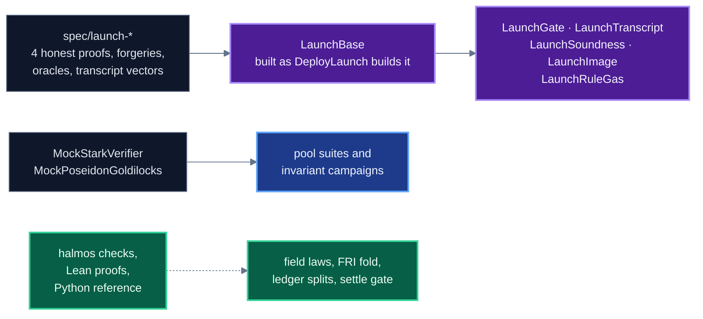

# Testing

What the test suite establishes about the launch stack, file by file, how to run each part, and
what CI runs on every change. It is for anyone who changes a Shield contract or decides how much
weight a green run carries. What is checked and what is not, across tests, proofs and review, is
in [20-security-status.md](20-security-status.md).

## Contents

- [Running it](#running-it)
- [The shape of the suite](#the-shape-of-the-suite)
- [The launch artifacts](#the-launch-artifacts)
- [The launch verifier against real proofs](#the-launch-verifier-against-real-proofs)
- [The deployed surface](#the-deployed-surface)
- [The pool](#the-pool)
- [The tree and the hasher](#the-tree-and-the-hasher)
- [Verifier building blocks](#verifier-building-blocks)
- [Invariants and fuzzing](#invariants-and-fuzzing)
- [Symbolic checks](#symbolic-checks)
- [Lean proofs](#lean-proofs)
- [Audit scripts](#audit-scripts)
- [The fork test](#the-fork-test)
- [CI](#ci)
- [What the suite does not establish](#what-the-suite-does-not-establish)

## Running it

```sh
forge test                                                   # everything, as CI runs it
forge test --match-contract 'Launch'                         # the launch verifier suites
forge test --match-contract LaunchImageTest                  # the evaluator pin, before a deployment
FOUNDRY_PROFILE=deep forge test --match-contract Invariant    # the long invariant campaign
MAINNET_RPC_URL=<rpc> forge test --match-contract BuybackForkTest -vv
```

```sh
pip install halmos==0.3.3
FOUNDRY_TEST=test/shield/halmos FOUNDRY_OUT=out-halmos \
  halmos --forge-build-out out-halmos --match-contract 'Halmos$'                 # every symbolic check
cd formal/lean && lake exe cache get && lake build && lake env lean Axioms.lean # the Lean proofs
```

`foundry.toml` sets what the verifier tests need:

| key | value | why |
|---|---|---|
| `gas_limit` | 90,000,000,000 | a whole verification in a test runs past the default block gas limit |
| `memory_limit` | 536,870,912 | the proof and its decoded sections sit in memory at once |
| `ffi` | true | `DeployedSurface.t.sol` runs a Python script, the only use of `ffi` |
| `fs_permissions` | read on `./` | the tests read proofs and vectors from `spec/` |
| `[profile.default.invariant]` | 512 runs, depth 200 | every run |
| `[profile.deep.invariant]` | 2,000 runs, depth 500 | nightly |

`test/shield/` holds 157 `*.t.sol` files, with more under `evaluator/`, `halmos/`, `invariants/` and
`yul/`. The test count is what `forge test` prints for the checkout in hand.

## The shape of the suite



The verifier suites build the real stack from real proofs. The pool suites replace the verifier
and the hasher with mocks, so they test the accounting under any proof the mock accepts. The
symbolic checks and the Lean proofs cover arithmetic and small predicates.

## The launch artifacts

| directory | contents |
|---|---|
| `spec/launch-honest`, `spec/launch-spend`, `spec/launch-withdraw-a`, `spec/launch-withdraw-b` | a 112,916-byte proof body, `structure.json`, `layout.json`, the 36 public limbs, the prover values of z and comp_z (`oracle.json`, `z.json`, `compz.json`) and `transcript-kat.json`, every transcript operation of the proof with the state after it |
| `spec/launch-forgeries` | proofs the verifier must refuse, their publics, a control built the same way with an honest witness, tampered publics, and `grind-kat.json` |
| `spec/launch-program` | the transition tape (14,074 bytes), `program.bin` (tape and boundary table) and `image.bin` (21,306 bytes, the evaluator image) |

`LaunchBase.sol` reads `spec/launch-honest` and deploys `RealSplitVerifier`, `LaunchEvaluator`
and a 12-word `ComposedStarkVerifier` the way `script/shield/DeployLaunch.s.sol` does, through the
same `EmitCodec` readers. Every shape constant comes from the JSON at run time.

## The launch verifier against real proofs

| suite | what it establishes |
|---|---|
| `LaunchGate.t.sol` (18 tests) | each of the four honest proofs verifies through `verifyBatch` with 12 words, and the gas of each is printed. The replayed $z$, $\beta$, $\gamma$ and the evaluator comp_z equal the prover values in `oracle.json` for all four. The evaluator refuses any image but its pin and pins 36 public words. The tape compiled with the wrong challenge count is refused. The forgery control is accepted. Refused: a bent trace, a value balanced only modulo $p$, a dummy note worth $p$, a wrong nullifier, a composition that is not the circuit, a mask pair opened apart, the statement of another proof, a tampered amount, a tampered recipient, and one flipped bit in each of the 12 nonces |
| `LaunchTranscript.t.sol` (7 tests) | the transcript of the verifier, read from its own walk, matches `transcript-kat.json` draw for draw on all four proofs: $\beta$, $\gamma$, $\alpha$ and the first composition coefficients, $z$, the DEEP coefficients and the seed, each FRI round nonce and fold challenge, the 8 query nonces and the 19 positions. The split-grind vector checks. A query nonce searched against the head and not against the previous nonce is refused, and so is a fold nonce under its bound |
| `LaunchSoundness.t.sol` (3 tests) | the adapter returns query term 80,774,533 and commit term 81,933,909 millionths of a bit, and $(142, 80)$. Without the round grind the commit term is 61,933,909 and the figure 61. One 28-bit query nonce prices the same as eight of 25 |
| `LaunchImage.t.sol` (1 test) | the pinned image is the compile of the tape, `image.bin` hashes to the pin, and tape plus boundaries is `program.bin` |
| `LaunchRuleGas.t.sol` (1 test) | prints the gas of each transcript rule against its alternative, and of the whole transcript, at the launch shape |
| `AddressLimbs.t.sol` (4 tests) | an address word splits into limbs of 48, 48, 48 and 16 bits, every address round-trips, and a word wider than an address is refused |

A test that accepts the honest proof shows only that the verifier does not refuse everything. The
refusal tests show that particular checks fire. The pair is the evidence.

## The deployed surface

`DeployedSurface.t.sol` computes the import closure of `RealSplitVerifier.sol` from source and
asserts that it equals a declared list of 13 files, each with its reason. A new import on the
deployed path fails the test until it is added to the list.

The closure script is `test/tools/import_closure.py`, run through `ffi`. The test calls it as
`script/shield/import_closure.py`, a path not in this tree, so the test fails until the two agree.

## The pool

These suites run on `ShieldTestBase`, a 12-word pool over `MockStarkVerifier` and
`MockPoseidonGoldilocks`.

| suite | covers |
|---|---|
| `ShieldedPool.t.sol` (36), `ShieldedPoolGuards.t.sol` (14), `ShieldedPoolReject.t.sol` (21) | deposit, settle, claim, sweep and every revert of the external functions |
| `FeeRecipient.t.sol` (21) | the relay fee: credited to `feeRecipient` and never pushed, sent to the router with no recipient, refused above `maxRelayFee` or at its default of zero, a recipient without a fee refused, 12 words per intent, only 11- and 12-word pools deploy |
| `BetaGate.t.sol` (29) | allowlist, caps, pause, depositor-only refund, and `endBetaMode`, which cannot be undone |
| `AssetScale.t.sol` (14) | notes, fees and public amounts in units, and every on-chain amount as units times the scale |
| `NullifierAndRoot.t.sol` (10), `OneNotePayment.t.sol` (3) | nullifier reuse, the root window, and the dead input of a one-note payment |
| `SettlerWindow.t.sol` (8) | the settler priority window and the open slot, bound to `SettlerGate` |
| `FeeExactness.t.sol` (3), `FeeRouterLiveness.t.sol`, `ShieldFeeRouter.t.sol`, `ShieldFeeRouterGuards.t.sol`, `NoxShieldStaking.t.sol`, `NoxShieldStakingGuards.t.sol` | fee arithmetic, the fee router and staking |
| `HostileTokens.t.sol` (9), `HostileTokenReturns.t.sol` (12), `invariants/KnownIssues.t.sol` (8) | tokens that under-deliver, rebase, reenter, block a recipient, burn gas or answer `transfer` badly |
| `AssociationSetRegistry.t.sol` (5) | open, append-only publishing, and refusal of a zero or non-canonical root |

## The tree and the hasher

| suite | covers |
|---|---|
| `TreeCapacity.t.sol` | the last leaf of the depth-32 tree, where both insert paths stop with `TreeIsFull` |
| `FrontierFold.t.sol`, `BatchInsert.t.sol` | the deferred fold against the full walk, and batched against single insertion |
| `ZerosChainReal.t.sol` | the empty-subtree chain against the real hasher, values pinned |
| `PoseidonGoldilocks.t.sol`, `PoseidonVector.t.sol` | the hasher against `spec/poseidon-constants.json` and against permutation vectors of the prover |

## Verifier building blocks

| suite | covers |
|---|---|
| `StarkFieldExt.t.sol` | $\mathbb{F}_p$ and $\mathbb{F}_{p^2}$ laws by fuzzing, $X^2 = 7$, norm, root-of-unity order |
| `CodecV12.t.sol` | 24-byte Merkle paths against `cast keccak` vectors |
| `Radix4.t.sol`, `EarlyStop.t.sol` | a radix-4 fold equals two radix-2 folds, and the degree check of the final layer |
| `yul/*Diff.t.sol` | the Yul of `GoldilocksCore`, `RealQueryWalk`, `StarkMerkle` and `StarkTranscript` against Solidity twins in `test/shield/reference/`, and for `RealQueryWalk` on queries damaged one way at a time |
| `evaluator/ProgramFormEvaluatorDiff.t.sol` | the program-form evaluator against a reference evaluator on oracles and random programs, refusal of a changed tape, a forward operand or a clobbering slot map, and the code-size limits |

Suites that read the artifacts of other circuits (`spec/f5-*`, `spec/emit-*`, `spec/onetx-*`,
`spec/production-*`, `spec/*-selftest.json`) exercise these shared components. They do not load
the launch verifier.

## Invariants and fuzzing

`ShieldInvariants.t.sol` drives a handler against the pool through deposits, private and public
batches, residual swaps, double spends, refunds, root commits, refused payouts, fee sweeps and
governance changes. After every sequence it checks 16 invariants:

| invariant | statement |
|---|---|
| solvency | $\mathrm{balance}_k \ge \mathtt{totalShielded}_k$ for the native asset and an ERC-20 |
| conservation | $\mathtt{totalShielded}_k = \text{credited}_k - \text{debited}_k$ as the handler tracks them |
| coverage | the balance covers `totalShielded`, held fees and claimable credits |
| fee caps | both fee rates at most 50 bps, also after governance changes |
| nullifiers | a spent nullifier is never unspent |
| roots | the current root is always known, and a second `commitRoot` changes nothing |
| custody pins | `verifier`, `treeHasher` and `associationRegistry` never change |
| beta | a refund never exceeds what was credited, wind-down is one-way, and refunds keep both assets solvent |

`invariants/PoolInvariants.t.sol`, `TreeInvariants.t.sol` and `ClearingFuzz.t.sol` hold the pool,
every insert path of the tree and residual clearing to their rules. `FieldFuzz.t.sol` states as
fuzz tests the field properties a solver does not close in time. `invariants/periphery/` drives the
registry, the faucet, staking and the fee router. Accounting drift shows in long sequences, so the
nightly job runs the deep profile.

## Symbolic checks

| suite | properties, for all inputs |
|---|---|
| `halmos/Field.halmos.t.sol` | $\mathbb{F}_p$ and $\mathbb{F}_{p^2}$ operations against plain 256-bit reference arithmetic |
| `halmos/PublicWords.halmos.t.sol` | the expansion of words into limbs |
| `halmos/SettlerGate.halmos.t.sol` | the settle predicate over every settler, caller and timestamp in one epoch |
| `halmos/ShieldLedger.halmos.t.sol` | deposit and unshield splits conserve value and never wrap |
| `halmos/periphery/*.halmos.t.sol` | the registry, the faucet, staking and the fee router |
| `ShieldSymbolic.t.sol` | digest canonicity, the router split, the fee bound, the staking accumulator |

`test/shield/halmos/README.md` lists the properties stated as fuzz tests instead, with the reason
for each.

## Lean proofs

`formal/lean` is a Lean 4 project pinned to `leanprover/lean4:v4.34.0` with Mathlib. It proves
the primality of $p$, that $X^2 - 7$ is irreducible, the inverse and Frobenius formulas in
$\mathbb{F}_{p^2}$, the radix-4 fold and the chained FRI inverses, and word-level models of the
contract arithmetic. The modules are under `Shield/`: `Field`, `Arith`, `Fri`, `Deep`, `Merkle`,
`Soundness`, `Zk` and `Protocol`. `formal/lean/README.md` states each theorem and what is not
proved. It does not prove the verifier sound.

## Audit scripts

| script | reports | exit |
|---|---|---|
| `test/tools/audit/declared-but-unenforced.sh` | a custom error no `revert` or `.selector` reaches, and a role constant nothing gates on | 1 if any are found, 2 if fewer than 10 files were scanned |
| `test/tools/audit/one-home-per-quantity.sh` | a quantity the structure file publishes written as a literal in more than one live contract | 1 on a second live home, 2 if fewer than 10 files were scanned |

On this tree both scripts exit 0. `declared-but-unenforced.sh` also matches a revert through a
qualified name, such as `ProgramFormEvaluatorBase.SlotsNotForThisTape`.

## The fork test

`BuybackFork.t.sol` forks mainnet and runs the buyback leg of `ShieldFeeRouter` against the
Uniswap V2 router. It reads `MAINNET_RPC_URL` and returns early, passing, when the variable is
unset. A green run without that variable has not exercised it. No suite forks Sepolia.

## CI

| workflow | trigger | jobs |
|---|---|---|
| `ci.yml` | every push and pull request | `forge build`. A size gate: the runtime and initcode of every deployed contract, `LaunchEvaluator` among them, against the limits of EIP-170 and EIP-3860. The generators must reproduce `spec/launch-program/program.bin`, `tape.bin` and `LaunchSlots.SLOTS` byte for byte. `forge test`, where the fork test returns early without `MAINNET_RPC_URL`. The two audit scripts. A render of every Mermaid block in `README.md` and `docs/*.md` |
| `security.yml` | pull requests, pushes to `main`, weekly | Slither, failing on high severity. Aderyn and Semgrep, reported to code scanning. gitleaks over the full history. Dependency review on pull requests. CodeQL on Python. Halmos over every `Halmos` contract except the fee router, whose split is proved in Lean (`Shield/Protocol/FeeRouter.lean`) |
| `nightly.yml` | daily | invariants at the deep profile, every other test at 10,000 fuzz runs, and Halmos over every contract with no per-query timeout |
| `lean.yml` | changes under `formal/lean` | refuses `sorry`, `admit` and any `axiom`, builds from clean, and checks that the main theorems use only `propext`, `Classical.choice` and `Quot.sound` |

The launch image lives in a data contract under the code-size limit, checked on chain by
`LaunchEvaluator.image()` ([19](19-deployments-and-receipts.md#state-read-on-chain)).

## What the suite does not establish

- **Adversarial proving.** Every accepted proof comes from a cooperating prover, and each refused
  forgery is a specific construction. The suite shows that valid proofs verify and those forgeries
  fail. It does not show that no forgery exists.
- **The circuit.** The suites hold the verifier to the proofs and oracles of the prover. They do not
  check that the constraints express the rules of the pool, including the value range checks,
  whose source is outside this repository.
- **Zero knowledge.** Hiding is a property of the prover. The contracts check soundness only, and no
  test here measures what a proof reveals.
- **The pool with the real verifier in the invariant campaign.** The campaign runs on mocks, so it
  says nothing about the verifier or the hasher.
- **External review.** No part of the repository has been audited.
