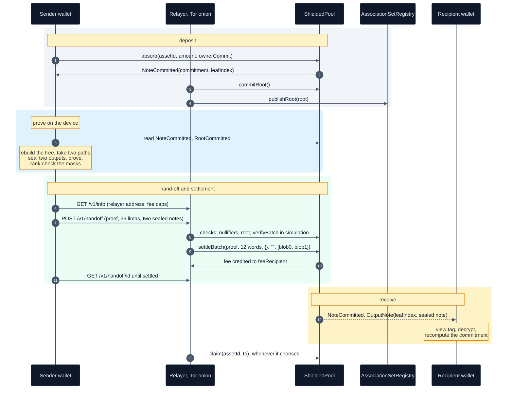

# Wallet integration

The complete flow a wallet implements against the launch pool: keys and the `nox1` address, deposit,
roots and Merkle paths, the 12 public words, a transfer with a relay fee, the relayer hand-off,
scanning for incoming notes, `claim`, and withdrawal. For wallet engineers.

The byte format of a sealed note is in [Client data](17-client-data.md), and the rules of the pool
itself are in [The pool](08-pool.md). Line references are to `contracts/shield/ShieldedPool.sol`
unless stated. What the verifier checks and what it does not is in
[Security status](20-security-status.md).

- [The flow in one picture](#the-flow-in-one-picture)
- [Contracts and events](#contracts-and-events)
- [Keys and the `nox1` address](#keys-and-the-nox1-address)
- [The note and its commitment](#the-note-and-its-commitment)
- [Deposit](#deposit)
- [Roots and Merkle paths](#roots-and-merkle-paths)
- [The statement: 12 words, 36 limbs](#the-statement-12-words-36-limbs)
- [A transfer with a relay fee](#a-transfer-with-a-relay-fee)
- [The relayer hand-off](#the-relayer-hand-off)
- [Submitting without a relayer](#submitting-without-a-relayer)
- [Receiving](#receiving)
- [Spent notes](#spent-notes)
- [Collecting a credit with `claim`](#collecting-a-credit-with-claim)
- [Withdraw](#withdraw)
- [What the wallet must never do](#what-the-wallet-must-never-do)

## The flow in one picture



## Contracts and events

Sepolia, chain 11155111:

| contract | address |
|---|---|
| `ShieldedPool` | `0x8e377752C8890E23A1E9F40eBbD41183Fc6949e2`, deployed at block 11,772,152 |
| `AssociationSetRegistry` | `0x4375eE7D015aC8E404A03deb577E90b08de32Df3` |
| `PoseidonGoldilocks`, the tree hasher | `0x0096416e4385BBd459141140A542f30E05b1A4d7` |
| `ComposedStarkVerifier`, the verifier of the pool | `0xf64c399696E10C84C73B66350b45bA0fCD860927` |
| NOX, asset 1 | `0x3E5249A65CA513D5e11260222e0D26f46b465d36` |

| event | emitted by | a wallet uses it to |
|---|---|---|
| `NoteCommitted(bytes32 indexed commitment, uint40 indexed leafIndex)` | `absorb`, `settleBatch` | rebuild the tree and check received notes |
| `OutputNote(uint40 indexed leafIndex, bytes clientData)` | `settleBatch` | find incoming notes |
| `RootCommitted(bytes32 indexed root, uint40 leafCount)` | `commitRoot` | know which leaves a root covers |
| `NullifierSpent(bytes32 indexed nullifier)` | `settleBatch` | mark its own notes spent |
| `PayoutCredited(uint64 indexed assetId, address indexed owner, uint256 amount)` | `settleBatch` | see a credit waiting for `claim` |
| `AssociationSetPublished(uint256 indexed setId, bytes32 indexed root, address indexed publisher, string uri)` | the registry | find a registered association root |

There is no ABI directory in the repository. Generate the ABI from the build with
`forge inspect ShieldedPool abi`.

## Keys and the `nox1` address

From the 64-byte seed of the recovery words, BLAKE3 in derive-key mode gives three keys, each under
its own context string:

| context | key | power |
|---|---|---|
| `nox-shield 2026 spend key v1` | spending key `sk`, four field elements | spends notes |
| `nox-shield 2026 receive key v1` | X-Wing receiving seed | opens notes sent to the account |
| `nox-shield 2026 note store key v1` | note store key | seals the local store of the wallet |

The circuit derives the rest from `sk`, with Poseidon over Goldilocks:

$$
\mathrm{spend\_pk} = \mathrm{Poseidon}(\mathrm{sk},\ \mathsf{SPEND}), \qquad
\mathrm{nk} = \mathrm{Poseidon}(\mathrm{sk},\ \mathsf{NULL}), \qquad
\mathrm{nf} = \mathrm{Poseidon}\big(\mathrm{Poseidon}(\mathrm{nk},\ \mathrm{cm}),\ \mathrm{position}\big),
$$

with `position` the leaf index of the note. Poseidon is one-way, so `spend_pk` and `nk` do not give
`sk`, and the circuit asks for `sk` to spend. A holder of `nk` can compute the nullifiers of an
account and cannot spend its notes. Neither derivation runs on chain, so this repository does not
test it.

A `nox1` address carries what a payer needs, 1,249 bytes before text encoding:

| bytes | field |
|---|---|
| 1 | version |
| 32 | `spend_pk`, four Goldilocks words |
| 1,216 | X-Wing encapsulation key: ML-KEM-768 (1,184) then X25519 (32) |

The payer puts `spend_pk` into the `ownerCommit` of the output and seals the opening to the X-Wing
key ([Client data](17-client-data.md)). The text form begins `nox1`. Its alphabet and checksum are
fixed by the wallet, and nothing in this repository reads them.

## The note and its commitment

```
blinding        fresh random digest per note, four Goldilocks words
ownerCommit  =  compress(spend_pk, blinding)       32 bytes, opaque to the pool
cm           =  compress(pub, ownerCommit)
```

$\mathsf{compress}$ is the two-to-one Poseidon compression `PoseidonGoldilocks.hash2`. With $v$ the
value in units, $a$ the asset id and $D$ = `NOTE_DOMAIN` = `0x4E4F5445`, ASCII `NOTE` (`:88`), the
pool computes (`_computeCommitmentWith`, `:816`):

$$
v_{lo} = v \bmod 2^{32}, \qquad v_{hi} = \lfloor v / 2^{32} \rfloor, \qquad
\mathit{pub} = v_{lo} + 2^{64}\, v_{hi} + 2^{128}\, a + 2^{192}\, D,
\qquad
\mathit{cm} = \mathsf{compress}(\mathit{pub}, \mathtt{ownerCommit}).
$$

```
pub = (value & 0xFFFFFFFF)            limb 0: low 32 bits of the value
    | ((value >> 32) << 64)           limb 1: the remaining high bits
    | (assetId << 128)                limb 2
    | (NOTE_DOMAIN << 192)            limb 3
cm  = hash2(pub, ownerCommit)
```

The four limbs are packed limb 0 lowest. The same numbers packed highest first form a different word
and a different commitment, and a leaf committed under the wrong order cannot be spent by anyone.
Since $v < 2^{64}$, $v_{hi} < 2^{32}$ and every limb is below $p = 2^{64} - 2^{32} + 1$.

## Deposit

```solidity
function absorb(uint64 assetId, uint256 amount, bytes32 ownerCommit)
    external payable returns (bytes32 commitment, uint40 leafIndex);
```

The native coin is asset 0 and is sent with `msg.value == amount`. For an ERC-20, `approve` the pool
first and send no value, else `WrongMsgValue`. The pool measures its balance change and refuses a
token that delivers any other amount with `NonStandardTokenTransfer` (`:359`).

| rule | detail |
|---|---|
| whole units | `amount` is in base units and a multiple of `scale(assetId)`: 1 for asset 0, $10^9$ for NOX. Else `InvalidAmount` (`:349`) |
| amount ceiling | at most $2^{64} - 1$ units. That is 18.446744073709551615 ETH for asset 0, and about $1.8 \cdot 10^{10}$ NOX. A larger deposit is several notes |
| the note holds the net amount | $f_u = \lfloor u \cdot \mathtt{shieldFeeBps} / 10^4 \rfloor$ and $v_u = u - f_u$ with $u = \mathit{amount}/s$ (`ShieldLedger.splitDeposit`). `shieldFeeBps` reads 25. The commitment binds $v_u$, so the wallet stores $v_u$ |
| canonical `ownerCommit` | each 64-bit limb below $p$, else `NonCanonicalFieldElement` (`:351`) |
| paused | `depositsPaused()` refuses every deposit with `DepositsArePaused`. It reads false |
| registered asset | `UnknownAsset` for an id at or above `nextAssetId()`, which reads 2 |

`absorb` returns the commitment and leaf index and emits `NoteCommitted`. The 80 deposits in the
launch record used 229,490 to 958,623 gas each. Beta mode is off, so any address may deposit with no
cap ([Fees, liveness, governance](10-fees-liveness-governance.md#beta-mode)).

## Roots and Merkle paths

`absorb` and `settleBatch` insert leaves without computing a root. A note becomes provable once a
published root contains it, and `commitRoot()` publishes one for every leaf inserted so far. Anyone
may call it.

The call in transaction `0x1788bdff…63fd9` used 4,424,015 gas. The relayer commits a
root whenever leaves have arrived since the current root, at most once every 120 seconds, and
publishes the same root in `AssociationSetRegistry`.

The pool keeps the last `ROOT_WINDOW = 128` roots (`GoldilocksIncrementalTree.sol:12`). A proof
built against any of them settles. Confirm with `isKnownRoot(root)` before proving.

To build the path of a note, the wallet rebuilds the tree from events:

1. Fetch every `NoteCommitted` log of the pool from block 11,772,152, and order the leaves by
   `leafIndex`.
2. Take a `RootCommitted(root, leafCount)` and keep the first `leafCount` leaves.
3. Hash up a depth-32 tree with $\mathsf{node} = \mathsf{hash2}(\mathsf{left}, \mathsf{right})$,
   where an empty subtree at level $\ell$ is `zeros(ℓ)` and `zeros(0)` is the zero word
   (`GoldilocksIncrementalTree.sol:47`).
4. Check that the result equals `root`. A mismatch means a missing log, and the wallet refetches.
5. The path of leaf $i$ is its 32 siblings, and bit $\ell$ of $i$ says whether the node at level
   $\ell$ is a right child.

The launch pool held 171 leaves at block 11,778,648 (`nextLeafIndex()`).

**Association root.** Word 1 names a root registered in `AssociationSetRegistry`, and the proof
establishes that the input notes lie under it. The registry is open to anyone and append-only. When
the relayer has published the current pool root, that root serves as both words 0 and 1: settlement
`0xbed088f0…d04f` carries the same value in both.

## The statement: 12 words, 36 limbs

`settleBatch` reads 12 words per intent (`wordsPerIntent()`, `_decodeIntent`, `:667`). The verifier
sees them as 36 Goldilocks limbs (`PublicWords.publicsOf`): digests as four 64-bit limbs, low limb
first, scalars as one limb, addresses as $48 + 48 + 48 + 16$ bits.

| word | name | limbs | rule | revert |
|---|---|---|---|---|
| 0 | `noteRoot` | 0 to 3 | canonical, one of the last 128 roots | `NonCanonicalFieldElement`, `UnknownOrStaleRoot` |
| 1 | `assocRoot` | 4 to 7 | canonical, registered | `UnknownAssociationRoot` |
| 2 | `nf0` | 8 to 11 | canonical, unspent | `NullifierAlreadySpent` |
| 3 | `nf1` | 12 to 15 | canonical, unspent, different from `nf0` | `DuplicateNullifier` |
| 4 | `outCm0` | 16 to 19 | canonical | `NonCanonicalFieldElement` |
| 5 | `outCm1` | 20 to 23 | canonical | `NonCanonicalFieldElement` |
| 6 | `publicAmount` | 24 | read as `int256`: negative refused, at most $2^{64} - 1$ | `ShieldInViaDepositOnly`, `AmountOutOfRange` |
| 7 | `fee` | 25 | at most $2^{64} - 1$, capped as below | `FeeOutOfRange`, `FeeExceedsCap` |
| 8 | `assetId` | 26 | a registered asset | `UnknownAsset` |
| 9 | `clearingPrice` | 27 | below $p$, the same in every intent of a batch. Zero for a transfer | `PriceOutOfRange`, `NonUniformClearingPrice` |
| 10 | `recipient` | 28 to 31 | an address in the low 160 bits | `NotAnAddress` |
| 11 | `feeRecipient` | 32 to 35 | an address, and zero when `fee` is zero | `NotAnAddress`, `FeeRecipientWithoutFee` |

Every limb must be below $p$, and `isRepresentable(address)` returns true for every address on a
12-word pool (`:947`). A batch has $1 \le n \le$ `MAX_INTENTS` $= 64$ intents and $12n$ words, else
`BadBatchLayout` or `TooManyIntents`. Every launch settlement carries one intent.

## A transfer with a relay fee

A private transfer spends two notes and creates two: the payment, to `spend_pk` of the recipient,
and the change, to the sender. The wallet sets:

| word | value |
|---|---|
| `publicAmount`, `recipient`, `clearingPrice` | 0 |
| `fee` | at most `maxRelayFee(assetId)` units. It reads $10^{15}$ for asset 0 and $10^{10}$ for NOX, 10 NOX |
| `feeRecipient` | the `relayer` address from `GET /v1/info` |

Value is conserved in the circuit: the two inputs equal the two outputs plus `publicAmount` plus
`fee`. A transfer that names a recipient reverts `NoPublicLegFieldsSet`, and a fee above the cap
reverts `FeeExceedsCap` (`:708`). Both outputs carry a 1,186-byte sealed note, `outCm0` then
`outCm1` ([Client data](17-client-data.md)).

The fee and its recipient are words of the proven statement. A relayer can submit the transfer or
drop it, and cannot change either. The pool credits the fee to `feeRecipient`
([Fees, liveness, governance](10-fees-liveness-governance.md#relay-fees-and-claim)).

The proof comes from the prover on the device, outside this repository. It takes `sk`, the openings
and paths of the two inputs, the association path and the two output openings. A rank check on the
masks runs before a proof leaves the device.

## The relayer hand-off

An automatic relayer runs behind a Tor onion service and submits from
`0xB6eB6aeFad95152C0d4f5fF4552915CB27548A6F`. It settled `0xbed088f0…d04f`, 7,086,413 gas. Its
code, `relayer.py` with the settling script `SettleHandoff.s.sol`, lives outside this repository.
The API it serves:

| request | body or path | answer |
|---|---|---|
| `GET /v1/info` | | `relayer`, `pool`, `chain_id`, `fee_cap_units` (`eth`, `nox`), `root` (the current root), `leaves`, `queue` |
| `POST /v1/handoff` | `{"proof": base64, "publics": [36 limbs], "blob0": base64, "blob1": base64}`, at most 262,144 bytes | `202 {"id", "status": "queued"}`, or `200 {"id", "status"}` for a proof it already holds |
| `GET /v1/handoff/<id>` | `id` is the SHA-256 of the proof bytes, 64 hex digits | `{"status": "queued" \| "settling" \| "settled" \| "refused", "tx", "reason"}`, or 404 |

`proof` is the package proof file, 112,956 bytes: a 40-byte header that begins `NOXP`, then the proof.
`blob0` and `blob1` are the sealed notes of `outCm0` and `outCm1`. Errors are `400 {"error"}` for a
malformed hand-off, 413 above the size limit, and 503 when 64 hand-offs are queued.

Before it queues a hand-off, the relayer checks (`check` in `relayer.py`):

- the package proof file is 112,956 bytes and starts with `NOXP`, and each blob is 1,186 bytes
- there are 36 limbs, each an integer below $p$
- limbs 32 to 35, read as $48 + 48 + 48 + 16$ bits, equal its own address
- the fee, limb 25, is nonzero and at most `maxRelayFee` of the asset in limb 26

Before it sends, it checks that neither nullifier is spent and that the root is known (`settle` in
`relayer.py`). It then re-encodes the proof into the single-call layout, runs `verifyBatch` of the live
verifier on it in a simulation, and broadcasts `settleBatch` only if the verifier accepts. A
hand-off refused by these checks costs it no gas. It keeps no access log.

A wallet polls `GET /v1/handoff/<id>` until the status is `settled` with a `tx`, or `refused` with a
`reason`. The same proof can be posted again with no harm: the relayer answers with the job it holds.

## Submitting without a relayer

The launch pool has no settler, so any address may call `settleBatch` and a sender can submit its
own proof. That address pays the gas and appears on chain as the submitter.

```solidity
function settleBatch(
    bytes calldata proof, uint256[] calldata publicInputs, ResidualExec calldata residual,
    bytes calldata attestation, bytes[] calldata clientData
) external;
```

- `proof` is the whole proof in the single-call layout,
  `abi.encode(ONE_CALL, head, claims, queries, 0, 0)` with
  `ONE_CALL = keccak256("NONOS-SHIELD-ONE-CALL-v1")` (`StagedStarkVerifier.sol:169`). It is 113,216
  bytes in settlement `0x1efa772d…8fa8`. `script/shield/SettleLaunch.s.sol` builds it from a
  package proof, and its `verifyOnly` checks it against the live verifier and sends nothing.
- `publicInputs` is the 12 words, built from the 36 limbs as in the table above.
- `residual` is all zero with an empty path, and `attestation` is empty.
- `clientData` is the two sealed notes, `outCm0` then `outCm1`. Another count reverts
  `ClientDataLengthMismatch(given, outputs)` (`:436`).

Simulate with `eth_call` first. The 43 launch settlements used 7,066,977 to 7,882,382 gas, under the
16,777,216-gas limit of one transaction.

## Receiving

A settlement emits, for each output in leaf order, `NoteCommitted` then `OutputNote` (`:439`). To
scan, fetch every `OutputNote` log of the pool and filter locally: skip an unknown version, skip a
view tag that does not match, open the rest, and keep what opens and passes the commitment check.
The steps are in [Client data](17-client-data.md#scanning). Never ask a server to filter by view tag.

**Checking a received note.** Before treating an opening as money, recompute the commitment and
compare it with the `NoteCommitted` commitment at the same `leafIndex`:

$$
\mathit{cm}' = \mathsf{compress}\big(v_{lo} + 2^{64} v_{hi} + 2^{128} a + 2^{192} D,\;
\mathsf{compress}(\mathit{spend\_pk}, \mathit{blinding})\big) \overset{?}{=} \mathit{cm}.
$$

A mismatch means the blob does not describe that leaf, and the wallet discards it. The pool treats
`ownerCommit` as opaque and cannot check it, so this check exists only in the client.

## Spent notes

For each note it holds, the wallet computes the nullifier and reads `nullifierSpent(nf)`, or
matches `NullifierSpent` logs. A spent note is removed from the balance. A proof that spends a
note already spent reverts `NullifierAlreadySpent` and the relayer refuses it before sending.

## Collecting a credit with `claim`

```solidity
function claimable(uint64 assetId, address owner) external view returns (uint256);
function claim(uint64 assetId, address to) external;
```

The pool credits a relay fee to `feeRecipient` and never pushes it (`:736`). It also credits a
public-leg payout that the recipient refuses (`_payOrCredit`, `:827`). Only the credited address
can call `claim`, and it sends the whole credit to `to` (`:847`). A wallet that acts as its own fee
recipient, or receives a withdrawal at a contract, shows a nonzero `claimable` as an action.

The relayer holds a credit of $10^{19}$ in asset 1, the fee of `0xbed088f0…d04f`.

## Withdraw

A withdrawal is an intent with `publicAmount` $P > 0$ units, paid to `recipient` as $P \cdot s$ base
units. The pool requires a recipient (`RecipientRequired`) and caps the fee at 0.5% of $P$,
$10^4\,\phi \le 50\,P$ (`:710`). The notes pay $P + \phi$, and the recipient receives all of $P$. A
fee with `feeRecipient` zero goes to the fee router.

A native payout forwards 50,000 gas (`:858`). A recipient that refuses or needs more is credited and
collects with `claim`. The recipient address, the amount and the time are public, so a fresh
address for each withdrawal is the default a wallet offers.

No withdrawal has settled on the launch pool. The 43 `IntentUnshielded` events all carry `amount` 0.

## What the wallet must never do

Send `sk`, the recovery words, a blinding or a note opening to any server. The witness of a proof
stays on the device, and only the proof, the 36 limbs and the two sealed notes leave it.
