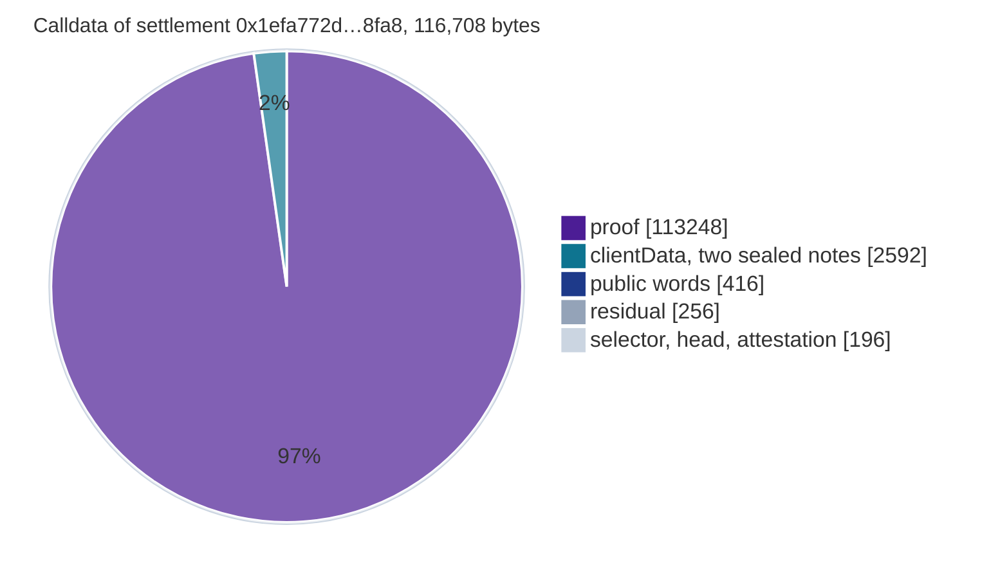

# Client data

The byte format of the sealed note a settlement publishes for each output, the recipient address a
payer encrypts to, how a payee finds and checks its notes, and what the notes cost in calldata. For
anyone implementing a wallet or an indexer.

The pool never reads these bytes, so the format lives in the wallets and here. Two wallets that
implement it from different readings will not find the notes of each other. The contract-side rule is
code. Every launch settlement carries the layout below, and the parts this repository does not
fix are listed at the end.

- [What the pool does with it](#what-the-pool-does-with-it)
- [Layout, version 0x01](#layout-version-0x01)
- [The view tag](#the-view-tag)
- [Recipient address](#recipient-address)
- [Why hybrid](#why-hybrid)
- [Size against the transaction limit](#size-against-the-transaction-limit)
- [Scanning](#scanning)
- [Checking a note](#checking-a-note)
- [What this repository does not fix](#what-this-repository-does-not-fix)

## What the pool does with it

`settleBatch` takes `bytes[] clientData`, one blob per output commitment, in output order: `outCm0`
then `outCm1` for each intent. For each output, in leaf order, it emits
(`contracts/shield/ShieldedPool.sol:437`)

```solidity
event NoteCommitted(bytes32 indexed commitment, uint40 indexed leafIndex);
event OutputNote(uint40 indexed leafIndex, bytes clientData);
```

If a batch of $n$ intents carries a number of blobs other than $2n$, the settlement reverts
`ClientDataLengthMismatch(given, outputs)` (`ShieldedPool.sol:436`). Fewer blobs would insert a leaf
no payee can recognise, and more would drop bytes the sender believes were delivered.

That is the whole contract-side rule. The pool does not parse, length-check or validate any blob,
and it accepts an empty one. The launch pool has emitted 86 `OutputNote` events for its 43
settlements, two per settlement.

## Layout, version 0x01

1,186 bytes.

```
offset      length   field
0           1        version, 0x01
1           1        view tag
2..1121     1,120    X-Wing ciphertext: ML-KEM-768 ciphertext (1,088), then X25519 ephemeral key (32)
1122..1185  64       the opening, sealed with ChaCha20-Poly1305: 48 bytes and the 16-byte tag
```

$1 + 1 + 1{,}120 + 64 = 1{,}186$.

```mermaid
%%{init: {'theme':'base','themeVariables':{'fontFamily':'Inter, -apple-system, Segoe UI, Helvetica, Arial, sans-serif','fontSize':'14px','lineColor':'#64748b','edgeLabelBackground':'#ffffff','titleColor':'#0f172a','clusterBkg':'#f8fafc','clusterBorder':'#cbd5e1'}}}%%
flowchart LR
    classDef head fill:#fef3c7,stroke:#d97706,color:#78350f,stroke-width:2px
    classDef kem fill:#4c1d95,stroke:#a78bfa,color:#f5f3ff,stroke-width:2px
    classDef aead fill:#0e7490,stroke:#22d3ee,color:#ecfeff,stroke-width:2px

    V["byte 0<br/>version 0x01"]:::head
    T["byte 1<br/>view tag"]:::head
    M["bytes 2 to 1089<br/>ML-KEM-768 ciphertext<br/>1,088"]:::kem
    X["bytes 1090 to 1121<br/>X25519 ephemeral key<br/>32"]:::kem
    O["bytes 1122 to 1169<br/>sealed opening<br/>48"]:::aead
    G["bytes 1170 to 1185<br/>Poly1305 tag<br/>16"]:::aead
    V --- T --- M --- X --- O --- G
```



The version comes first so that a scanner can tell what it is looking at before anything else. A
scanner that meets a version it does not implement skips the blob and never guesses at the layout.
0x01 is the only defined version, and there is no classical-only version.

All 86 `OutputNote` blobs of the launch pool have this shape: 1,186 bytes with byte 0 equal to
`0x01`, decoded from the event logs at block 11,778,648. Their view tags take 74 distinct values.

### The opening

The sealed payload carries what the payee needs to spend the note: the value (8 bytes), the asset
id (8 bytes) and the blinding (four Goldilocks words, 32 bytes), 48 bytes in all. The payee already
holds `spend_pk`, and recomputes the commitment before trusting the opening
([Checking a note](#checking-a-note)).

## The view tag

One byte, derived from the per-note shared secret, so it is uniform and fresh for every note.
It is never derived from the key of the recipient alone. A tag that depends only on the recipient
repeats on every note to that payee and lets anyone group the outputs of the pool by recipient.

One byte is a privacy choice. A wallet opens every output whose tag matches, a fraction $2^{-8}$ of
the outputs that are not its own, and most matches belong to other people. A wider tag would let an
indexer that filters by tag return the notes of one recipient, and a wallet asking for that filter
would identify itself.

## Recipient address

What a payer needs to send to someone: 1,249 bytes, the payload of a `nox1` address.

```
offset      length   field
0           1        version
1           32       spend key (spend_pk)
33          1,216    X-Wing encapsulation key: ML-KEM-768 (1,184), then X25519 (32)
```

The spend key goes into the output as $\mathtt{ownerCommit} = \mathsf{compress}(\mathit{spend\_pk},
\mathit{blinding})$ ([Wallet integration](16-wallet-integration.md#the-note-and-its-commitment)). The
encryption key seals the client data. The receiving secret is the X-Wing seed that the wallet derives
under `nox-shield 2026 receive key v1` ([Wallet integration](16-wallet-integration.md#keys-and-the-nox1-address)).

## Why hybrid

The proofs rest on hash functions, with no trusted setup and no pairing curve, and a reader will
take that to cover the note encryption too. X25519 alone is a discrete-log construction that a
large quantum computer breaks. Encryption is exposed in a way a proof is not: a proof verified today
stays verified, and a ciphertext published today can be stored and opened later.

A note sealed with
a classical scheme alone would have its value, asset and recipient readable from that day on.

X-Wing combines ML-KEM-768 and X25519 so that the shared secret stays secret if either one holds. A
break of the lattice scheme does not expose notes that X25519 protects, and a quantum break of
X25519 does not expose notes that ML-KEM protects.

## Size against the transaction limit

Measured on the phone settlement `0x1efa772d78a8ba014b51a1d28c46020b0df446427af3c4db9928559d683d8fa8`
(block 11,775,200, 7,337,580 gas), by decoding its calldata:

| part of the `settleBatch` calldata | bytes |
|---|---:|
| `proof`: a 32-byte length and the 113,216-byte single-call proof | 113,248 |
| `clientData`: count, two offsets, and two blobs each with a length word and padded to 1,216 bytes | 2,592 |
| `publicInputs`: a length and 12 words | 416 |
| `residual`, all zero | 256 |
| selector, five head words and the empty `attestation` | 196 |
| **total calldata** | **116,708** |



| quantity | value | source |
|---|---:|---|
| one sealed note | 1,186 bytes | the layout above |
| `clientData` in the calldata | 2,592 bytes, 2.2% of the calldata | decoded calldata |
| gas for those 2,592 bytes | 38,748 | 2,365 nonzero bytes at 16 and 227 zero bytes at 4 |
| gas for the whole calldata | 1,836,152 | 114,110 nonzero bytes at 16 and 2,598 zero bytes at 4 |
| signed transaction | 116,826 bytes | `cast tx --raw` |
| limit a node relays | 131,072 bytes | `txMaxSize` of the go-ethereum transaction pool |
| room left | 14,246 bytes | $131{,}072 - 116{,}826$ |

The relayed settlement `0xbed088f0…d04f` has the same 116,708 bytes of calldata and a signed size
of 116,825 bytes. The sealed notes cost about 0.5% of the gas of the settlement. The rest of the
gas is in [Gas](12-gas.md) and [Gas research](18-gas-research.md).

## Scanning

Fetch every `OutputNote` log of the pool over a block range, from block 11,772,152, then filter
locally:

1. Skip a blob whose length is not 1,186 or whose byte 0 is not a version you implement.
2. Decapsulate the X-Wing ciphertext with your decryption key, derive the view tag from the shared
   secret, and skip the blob if it differs from byte 1.
3. Open the sealed opening. Skip the blob if authentication fails.
4. Check the commitment as below. Keep the note only if it matches.

A wallet with several accounts tries the key of each account on every blob, so the request is the
same whatever the number of accounts.

Never ask a server to filter by view tag. That request is a statement of which notes are yours.
Fetching every log means every wallet sends the same query, so an endpoint learns only that someone
is scanning the pool. Tor also hides the address and the timing, and the uniform query is what
protects the recipient.

Nodes commonly cap the block range of one `eth_getLogs` call. Page through the range in fixed-size
steps.

## Checking a note

A decrypted opening is money only if it reproduces the leaf the pool emitted at that index. With
$v$ the value, $a$ the asset id and $D = \texttt{0x4E4F5445}$ (`NOTE_DOMAIN`):

$$
\mathit{cm}' = \mathsf{compress}\big(v_{lo} + 2^{64} v_{hi} + 2^{128} a + 2^{192} D,\;
\mathsf{compress}(\mathit{spend\_pk}, \mathit{blinding})\big),
\qquad v_{lo} = v \bmod 2^{32},\; v_{hi} = \lfloor v/2^{32} \rfloor .
$$

This is the computation of `ShieldedPool._computeCommitmentWith` (`ShieldedPool.sol:816`), where
$\mathsf{compress}$ is `PoseidonGoldilocks.hash2`. Compare $\mathit{cm}'$ with the `commitment` of
the `NoteCommitted` event at the same `leafIndex`.

If they differ, the blob describes some other leaf, and the wallet discards it. The pool treats
`ownerCommit` as opaque and cannot tell whether it came from a real key, so only the client can make
this check. The limb packing is in [Wallet integration](16-wallet-integration.md#the-note-and-its-commitment).

## What this repository does not fix

Nothing in the contracts reads the contents of a blob. These parameters live in the sealing code of
the wallet and the prover, outside this repository. A second implementation interoperates only if
it matches them:

| parameter | what has to match |
|---|---|
| the 48-byte plaintext | the byte order of the value, the asset id and the four blinding words |
| key schedule | how the ChaCha20-Poly1305 key and the view tag come from the X-Wing shared secret |
| nonce | the AEAD nonce under a fresh key per note |
| associated data | the bytes that bind the seal to its leaf commitment |
| address encoding | the version byte, the byte order of `spend_pk`, and the `nox1` text form |
