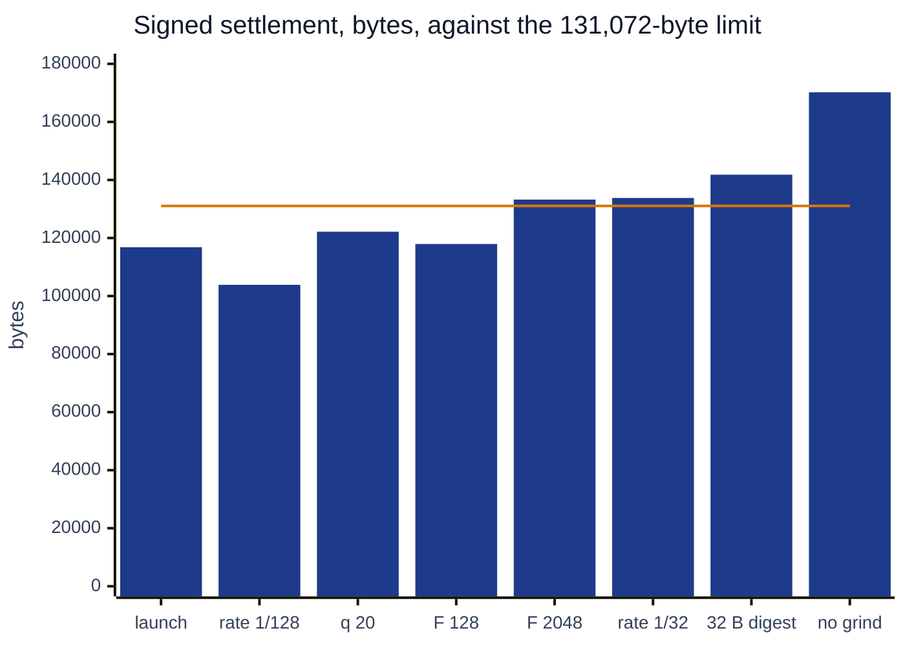

# Gas research

The design levers that set the bytes and the gas of a launch settlement: the number of queries,
the rate, grinding, the digest width and the final layer. It is for anyone who changes the proof
parameters or the verifier and needs to know what a change costs and what it buys. Measured
figures name their receipt, test or file. Figures for shapes that have no proof are computed from
the codec and labelled. The plain cost table is [12-gas.md](12-gas.md), and every transaction is
in [19-deployments-and-receipts.md](19-deployments-and-receipts.md).

## Contents

- [The launch shape](#the-launch-shape)
- [Where the bytes go](#where-the-bytes-go)
- [Where the gas goes](#where-the-gas-goes)
- [The soundness budget](#the-soundness-budget)
- [Lever 1: queries](#lever-1-queries)
- [Lever 2: rate](#lever-2-rate)
- [Lever 3: grinding](#lever-3-grinding)
- [Lever 4: digest width](#lever-4-digest-width)
- [Lever 5: the final layer](#lever-5-the-final-layer)
- [All levers against the transaction limit](#all-levers-against-the-transaction-limit)
- [Execution gas per rule](#execution-gas-per-rule)
- [Three verifier designs, measured](#three-verifier-designs-measured)

## The launch shape

Read by `cast call` on `RealSplitVerifier` `0x59AA9624…747eA`.

| symbol | parameter | value |
|---|---|---:|
| $q$ | queries | 19 |
| $L$ | $\log_2$ of the evaluation domain $N$ | 23 |
| $e$ | extra blowup bits, rate $\rho = 2^{-(1+e)}$ | 5 |
| $\kappa$, $S$ | bits per query nonce, query nonces | 25, 8 |
| $\kappa_r$ | bits per FRI round nonce | 20 |
| $w$ | trace columns | 44 |
| $n_p$ | periodic columns | 93 |
| $\delta$ | digest bytes | 24 |
| $\ell$ | radix-4 FRI layers, $(\log_2 D - \log_2 F)/2$ with $\log_2 D = 17$ | 4 |
| $F$ | final-layer coefficients | 512 |

## Where the bytes go

The codec is laid out in [04-proof-codec.md](04-proof-codec.md#sizes-at-the-launch-shape). Summed
over its readers (`RealQueryVerify.decode`, `skipFri`, `_readBase`, `_readPeriodic`, `_readPerm`),
the head $H$, the nonce region $R$, the claims $C$ and one query $Q$ are

$$
H = (3 + \ell)\,\delta + 32w + 16F + 20, \qquad R = 8(S + \ell) + 4, \qquad C = 4 + 16\,n_p,
$$

$$
Q = 40 + 68\ell + 8w + 8n_p + \delta\big(\ell(L - 1 - \ell) + 4L\big), \qquad |\pi| = H + R + C + qQ .
$$

A query opens four FRI leaves with paths of $L - 2 - 2m$ siblings, $m = 0, \dots, \ell - 1$, and
four paths of $L$ siblings: trace, composition, periodic row and permutation. At the launch shape
$H = 9{,}788$, $R = 100$, $C = 1{,}492$, $Q = 5{,}344$ and $|\pi| = 112{,}916$. That is the size of
`spec/launch-honest/settlement.proof`, and the length of head, claims and queries in the calldata
of every settlement.

| part | bytes | share of the body |
|---|---:|---:|
| 19 queries | 101,536 | 89.9% |
| of which Merkle siblings, $19 \cdot 24 \cdot 164$ | 74,784 | 66.2% |
| final layer, $16F$ | 8,192 | 7.3% |
| frame, roots, counts | 1,596 | 1.4% |
| periodic claims | 1,492 | 1.3% |
| nonces and base count | 100 | 0.1% |

The query count and the digest width set most of the size. Each query is 5,344 bytes, and $\delta$
multiplies 3,936 of them.

## Where the gas goes

Settlement `0x1efa772d…8fa8` used 7,337,580 gas: verifier execution 4,980,509, calldata 1,836,152,
pool logic 499,919 and the 21,000 base ([12-gas.md](12-gas.md#where-the-gas-of-one-settlement-goes)).
Calldata is 25.0% of the total. The EIP-7623 floor, $10T = 4{,}590{,}380$, sits below the charge,
so a byte saved saves its standard price, 15.73 gas on average over this calldata
($1{,}836{,}152 / 116{,}708$).

Every settlement carries the same 116,708 bytes. The spread from 7,066,977 to 7,882,382 is the tree
insertion of the two outputs, about 135,000 gas per Poseidon call
([12-gas.md](12-gas.md#why-settlements-differ)). No proof parameter moves it.

## The soundness budget

The adapter computes both terms on chain (`StagedStarkVerifier._outerTerms`), in millionths of a
bit, each constant rounded so the figure errs low. With $r = 1 + e$ rate bits:

$$
\text{query} = q\Big(\tfrac{r}{2} - \log_2\tfrac{7}{6}\Big) + \kappa + \log_2 S,
\qquad
\text{commit} = 2\log_2 p - \Big(7\log_2 3.5 - \log_2 3 + 2L + \tfrac{3}{2}r\Big) + \kappa_r ,
$$

$$
\text{provable} = \big\lfloor \min(\text{query}, \text{commit}) \big\rfloor, \qquad
\text{conjectured} = q\,r + \kappa + \log_2 S .
$$

At the launch shape the query term is 80.774533, the commit term 81.933909, the provable figure 80
and the conjectured 142 (`soundnessTermsForSize(1)`, `soundnessBits()`, and
`LaunchSoundness.t.sol::test_theLaunchPointIsAtLeastEightyBits`). Every lever below is judged by
whether both terms stay at 80 or above and whether the settlement stays under 131,072 bytes.

## Lever 1: queries

At rate $2^{-6}$ each query adds $3 - \log_2(7/6) = 2.777607$ bits to the query term and 5,344 bytes
to the proof. It does not move the commit term.

| $q$ | query term | provable | proof body | kind |
|---:|---:|---:|---:|---|
| 18 | 77.996926 | 77 | 107,572 | computed |
| **19** | **80.774533** | **80** | **112,916** | on chain, and the file size |
| 20 | 83.552140 | 81 | 118,260 | computed |

Nineteen is the fewest queries that reach 80 at this rate and grind.

## Lever 2: rate

The rate fixes the domain: $L = \lceil \log_2(11 \cdot 2^{13}) \rceil + 1 + e = 18 + e$. A lower rate
earns more bits per query, and costs a longer codeword on the prover and a longer path per opening.
It also lowers the commit term by 2 bits per step of $L$ and 1.5 per rate bit. For each rate the
table takes the fewest queries that reach 80 on the query term, with the launch grind.

| rate | $L$ | $q$ | query term | commit term | provable | proof body | signed settlement, estimate |
|---|---:|---:|---:|---:|---:|---:|---:|
| $2^{-5}$ | 22 | 23 | 80.384961 | 85.433909 | 80 | 129,876 | 133,786 |
| $\mathbf{2^{-6}}$ | **23** | **19** | **80.774533** | **81.933909** | **80** | **112,916** | **116,826, measured** |
| $2^{-7}$ | 24 | 16 | 80.441712 | 78.433909 | 78 | 99,956 | 103,866 |

At $2^{-5}$ the settlement goes over 131,072 bytes. At $2^{-7}$ the commit term falls under 80, and
the round grind would need 22 bits to lift it to 80.433909. The settlement estimates add the
measured 3,910 bytes of envelope and encoding around the launch proof ($116{,}826 - 112{,}916$).

## Lever 3: grinding

Grinding buys bits with prover work and costs the verifier one Keccak per nonce.

**Query nonces.** Eight chained nonces of 25 bits add $25 + \log_2 8 = 28$ bits to the query term
for 64 bytes. Without them the query term needs $\lceil 80 / 2.777607 \rceil = 29$ queries, a body
of 166,300 bytes (computed). The split into eight searches prices the same as one nonce of 28 bits
(`LaunchSoundness.t.sol::test_aSplitGrindCountsAsItsTotalWork`) and costs 56 bytes more than one
nonce. Each nonce is checked against the state the previous one left, so the searches cannot run
ahead (`LaunchTranscript.t.sol::test_aQueryNonceSearchedAheadIsRefused`).

**Round nonces.** A 20-bit nonce after each of the 4 FRI roots adds 20 bits to the commit term for
32 bytes. Without them the commit term is 61.933909 and the provable figure 61
(`LaunchSoundness.t.sol::test_withoutTheRoundGrindTheCommitTermDecides`).

| grinding | query term | commit term | provable | proof body | kind |
|---|---:|---:|---:|---:|---|
| launch: 8 × 25 query bits, 4 × 20 round bits | 80.774533 | 81.933909 | 80 | 112,916 | on chain |
| one 28-bit query nonce, 4 × 20 round bits | 80.774533 | 81.933909 | 80 | 112,860 | computed |
| no round grind | 80.774533 | 61.933909 | 61 | 112,884 | test, computed size |
| no query grind, 29 queries | 80.550603 | 81.933909 | 80 | 166,300 | computed |

## Lever 4: digest width

Every Merkle sibling and root is $\delta$ bytes, 164 siblings a query and 7 roots. At 24 bytes
collision resistance is $2^{96}$ against a classical attacker. At 32 bytes the body grows by
$8 \cdot (19 \cdot 164 + 7) = 24{,}984$ bytes to 137,900 (computed), and a settlement to about
141,810 bytes (estimate), over the 131,072-byte limit. At this query count 32-byte digests do not
fit one transaction. The verifier accepts either width (`digestBytes` is 24 or 32).

## Lever 5: the final layer

FRI folds by 4 until $F$ coefficients remain, and the verifier evaluates that polynomial at each
final point. A larger $F$ costs $16F$ bytes once. A smaller one costs one more folded layer in every
query, $68 + \delta(L - 2 - 2\ell)$ bytes, plus a root and a round nonce. With
$\log_2 D - \log_2 F$ even:

| $\ell$ | $F$ | head | per query | proof body | kind |
|---:|---:|---:|---:|---:|---|
| 3 | 2,048 | 34,340 | 4,916 | 129,328 | computed |
| **4** | **512** | **9,788** | **5,344** | **112,916** | **the file** |
| 5 | 128 | 3,668 | 5,724 | 114,024 | computed |
| 6 | 32 | 2,156 | 6,056 | 118,828 | computed |

512 coefficients give the smallest body. The degree check on a coefficient list is its length, so
the constructor pins $F$ and $\ell$ (`FriShapeUnpinned`), and each head is checked against them
(`FriShapeNotTheDeployment`).

## All levers against the transaction limit

Signed settlement size for each variant above, estimated as the proof body plus the 3,910 bytes
measured around the launch proof. The launch bar is measured.

Of the variants that fit, rate $2^{-7}$ is the smallest and needs a 22-bit round grind to keep 80
provable bits. Of these variants, the launch shape is the smallest that fits at 80 bits with a 20-bit round grind.

## Execution gas per rule

The execution cost of each transcript rule is measured by tests that print it. Run them with `-vv`:

| test | prints |
|---|---|
| `LaunchRuleGas.t.sol::test_eachRulesGas` | gas of powers against independent draws for the 100 composition and 182 DEEP coefficients, of the 4 round nonces, of 8 query nonces against 1, and of the whole transcript at the launch shape |
| `LaunchGate.t.sol::test_everyHonestProofVerifiesWithTwelveWords` | `verifyBatch` gas of each of the four launch proofs, measured in the callee |

This document quotes none of these printed values. The verifier figure it uses is the estimate on
chain, 4,980,509.

## Three verifier designs, measured

Two chunked walks and the launch verifier, each on Sepolia. The walks verify one proof across many
transactions and take the composition value from the caller. The launch verifier checks a proof
in one call and evaluates every constraint on chain.

| | walk, one base query a chunk | walk, two base queries a chunk | launch, one call |
|---|---|---|---|
| verifier | `0xB16FFE48…5feA` | `0xc6424447…af67` | `0x59AA9624…747eA` |
| queries, $L$, trace columns, periodic columns | 32, 26, 749, 2,649 | 32, 26, 749, 2,649 | 19, 23, 44, 93 |
| `recomputesCompZ()` | false | false | true |
| calldata of one base chunk | 98,180 bytes, one query | 70,628 bytes, two queries | |
| periodic claims | inside every base chunk | once, in a 42,500-byte `computeScalar` | once, 1,492 bytes |
| transactions | 49 | 34 | 1 |
| gasUsed | 512,576,167 | 258,556,537 | 7,066,977 to 7,882,382 |

The walk figures are verification alone. The launch figure is a whole settlement, the pool work
included. The lowest settlement is 72.5 times cheaper than the first walk and 36.6 times cheaper
than the second. The shape values are read by `cast call` on each verifier, the calldata sizes from the
transactions, and the receipts are in [19](19-deployments-and-receipts.md#verifier-walks-compared-in-18).

What separates the designs, by the numbers in the table: 44 trace columns and 93 periodic columns
in place of 749 and 2,649 shrink every opened row and every claim list, 19 queries in place of 32
shrink the query count, and one transaction in place of 49 or 34 pays one base and one calldata
charge.
