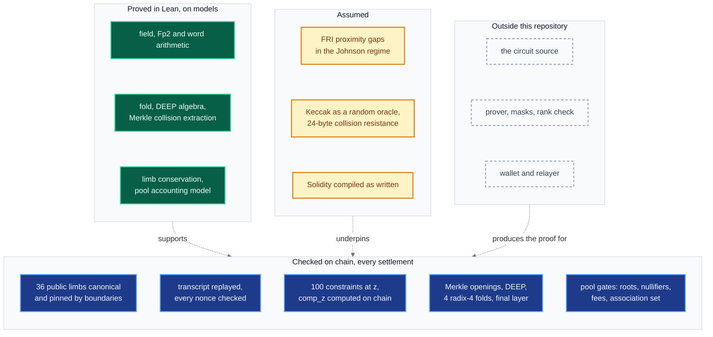

# Security status

This document lists every security property of the launch stack on Sepolia, with its status today
and the evidence behind it: a code line, a named test, a Lean theorem or a value read on chain.
It is for auditors, integrators and anyone deciding how far to trust the pool. Other documents link
here and do not restate these limits.

## Contents

1. [Scope](#scope)
2. [How to read the tables](#how-to-read-the-tables)
3. [The verifier](#the-verifier)
4. [Soundness and its assumptions](#soundness-and-its-assumptions)
5. [Hashes and digests](#hashes-and-digests)
6. [Zero knowledge](#zero-knowledge)
7. [The pool](#the-pool)
8. [Owner powers](#owner-powers)
9. [Association sets and the relayer](#association-sets-and-the-relayer)
10. [Machine-checked proofs](#machine-checked-proofs)
11. [Current limitations](#current-limitations)
12. [Audit](#audit)

## Scope

Every statement below is about these contracts on Sepolia and the source they are built from.
Addresses and receipts are in [Deployments and receipts](19-deployments-and-receipts.md).

| contract | address | read on chain |
|---|---|---|
| `ShieldedPool` | `0x8e377752C8890E23A1E9F40eBbD41183Fc6949e2` | `betaMode() = false`, `settler() = 0x0`, `wordsPerIntent() = 12`, EIP-1967 slot empty |
| `ComposedStarkVerifier` | `0xf64c399696E10C84C73B66350b45bA0fCD860927` | `soundnessBits() = (142, 80)`, `sizeCount() = 1`, `evaluator() = 0x619A…3FF6`, EIP-1967 slot empty |
| `RealSplitVerifier` | `0x59AA962433060D0206C3595afEb1793c621747eA` | `nq() = 19`, `logDomain() = 23`, `logDegreeBound() = 17`, `roundGrindBits() = 20`, `grindBits() = 25`, `finalSearches() = 8`, `digestBytes() = 24`, `recomputesCompZ() = true` |
| `LaunchEvaluator` | `0x619A5ecdEe779Ec4455bbFa2eC3a5f4f9DEE3FF6` | image pinned to `LaunchProgram.IMAGE_HASH` |
| `AssociationSetRegistry` | `0x4375eE7D015aC8E404A03deb577E90b08de32Df3` | no owner and no admin function |

Nothing in this repository is deployed on mainnet.

## How to read the tables

| status | meaning |
|---|---|
| **enforced** | a deployed contract checks it on every call, and a revert or `false` follows when it fails |
| **tested** | a named Forge test, fuzz run, invariant or Halmos check exercises it |
| **proved** | a Lean theorem states it, about a model of the code (see [Machine-checked proofs](#machine-checked-proofs)) |
| **assumed** | it rests on a cryptographic assumption that nothing here proves |
| **outside** | the code that provides it is outside this repository |
| **not checked** | nothing enforces it |

## The verifier

The pool calls `ComposedStarkVerifier.verifyBatch`, which calls
`RealSplitVerifier.verifyWholeComposed` (`RealSplitVerifier.sol:216`). The launch tests build the
same stack from `spec/launch-honest` and `spec/launch-program` (`test/shield/LaunchBase.sol`).

| property | status | evidence |
|---|---|---|
| every constraint is evaluated on chain: 38 transitions and 62 boundaries at $z$, weighted $1, \alpha, \alpha^2, \dots$ | enforced, tested | `RealSplitVerifier._evaluate` calls `LaunchEvaluator.evaluate` with the replayed $(\beta, \gamma, z)$. `LaunchGate.t.sol::test_theOraclesMatch`, `test_aCompositionTakenAsToldIsRefused` |
| no caller supplies comp_z. The two trailing words of the `ONE_CALL` encoding are never read | enforced | `StagedStarkVerifier.ONE_CALL`. `ComposedStarkVerifier._composedWhole` reads fields 1 to 3 only |
| the evaluator runs the launch circuit and no other | enforced, tested | the `LaunchEvaluator` constructor takes its image only if `keccak256(image) == LaunchProgram.IMAGE_HASH` (`ProgramFormEvaluator.sol:31`). `LaunchImage.t.sol::test_thePinIsTheCompileOfTheTape`, `LaunchGate.t.sol::test_eachEvaluatorServesOnlyItsCircuit` |
| the evaluator takes 36 public limbs and reads every one through a boundary pin | enforced | `publics.length != N_PUBLIC` reverts `NotThisCircuit` (`ProgramFormEvaluator.sol:110`). An image whose pins leave a limb unread reverts `PinsNotContiguous` (`ProgramFormEvaluator.sol:76`) |
| the 12 public words map to 36 canonical limbs: words 0 to 5, 10 and 11 four limbs each, words 6 to 9 one limb each, every limb below $p$ | enforced, tested, proved | `PublicWords.publicsOf` reverts `NonCanonicalLimb`. `FeeRecipient.t.sol::testFuzz_isRepresentableAtTwelveWords`. Lean `publicsOf_ok_iff_canonical`, `publicsOf_injective` (`Shield/Protocol/Limbs.lean`) |
| a changed statement is refused: a swapped statement, a changed amount, a changed recipient | tested | `LaunchGate.t.sol::test_aStatementSwapIsRefused`, `test_aTamperedAmountIsRefused`, `test_aTamperedRecipientIsRefused` |
| transcript binding: the 36 limbs are absorbed first, then the trace root, $\beta$, $\gamma$, the permutation root, $\alpha$, the composition root, $z$, the frame, the 93 periodic claims, the DEEP challenge and the seed | enforced, tested | `RealQueryVerify._mainCheckpoint` (`RealQueryVerify.sol:386`), `_deepCoeffs`, `mainResume`. `LaunchTranscript.t.sol::test_theMainTranscriptIsThePackages`, `test_theDeepCoefficientsAndSeedAreThePackages`, against the 1,482 events of `spec/launch-honest/transcript-kat.json` |
| the FRI transcript absorbs the seed, each of the 4 roots, each round nonce, the 512 final coefficients and the 8 final nonces before it draws the 19 positions | enforced, tested | `RealQueryVerify.friChallenges` (`RealQueryVerify.sol:483`). `LaunchTranscript.t.sol::test_eachFoldNonceAndChallengeIsThePackages`, `test_theSplitGrindAndThePositionsAreThePackages` |
| grinding: each FRI round nonce has 20 leading zero bits before its fold challenge is drawn | enforced, tested | `StarkTranscript.grindRound` (`RealQueryVerify.sol:494`). `LaunchTranscript.t.sol::test_aFoldNonceUnderItsBoundIsRefused` |
| grinding: 8 chained final nonces of 25 bits, each checked against the state the previous one left | enforced, tested | `FinalGrindRejected` (`RealQueryVerify.sol:513`). `LaunchTranscript.t.sol::test_aQueryNonceSearchedAheadIsRefused`, `LaunchGate.t.sol::test_aTamperedNonceIsRefused` |
| the mask pair, columns 42 and 43, is opened as one $\mathbb{F}_{p^2}$ value and slot 43 must be zero | enforced, tested | `MaskSlotNotZero` (`RealQueryVerify.sol:429`). `LaunchGate.t.sol::test_theMaskPairIsOpenedAsOneValue`, `test_aMaskOpenedApartIsRefused` |
| the proof decodes at the deployed shape: every field element below $p$, the FRI shape $512 \cdot 4^{4} = 2^{17}$, no trailing bytes | enforced | `RealQueryWalk.readHead`, `readClaims`, `RealSplitVerifier._friShape` (`RealSplitVerifier.sol:144`), `ChunkLengthMismatch` (`RealSplitVerifier.sol:241`) |
| every trace row has 44 cells, 34 under the trace root and 10 under the permutation root | enforced | `TraceRowWidthMismatch` (`RealQueryVerify.sol:666`), `RealQueryWalk.baseQuery` |
| every opened trace row, composition value and periodic row verifies against its root. The periodic root is fixed at deployment | enforced, tested | `RealQueryWalk.baseQuery`, `periodicRoot` immutable (`RealSplitVerifier.sol:29`) |
| the DEEP value at each position equals the slot of the FRI layer-zero leaf at the same position | enforced, tested | `RealSplitVerifier._fri` hands each layer-zero value to `_bases`. `LaunchGate.t.sol::test_aBentTraceIsRefused` |
| each radix-4 fold is recomputed from the index, and the final layer is evaluated as a polynomial of 512 coefficients at a point the verifier computes | enforced, proved | `RealQueryWalk.friQuery`. Lean `quadFold_correct` (`Shield/Fri/Fold.lean`), `ixStep_spec` (`Shield/Fri/Chain.lean`) |
| value conservation holds over the integers: limbs are range-checked, and a balance that holds only modulo $p$ is refused | tested, proved on the described circuit | `LaunchGate.t.sol::test_aValueBalancedOnlyModPIsRefused`, `test_aDummyWorthPIsRefused`. Lean `limbwise_conservation` (`Shield/Arith/LimbBalance.lean`) |
| the nullifier is derived from the spent note | tested | `LaunchGate.t.sol::test_aWrongNullifierIsRefused` |
| every honest launch proof verifies with 12 words | tested | `LaunchGate.t.sol::test_everyHonestProofVerifiesWithTwelveWords` |
| the verifier path imports only its declared contracts | tested | `DeployedSurface.t.sol::test_theDeployedVerifierReachesExactlyTheseContracts` |
| the pool refuses to deploy unless the verifier accepts a real proof | enforced | `VerifierSelfTestFailed` (`ShieldedPool.sol:301`) |
| the verifier, its evaluator and its parameters cannot change | enforced | `ShieldedPool.verifier` immutable (`ShieldedPool.sol:92`), `ComposedStarkVerifier.evaluator` immutable, every `RealSplitVerifier` parameter immutable, no proxy |

## Soundness and its assumptions

`StagedStarkVerifier._outerTerms` (`StagedStarkVerifier.sol:97`) computes two terms from the
parameters of the deployed verifier, in millionths of a bit. With $q = 19$, $\log_2(1/\rho) = 6$,
$\kappa = 25$, $S = 8$, $\kappa_r = 20$ and $\log_2 N = 23$:

$$
\text{query} = q\Big(\tfrac{1}{2}\log_2\tfrac{1}{\rho} - \log_2\tfrac{7}{6}\Big) + \kappa + \log_2 S = 80.774533,
$$

$$
\text{commit} = 2\log_2 p - \Big(7\log_2 3.5 - \log_2 3 + 2\log_2 N + \tfrac{3}{2}\log_2\tfrac{1}{\rho}\Big) + \kappa_r = 81.933909,
$$

$$
\text{provable} = \big\lfloor \min(\text{query},\ \text{commit}) \big\rfloor = 80, \qquad
\text{conjectured} = q\log_2\tfrac{1}{\rho} + \kappa + \log_2 S = 142 .
$$

The code rounds `JOHNSON_LOSS`, `LOG_K` and `COMMIT_CONST` so that each figure errs low.
`soundnessTermsForSize(1)` returns `(80774533, 81933909)` and `soundnessBits()` returns `(142, 80)`.

| property | status | evidence |
|---|---|---|
| provable 80 bits, computed on chain from the deployed parameters | enforced, tested | `StagedStarkVerifier._bits` (`StagedStarkVerifier.sol:111`). `LaunchSoundness.t.sol::test_theLaunchPointIsAtLeastEightyBits` |
| the per-round grind carries the commit term. Without it the commit term falls far below 80 | tested | `LaunchSoundness.t.sol::test_withoutTheRoundGrindTheCommitTermDecides` |
| 8 final nonces of 25 bits count as $25 + \log_2 8 = 28$ bits of work | tested | `LaunchSoundness.t.sol::test_aSplitGrindCountsAsItsTotalWork`, `LaunchTranscript.t.sol::test_theGrindVector` |
| the provable figure rests on the proximity-gaps theorem of Ben-Sasson, Carmon, Ishai, Kopparty and Saraf (FOCS 2020) in the Johnson regime, list parameter $m = 3$ | assumed | stated at `StagedStarkVerifier.sol:84`. Lean states the theorem as the hypothesis `FriSoundnessHyp` and does not prove it |
| the conjectured 142 bits assume the Reed-Solomon proximity conjecture up to capacity | assumed | the ethSTARK documentation (StarkWare, 2021) |
| Fiat-Shamir: Keccak-256 acts as a random oracle for every challenge and every nonce | assumed | `StarkTranscript`. No theorem here bounds hash queries |
| the figures cover the STARK alone. The 24-byte commitments bound the system separately | assumed | see [Hashes and digests](#hashes-and-digests) |
| a soundness floor at settlement | not checked | `ShieldedPool` never reads `soundnessBits()`. The 80-bit floor is a deployment rule ([Deployment](13-deployment.md)) |

## Hashes and digests

| property | status | evidence |
|---|---|---|
| the Merkle commitments of the proof use Keccak-256 cut to 24 bytes | enforced | `digestBytes() = 24` on chain, `StarkMerkle` |
| an accepted forged opening at a fixed depth yields a collision of the truncated hash, with no loss | proved | Lean `verify_extracts_collision`, `opening_binding` (`Shield/Merkle/Binding.lean`) |
| leaf and node preimages are separated by tag | proved | Lean `leaf_ne_node`, `leaf_node_confusion_is_collision`. Separation between different leaf kinds is not proved in Lean |
| classical collision resistance of a 24-byte digest is $2^{96}$ | assumed | generic birthday bound on 192 bits |
| against a quantum attacker the generic collision bound is about $2^{64}$ (Brassard, Høyer and Tapp) | assumed, estimate | an estimate from the generic bound on 192 bits. It sits below the 80 provable bits |
| the note tree and note commitments use Poseidon over Goldilocks | enforced, assumed | `PoseidonGoldilocks` `0x0096…A4d7`, checked by the constructor self-test of the pool (`HasherSelfTestFailed`). Its collision resistance is assumed |

## Zero knowledge

| property | status | evidence |
|---|---|---|
| hiding is a property of the prover. The verifier checks soundness only | outside | the prover and its masks are outside this repository |
| the trace carries a mask pair in columns 42 and 43, filled from a keyed hash of device randomness | outside | computational zero knowledge: hiding rests on that hash and on the randomness of the device |
| a rank check on the masks runs on the device before a proof leaves it | outside | prover code, outside this repository |
| the chain accepts only proofs that open the mask pair as one value | enforced | `MaskSlotNotZero` (`RealQueryVerify.sol:429`) |
| the probability over the challenges that the rank condition fails is at most $1328 \cdot 102 / p \approx 2^{-46.95}$, for each position set with a witness | proved, under hypotheses | Lean `launch_rank_failure`, `launch_condition_R`, `package_rank_failure` (`Shield/Zk/Launch.lean`). Hypotheses H1 to H8 are listed in `formal/lean/README.md`, section 13 |
| a failure bound of $2^{-80}$ is out of reach of this method | proved | Lean `eps_not_lt_two_pow_neg_80`, `sz_floor` |

## The pool

| property | status | evidence |
|---|---|---|
| a nullifier is spent once: a seen nullifier reverts, two equal nullifiers in one intent revert | enforced, tested, proved | `_spend` (`ShieldedPool.sol:715`), `DuplicateNullifier` (`ShieldedPool.sol:701`). `NullifierAndRoot.t.sol::test_aNullifierCannotBeReplayedInALaterBatch`. Lean `nullifier_once` |
| the note root is one of the last 128 published roots | enforced, tested | `UnknownOrStaleRoot` (`ShieldedPool.sol:416`), `ROOT_WINDOW = 128`. `TreeInvariants.t.sol::invariant_aKnownRootStaysKnownForTheWindow` |
| every digest word is canonical, the public amount lies in $[0, p - 2]$, and a negative amount reverts | enforced | `_decodeIntent` (`ShieldedPool.sol:667`), `ShieldInViaDepositOnly` (`ShieldedPool.sol:681`), `Goldilocks.MAX_VALUE = P - 2` |
| a transfer names no recipient and pays at most `maxRelayFee` of its asset | enforced, tested | `NoPublicLegFieldsSet`, `FeeExceedsCap` (`ShieldedPool.sol:707`, `:686`). `FeeRecipient.t.sol::test_aTransferFeeAboveTheCapIsRefused` |
| a withdrawal names a recipient and pays at most 0.5% of its amount | enforced, tested | `FeeExceedsCap`, `RecipientRequired` (`ShieldedPool.sol:710`, `:689`). `FeeRecipient.t.sol::test_theRelayCapDoesNotLoosenTheUnshieldCap` |
| a fee recipient without a fee reverts. A fee to a named recipient is credited and taken with `claim` | enforced, tested | `FeeRecipientWithoutFee` (`ShieldedPool.sol:703`). `FeeRecipient.t.sol::test_theFeeIsCreditedToTheFeeRecipientAndNeverPushed`, `test_aContractFeeRecipientCannotGriefTheBatch` |
| solvency: for each asset the pool holds at least `totalShielded + totalClaimable + unsweptFees` | tested, proved | `PoolInvariants.t.sol::invariant_solvency`. Lean `conservation`, `solvent` (`Shield/Protocol/Pool.lean`) |
| `totalShielded` moves only by deposits, withdrawals with their fee, and refunds | tested | `PoolInvariants.t.sol::invariant_ledgerMovesOnlyByDepositsUnshieldsAndRefunds` |
| reentrancy: `absorb`, `settleBatch`, `claim`, `sweepFees` and `betaRefund` are `nonReentrant` | enforced, tested | `ShieldedPool.sol:339`, `:392`, `:847`, `:924`, `:563`. `HostileTokens.t.sol::test_aTransferHookCannotReenterSettlement`, `test_aTransferHookCannotReenterDeposit` |
| effects before interactions: every nullifier is marked and every output inserted before the first transfer | enforced | `settleBatch` (`ShieldedPool.sol:386`), transfers last in `_settleIntents` |
| a push forwards capped gas and copies at most one return word, so a hostile token cannot void a batch or be paid twice | enforced, tested | `_tryTransfer`, `_pushToken`, `NATIVE_PUSH_GAS`, `TOKEN_PUSH_GAS`. `KnownIssues.t.sol::test_knownIssue_hostileTokenVoidsBatch_burnsAllGas` and `test_knownIssue_aTokenThatDeliversThenAnswersBadlyIsPaidTwice` assert that the batch settles and the payout is made once |
| a hostile token cannot reach the escrow of another asset | tested | `HostileTokens.t.sol::test_noHostileTokenCanReachAnotherAssetsEscrow` |
| settlement is open to anyone: no settler is configured | enforced, proved | `settler() = 0x0` on chain, `SettlerGate.open`. Lean `passes_of_no_settler` (`Shield/Protocol/SettlerGate.lean`) |
| a configured settler could hold an intent out for at most one epoch of 24 hours | tested, proved | `SettlerWindow.t.sol`, `FieldFuzz.t.sol::testFuzz_theOpenSlotIsNeverMoreThanAnEpochAway`, Halmos `SettlerGate.halmos.t.sol::check_theOpenSlotIsNeverMoreThanAnEpochAway`. Lean `anyone_passes_within_epoch` |
| the tree stops at $2^{32} - 1$ leaves, and a batch crossing the bound is refused whole | tested | `TreeInvariants.t.sol::test_theTreeStopsOneShortOf2To32`, `testFuzz_aBatchCrossingTheBoundIsRefusedWhole` |
| a residual swap needs a router approved after a 2-day timelock. No router is proposed or approved on the launch pool, so every residual reverts `RouterNotApproved` | enforced | `_settleResidual` (`ShieldedPool.sol:749`). No `RouterProposed` or `RouterApproved` log since block 11,772,152 |
| staking pays no more reward than was notified, and holds every stake, unstake, owed reward and carried remainder | enforced, tested | the booked share rounds up (`NoxShieldStaking.sol:159`). `NoxShieldStaking.invariant.t.sol::invariant_solvent`, `invariant_rewardsNeverExceedWhatWasNotified`, `test_roundingNeverOverCommitsAcrossNotifications` |
| a staking reward that arrives while nothing is staked is burned, so no later staker takes it | enforced, tested | `RewardBurned` (`NoxShieldStaking.sol:155`). `NoxShieldStaking.t.sol::test_RewardsWithNoStakersAreBurned`, `test_aRewardWithNoStakerIsBurned` |

## Owner powers

The owner is a Safe at `0xD4251BA8bD4F68690BaB9f27d544819cFBE11854`, 2 of 3 signers by
`getThreshold()` and `getOwners()`. Ownership moves in two steps (`Ownable2Step`). Every power
below is read from `ShieldedPool.sol`.

| function | effect | bound |
|---|---|---|
| `registerAsset` | adds an ERC-20 with a permanent unit scale | scale 1 to $10^{18}$, contract code required |
| `setFeeBps` | sets the deposit fee. Settlement does not read `unshieldFeeBps` | at most 50 bps each. Lean `fee_caps` |
| `setMaxRelayFee` | caps the relay fee on transfers, per asset, at once | at most $p - 2$ units |
| `setDepositsPaused` | pauses `absorb` | settlement, `claim` and refunds unaffected |
| `proposeFeeRouter`, `cancelFeeRouterChange` | changes where protocol fees go | 2-day timelock, anyone executes |
| `proposeRouter`, `revokeRouter` | approves or removes a DEX router for residual swaps | 2-day timelock to approve, revocation at once |
| `proposeSettler`, `cancelSettlerChange` | sets a settler with 24 hours of priority after each settlement | 48-hour timelock. The daily open slot stays |
| `setResidualBand` | how far a residual floor may sit below the clearing price | at most 1,000 bps |
| `setAttestationVerifier` | changes the `attested` flag of `BatchSettled` | no effect on acceptance |
| `setBetaCaps`, `setBetaPaused`, `setOpenDeposits`, `setBetaDepositor`, `setDepositorRegistrar` | beta gating | no effect while `betaMode() = false`. `endBetaMode` is one-way |

The owner cannot change the verifier, the evaluator, the registry, `wordsPerIntent` or the hasher,
which are immutable. No owner function moves note funds or marks a nullifier. `betaRefund`
requires `betaMode`, which is off.

## Association sets and the relayer

| property | status | evidence |
|---|---|---|
| the pool accepts an intent only if its association root is registered | enforced | `UnknownAssociationRoot` (`ShieldedPool.sol:417`) |
| the registry is permissionless and append-only, and refuses zero and non-canonical roots | enforced, tested | `AssociationSetRegistry.publishRoot`. `AssociationSetRegistry.t.sol::testFuzz_AppendOnly`, `test_NonCanonicalRootReverts`. `AssociationSetRegistry.invariant.t.sol::invariant_countAndNewestEntryMatch` |
| the association root is word 1 of the statement and enters the circuit as 4 pinned limbs | enforced | `PublicWords.publicsOf`, `PinsNotContiguous` |
| the input notes lie under the association root they name | outside | a constraint of the circuit, whose source is outside this repository |
| what a published root stands for | not checked | anyone may publish any canonical root, and a set means only what its publisher claims |
| the relayer cannot change a transfer: the fee (word 7) and the fee recipient (word 11) are bound in the proof | enforced | both words enter the circuit as pinned limbs |
| the relayer can refuse or delay a transfer | not checked | the sender can submit the same proof itself, since no settler is configured |
| the relayer sees the proof, the words and the sealed notes, and no key | outside | the relayer service and its Tor onion are outside this repository |

## Machine-checked proofs

`formal/lean` is a Lean 4 project on Mathlib `v4.34.0`. It proves mathematics the verifier uses and
properties of hand transcriptions of the contracts. It does not prove the verifier sound.

| module | what it proves | main theorems |
|---|---|---|
| `Shield/Field/Basic.lean`, `Fp2.lean` | $p$ is prime by a Lucas certificate, 7 generates $\mathbb{F}_p^\times$ and is a non-residue, $X^2 - 7$ is irreducible, the inverse formula, Frobenius is conjugation | `P_prime`, `orderOf_seven`, `seven_not_square`, `irreducible_X_sq_sub_seven`, `inv_eq`, `frobenius_eq_star` |
| `Shield/Arith/Goldilocks.lean` | transcriptions of `fpAdd`, `fpSub`, `fpNeg`, `fpMul`, `fpPow` and `fpInv` return the canonical result, and `isCanonicalDigest` checks four limbs | `fpMul_spec`, `fpInv_spec`, `fpPow_spec`, `isCanonicalDigest_iff` |
| `Shield/Arith/Fp2Impl.lean` | the word-pair $\mathbb{F}_{p^2}$ operations compute field operations, and `conjugate` is Frobenius | `mul_val`, `inv_val`, `conjugate_eq_frobenius` |
| `Shield/Fri/Chain.lean`, `Fold.lean` | the chained inverses of `_ixStep` and the radix-4 fold compute $\sum_{j<4} \beta^j f_j(x^4)$ | `ixStep_spec`, `fold_quad`, `quadFold_correct` |
| `Shield/Deep/Quotient.lean` | DEEP algebra: division, grouping by point, one bad coefficient per wrong claim, distance of the quotient from any polynomial | `combined_dvd_iff`, `bad_coefficient_card`, `deep_far` |
| `Shield/Merkle/Binding.lean` | an opening forgery yields a collision, and leaf and node tags separate | `verify_extracts_collision`, `leaf_ne_node` |
| `Shield/Arith/LimbBalance.lean` | limb-wise conservation with range-checked limbs and carry implies conservation over $\mathbb{Z}$ | `limbwise_conservation`, `closes_iff_balances` |
| `Shield/Soundness/Fri.lean` | the query-phase formula of `_stageProvable`, and the proximity-gaps bound as a named hypothesis evaluated at stated parameters | `johnson_query_bits`, `FriSoundnessHyp`, `outer_eps_le` |
| `Shield/Zk/*.lean` | Schwartz-Zippel and rank lemmas, and the rank-condition failure bound of [Zero knowledge](#zero-knowledge) | `rank_lemma`, `launch_rank_failure` |
| `Shield/Protocol/Limbs.lean` | `publicsOf` succeeds on canonical words and only on them, is injective and round-trips, 36 limbs at 12 words | `publicsOf_ok_iff_canonical`, `publicsOf_injective`, `limbsPerIntent_v2` |
| `Shield/Protocol/Pool.lean` | on a state-machine model of the pool: conservation, solvency, nullifiers spent once, fee caps, a leaf count that never decreases | `conservation`, `solvent`, `nullifier_once`, `fee_caps`, `leafCount_mono` |
| `Shield/Protocol/SettlerGate.lean`, `FeeRouter.lean` | the open slot comes within one epoch, and the fee split sums and rounds as stated | `anyone_passes_within_epoch`, `split_sum` |

**The axioms check.** `.github/workflows/lean.yml` fails on any `sorry` or `admit` in `Shield/` or
`Axioms.lean`, and on any `axiom` declaration in `Shield/`. It then builds every module with
`lake build` and runs `lake env lean Axioms.lean`, which prints the axioms of each theorem listed
there. It fails on any axiom other than `propext`, `Classical.choice` and `Quot.sound`.

`Axioms.lean` lists the theorems of the field, arithmetic, FRI, DEEP, limb, Merkle, soundness and
zero-knowledge modules. The `Shield/Protocol/` theorems are built and scanned for `sorry` in CI,
and are not in that printout.

## Current limitations

- The staking contract on Sepolia, `0x739e06586305c4a543d5cFd5fE5506aA289cf397`, runs a build without the burn and round-up rules. It holds no stake.
- No external audit has reviewed the verifier, the evaluator or the pool.
- The circuit source is outside this repository. The tests hold the evaluator to the circuit oracle and to its pinned image. They do not show that the circuit encodes the join-split correctly.
- The Lean proofs model hand transcriptions of Solidity. Solidity, Yul, assembly and the EVM are not modelled, and no proof here detects a transcription error.
- The Lean proofs do not model the AIR, the transcript, calldata decoding or the proof codec.
- FRI soundness and Fiat-Shamir are hypotheses in Lean. The chain from a wrong claim to a rejection is not closed.
- `Shield/Soundness/Fri.lean` evaluates its bounds at parameters other than the launch parameters. The launch figures are checked by `LaunchSoundness.t.sol`, and not in Lean.
- The Lean pool model requires a zero fee on intents with no public amount. The relay fee on transfers is covered by `FeeRecipient.t.sol`, and not by the model.
- Provable soundness is 80 bits, under the proximity-gaps theorem in the Johnson regime and the random-oracle model.
- No contract enforces a soundness floor. The pool never reads `soundnessBits()`.
- Merkle digests are 24 bytes: $2^{96}$ classical collision work, and about $2^{64}$ against a generic quantum collision search (estimate).
- Zero knowledge is computational and rests on the prover. The Lean bound on rank-condition failure is about $2^{-46.95}$.
- The adapter serves batches of one intent (`sizeCount() = 1`), so every settlement pays for a whole verification.
- Association roots are published by anyone and carry no meaning that the chain checks.
- The relayer can refuse or delay a transfer. The fallback is self-submission.
- The owner can pause deposits and change the relay fee cap at once, and change fee routing after a timelock.

## Audit

No part of this repository has been audited. An external audit is required before any mainnet
deployment.
